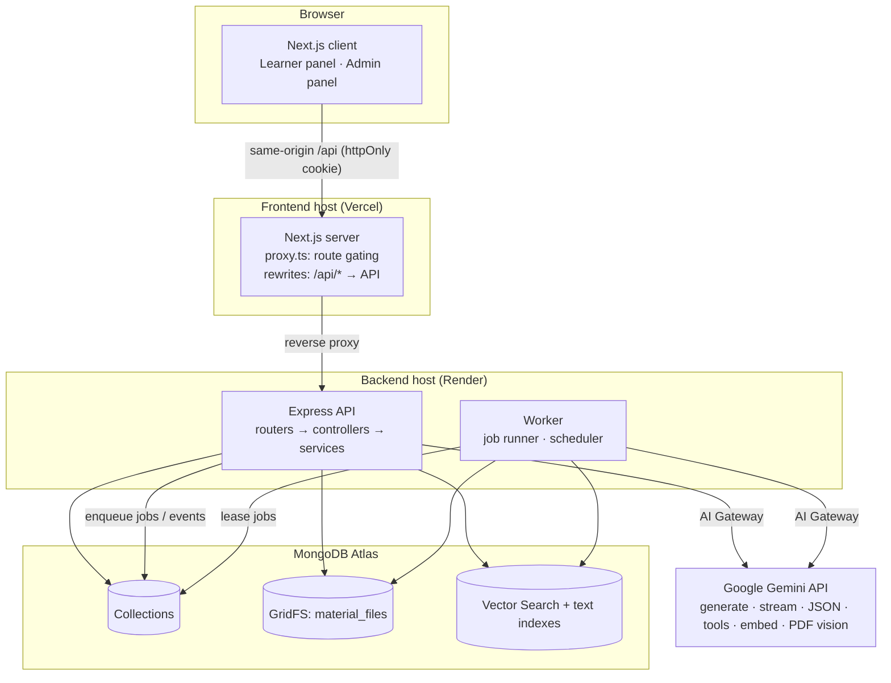
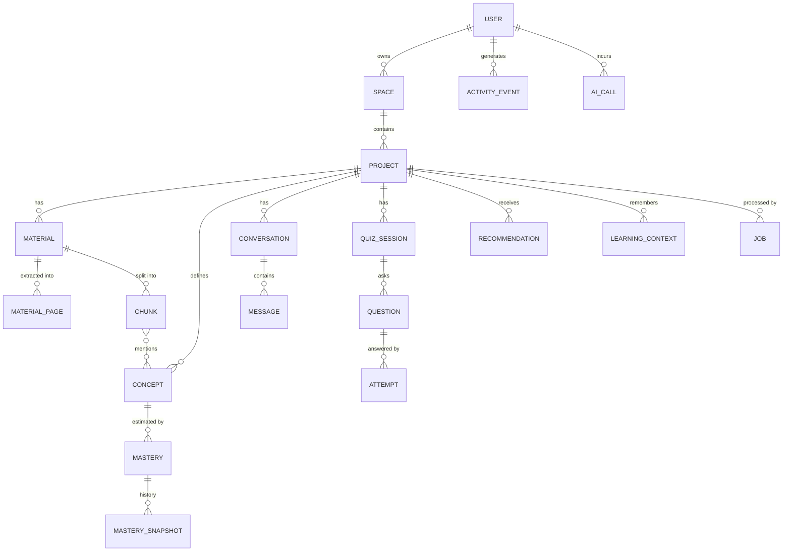
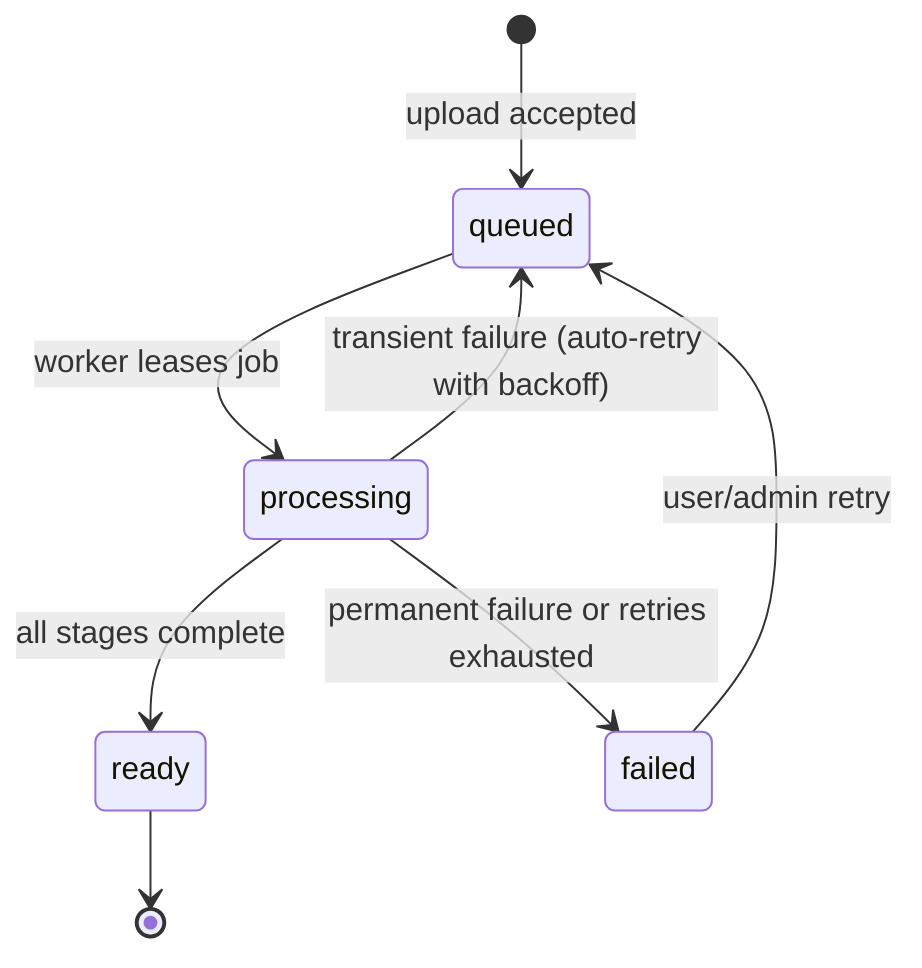

# AI Study Companion — System Architecture

> **Living document.** Every change that affects the architecture updates this file in the same change.
> Build progress is tracked in [§31 Build plan & status](#31-build-plan--status); history in [§33 Changelog](#33-changelog).

| | |
|---|---|
| **Version** | 1.1 |
| **Last updated** | 2026-09-25 |
| **Current phase** | Phase 1 — Foundation ✅ built and verified (awaiting review); Phase 2 next |
| **Stack** | Next.js 16 · Node.js 22 / Express 5 · MongoDB Atlas 8 · Google Gemini |

---

## Table of contents

1. [Purpose & scope](#1-purpose--scope)
2. [Technology stack](#2-technology-stack)
3. [System overview](#3-system-overview)
4. [Repository layout & modules](#4-repository-layout--modules)
5. [Backend architecture](#5-backend-architecture)
6. [Authentication & authorization](#6-authentication--authorization)
7. [Data model](#7-data-model)
8. [API reference](#8-api-reference)
9. [Materials & knowledge pipeline](#9-materials--knowledge-pipeline)
10. [Background processing](#10-background-processing)
11. [Events & activity](#11-events--activity)
12. [AI layer](#12-ai-layer)
13. [Retrieval](#13-retrieval)
14. [AI Tutor](#14-ai-tutor)
15. [AI ↔ application tools](#15-ai--application-tools)
16. [Adaptive quiz & assessment](#16-adaptive-quiz--assessment)
17. [Mastery model](#17-mastery-model)
18. [Growth analysis](#18-growth-analysis)
19. [Recommendations](#19-recommendations)
20. [Persistent learning context](#20-persistent-learning-context)
21. [Analytics](#21-analytics)
22. [Admin dashboard](#22-admin-dashboard)
23. [Observability](#23-observability)
24. [AI evaluation](#24-ai-evaluation)
25. [Security](#25-security)
26. [Reliability & failure handling](#26-reliability--failure-handling)
27. [Performance](#27-performance)
28. [Frontend architecture](#28-frontend-architecture)
29. [Testing strategy](#29-testing-strategy)
30. [Configuration & deployment](#30-configuration--deployment)
31. [Build plan & status](#31-build-plan--status)
32. [Key decisions, simplifications & future work](#32-key-decisions-simplifications--future-work)
33. [Changelog](#33-changelog)

---

## 1. Purpose & scope

AI Study Companion is a **persistent, contextual, measurable AI learning companion**. A learner organises learning into
**Spaces** (broad areas) and **Projects** (focused journeys), adds material, learns with a grounded AI Tutor, is assessed
adaptively, and receives evidence-based guidance on what to do next. An **Admin Dashboard** gives operators visibility
into users, learning activity, AI usage/quality, background processing and system health.

**Core learning loop** (the primary success criterion — the user completes it without losing context):

```
Space → Project → Material → Knowledge → Tutor → Grounded answer + citation → Unsupported-question handling
      → Adaptive quiz → Assessment → Mastery → Growth → Analytics → Recommendation → Continue learning
```

The system continuously answers three questions, each backed by explicit evidence and a subsystem:

| Question | Evidence | Subsystems |
|---|---|---|
| What am I learning? | Spaces, Projects, goals, materials, concepts, conversations | Workspace, Knowledge |
| How well am I learning it? | Quiz answers, open-ended grading, repeated mistakes, Tutor interactions | Assessment, Mastery |
| What should I do next? | Mastery trends, weaknesses, goals, history, previous recommendations | Growth, Recommendations, Learning context |

**PRD principles → concrete mechanisms**

| Principle | Mechanism in this architecture |
|---|---|
| Context first | Every tenant document carries `ownerId` (+ `projectId`); retrieval, memory and AI tools are scoped by **server-bound** project context — never by model-supplied ids (§13, §15). |
| Evidence over guessing | Retrieval sufficiency gate before generation, per-answer grounding status, explicit insufficient-evidence path (§14); mastery shown with confidence (§17). |
| Persistent but relevant context | Salience-ranked `learning_context` items + rolling conversation summaries, selected top-K under a token budget (§20). |
| Asynchronous by design | Durable MongoDB-backed job queue + worker; events trigger workflows (§10, §11). |
| Observable AI | AI Gateway records every call (model, feature, latency, tokens, cost, retries, fallbacks, retrieval trace, prompt version) (§12, §23). |
| Safe AI interaction | Allow-listed tool registry, zod-validated arguments and outputs, authorization on every tool call (§15, §25). |

---

## 2. Technology stack

| Layer | Choice | Why | Alternatives considered |
|---|---|---|---|
| Frontend | **Next.js 16** (App Router), React 19, TypeScript | Required. Nested layouts fit the two panels; `rewrites` give a same-origin API proxy; Vercel-native. | — |
| Styling / UI | Tailwind CSS v4 design tokens, small in-house UI kit, Radix primitives (dialog, dropdown), lucide icons | Consistent blue "AI" theme, accessible primitives, no heavy component framework. | MUI (heavy), shadcn CLI (equivalent; we hand-roll the few components needed) |
| Client data | TanStack Query v5 | Caching, invalidation, polling of processing status, request dedupe. | SWR; RSC fetching (would need cookie forwarding) |
| Backend | **Node.js 22 + Express 5**, TypeScript (ESM) | Required. Express 5 forwards async errors natively; SSE streaming is trivial; mature ecosystem. | Fastify, NestJS (more ceremony) |
| Validation | Zod 4 | One schema language for requests, env config and AI structured outputs (`z.toJSONSchema`). | Joi, class-validator |
| Database | **MongoDB Atlas 8.0** + Mongoose 9 | Required. Documents suit AI artifacts; Vector Search, text index and GridFS in the same cluster; replica set → transactions. | Postgres + pgvector |
| File storage | GridFS bucket `material_files` behind a `StorageProvider` interface | No extra service/credentials; files carry ownership metadata; streamable. | S3 / R2 (drop-in via the interface) |
| Retrieval | Atlas Vector Search (`$vectorSearch` with `projectId` pre-filter) + `$text`, fused with RRF; in-process cosine fallback | Hybrid recall (terms, acronyms, semantics); isolation enforced inside the index query. | Pinecone / Qdrant (extra infrastructure) |
| AI provider | **Google Gemini** via `@google/genai`, behind an `AIProvider` interface | Key available; native PDF understanding (OCR), JSON-schema output, function calling, embeddings. | OpenAI / Anthropic (drop-in via the interface) |
| Background jobs | Custom durable queue in MongoDB + worker (same codebase, `APP_ROLE`) | No Redis; atomic leasing with `findOneAndUpdate`; idempotency via unique keys; survives restarts. | BullMQ + Redis, Agenda |
| Auth | Email + password; **bcrypt** (cost 12); JWT (HS256) in an **httpOnly, SameSite=Lax** cookie; RBAC (`user`, `admin`) | Required (no OAuth). httpOnly prevents token theft via XSS; same-origin proxy avoids third-party-cookie blocking. | Bearer token in localStorage (XSS-exposed) |
| Logging | pino + pino-http, AsyncLocalStorage request context | Structured JSON logs carrying `requestId` / `userId`. | winston |
| Testing | Vitest + Supertest + mongodb-memory-server; `MockAIProvider` | Fast, isolated, deterministic (no network in unit/integration tests). | Jest |
| Deployment | Vercel (frontend) + Render (API + worker) + MongoDB Atlas | Free tiers, public URLs, zero ops. | Railway, Fly.io |

### Model configuration (verified against the project's key on 2026-09-25)

| Purpose | Env var | Default | Verification notes |
|---|---|---|---|
| Primary generation (Tutor, quiz generation, grading) | `AI_MODEL_PRIMARY` | `gemini-3.7-flash` | OK (~2–4 s for a trivial prompt, thinking model) |
| Fallback chain | `AI_MODEL_FALLBACKS` | `gemini-3.6-flash,gemini-3.5-flash-lite` | OK; used on 429 / 5xx / timeout |
| Light tasks (intent, query rewrite, summaries, recommendation phrasing, OCR) | `AI_MODEL_LIGHT` | `gemini-3.5-flash-lite` | OK (~1 s, no thinking tokens) |
| Embeddings | `AI_EMBEDDING_MODEL` / `AI_EMBEDDING_DIM` | `gemini-embedding-2` / `768` | OK; unit-normalised vectors; batch endpoint OK |
| Not used | — | `gemini-2.5-*` (closed to new keys → 404), `*-pro` (free-tier quota 0 → 429), `gemini-3.8-flash` (503 "high demand" at test time) | Proves the need for the fallback chain; all names are env-configurable. |

---

## 3. System overview



Logical layering (maps to PRD §17):

```
Frontend (Next.js) ── same-origin /api, cookie session
   ↓
API layer ── Express routers: request context · authentication · authorization · validation · rate limits · CSRF guard
   ↓
Business logic (modules/services)
 ┌────────────┬─────────────┬─────────────┬──────────────┬──────────────┬─────────┐
 Workspace    Knowledge     AI Tutor      Assessment     Learning        Admin
 spaces,      materials,    retrieval,    quiz, grading, analytics,      platform
 projects     pipeline      context       mastery        growth, recs    views
   ↓
Data & knowledge ── MongoDB documents · GridFS files · vector/text indexes · learning_context memory
   ↓
Background processing ── durable job queue · worker · scheduler · event → workflow subscriptions
   ↓
AI / external ── AI Gateway (timeouts, retries, fallbacks, validation, accounting) → Gemini
   ↓
Observability ── pino logs · ai_calls · job telemetry · retrieval traces · health · eval runs
```

---

## 4. Repository layout & modules

```
Ai_study_companion/
├── docs/ARCHITECTURE.md          ← this file (plus later: AI_USAGE.md, PROMPTS.md, EVALUATION.md)
├── backend/
│   ├── src/
│   │   ├── index.ts              bootstrap: config → db → admin bootstrap → HTTP server and/or worker (APP_ROLE) → graceful shutdown
│   │   ├── app.ts                Express app factory (imported by tests; no listening side effects)
│   │   ├── config/env.ts         zod-validated environment (fail fast)
│   │   ├── lib/                  logger, AppError, request context (ALS), typed handler(), db, validation helpers, constants
│   │   ├── middleware/           requestContext, authenticate + requireRole, csrfGuard, rateLimits, errorHandler
│   │   ├── models/               one Mongoose model per collection (§7)
│   │   ├── modules/<domain>/     <domain>.routes.ts (routing + thin typed handlers) · .service.ts · .schemas.ts
│   │   ├── modules/{serializers,aggregates,workspace}.ts   DTO mapping · shared count pipelines · activity touch + next-step rules
│   │   ├── storage/              StorageProvider interface + GridFS implementation
│   │   ├── jobs/                 queue.ts · worker.ts · scheduler.ts · handlers/*            (Phase 2)
│   │   ├── ai/                   provider.ts · gemini.ts · mock.ts · gateway.ts · prompts/* · tools/*   (Phase 3)
│   │   └── scripts/              seed-admin.ts
│   └── tests/                    Vitest + Supertest + mongodb-memory-server
└── frontend/
    └── src/
        ├── app/                  (auth)/login|register · (learner)/dashboard|spaces|projects · admin/*
        ├── components/           ui/ (kit) · layout/ (shells, sidebars) · feature components
        ├── lib/                  api client, auth provider, query keys, formatters, constants
        └── proxy.ts              navigation gating (session-cookie presence + role hint)
```

| Module | Responsibility | Phase |
|---|---|---|
| `auth` | Register, login, logout, current user, password hashing, session cookie | 1 |
| `spaces` | CRUD, Space dashboard data | 1 |
| `projects` | CRUD, Project dashboard data, recent projects | 1 |
| `materials` | PDF upload, list, stream file, rename, delete (retry: P2) | 1 |
| `activity` | Event recording, user activity feed, home dashboard aggregate | 1 |
| `admin` | Platform-wide read views (grows every phase) | 1+ |
| `health` | Liveness/readiness | 1 |
| `jobs` | Durable queue, worker, scheduler, reconciler | 2 |
| `knowledge` | Processing pipeline, pages, chunks, concepts, retrieval | 2–3 |
| `ai` | Provider abstraction, gateway, prompts, tools, AI call logging | 3 |
| `tutor` | Conversations, grounded streaming answers, feedback | 3 |
| `quiz` | Adaptive sessions, question generation, grading | 4 |
| `mastery` | Ability model, snapshots | 4 |
| `growth` · `recommendations` · `context` · `analytics` | Trends, next actions, learner memory, aggregates | 5 |
| `evals` | Offline suites, online checks, regression reports | 6 |

---

## 5. Backend architecture

**Layering rules**

1. **Routes** declare the path and middleware chain (`authenticate` → `requireRole?` → rate limit) and a thin handler built with
   `handler({ params, query, body }, fn)`: it zod-validates each part (400 on failure), asserts the caller's identity and serialises the
   return value (`undefined` → 204). Express 5 makes `req.query` read-only, so validated input is passed to `fn` rather than written back.
2. **Handlers** translate HTTP ↔ service calls only (no business rules, no queries); there is no separate controller layer.
3. **Services** hold business rules. **Every tenant-scoped service function takes `ownerId` first and filters by it** — isolation
   is structural rather than remembered per endpoint. Services emit activity events (§11).
4. **Models** define schemas and indexes only.
5. **Admin services are the only code allowed to read across tenants** and are mounted exclusively behind `requireRole('admin')`.

**Cross-cutting concerns**

| Concern | Implementation |
|---|---|
| Configuration | `config/env.ts` parses `process.env` with zod once; the process exits with a readable report on invalid config. |
| Request context | `AsyncLocalStorage` holds `{ requestId, userId, role, ip }`; read by the logger, activity recorder, AI gateway and job enqueue (propagated as `traceId`). |
| Errors | `AppError(status, code, message, details)`. Central handler maps AppError, ZodError, Mongoose Cast/Validation errors, duplicate key `E11000` → 409, Multer limits → 413, anything else → 500 (message hidden in production). |
| Response shape | Success: resource JSON (`{ items, page, limit, total }` for lists). Error: `{ "error": { "code", "message", "details", "requestId" } }`. |
| Validation | `validate({ body, query, params })` with zod; ObjectId params validated; unknown body keys stripped; strings trimmed and length-bounded. |
| Security middleware | helmet, CORS allow-list (only relevant for direct cross-origin calls), JSON limit 1 MB, CSRF guard, rate limits (§6). |
| Pagination | `page ≥ 1`, `limit 1–100` (default 20) → `{ items, page, limit, total }`. |

**HTTP status conventions**: 200 OK · 201 Created · 204 No Content · 400 `VALIDATION_ERROR` · 401 `UNAUTHENTICATED` · 403 `FORBIDDEN` / `CSRF_REJECTED` ·
404 `NOT_FOUND` (also for other users' resources) · 409 `CONFLICT` / `DUPLICATE_MATERIAL` / `EMAIL_TAKEN` · 413 `FILE_TOO_LARGE` ·
415 `UNSUPPORTED_FILE_TYPE` · 429 `RATE_LIMITED` · 500 `INTERNAL_ERROR` · 503 `DEPENDENCY_UNAVAILABLE`.

---

## 6. Authentication & authorization

```mermaid
sequenceDiagram
  participant B as Browser
  participant N as Next.js (same origin)
  participant A as Express API
  participant M as MongoDB
  B->>N: POST /api/auth/login {email, password} + X-Requested-With
  N->>A: proxied request
  A->>M: find user by normalised email (+passwordHash)
  A->>A: bcrypt.compare (dummy compare if user missing)
  A-->>N: 200 {user} + Set-Cookie asc_session=JWT; HttpOnly; SameSite=Lax; Secure(prod); Path=/
  N-->>B: response (cookie stored for the frontend origin)
  B->>N: GET /api/spaces (cookie sent automatically)
  N->>A: proxied request
  A->>A: verify JWT → load user → check status & tokenVersion
  A->>M: Space.find({ ownerId })
```

- **Passwords**: bcrypt with cost 12 (configurable; tests use 4). Policy: at least 8 characters, at most **72 bytes** (bcrypt ignores
  anything beyond, so longer inputs are rejected rather than silently truncated), at least one letter and one digit. Emails trimmed +
  lower-cased; unique index.
- **Anti-enumeration**: login returns the same 401 for unknown email and wrong password, and performs a dummy bcrypt compare for unknown emails.
- **Session token**: JWT HS256, secret ≥ 32 chars from env; claims `{ sub, role, tv, iat, exp }`; lifetime `SESSION_TTL_DAYS` (default 7) for both the JWT and the cookie. `tv` mirrors `user.tokenVersion`,
  which is incremented on password change / "log out everywhere" to revoke outstanding tokens.
- **`authenticate`**: reads the cookie → verifies → loads `{ role, status, tokenVersion }` → rejects disabled users and stale `tv` → sets `req.auth`.
  Updates `lastActiveAt` at most every 5 minutes (write throttling).
- **RBAC**: roles `user` and `admin`. `/api/admin/*` requires `admin`. Registration always creates `user`; `role` is never accepted from clients.
- **Admin bootstrap**: at startup, if `ADMIN_EMAIL`/`ADMIN_PASSWORD` are set and that user does not exist, an admin is created (idempotent).
  `npm run seed:admin` explicitly upserts the admin and resets its password from env.
- **CSRF**: the cookie is `SameSite=Lax` (not sent on cross-site subrequests) **and** the API rejects unsafe methods
  (POST/PUT/PATCH/DELETE) without `X-Requested-With: fetch` — a cross-site form cannot set it, and a cross-site `fetch` would need a CORS preflight that the API does not grant.
- **Frontend gating**: `proxy.ts` redirects unauthenticated navigations to `/login` (cookie presence) and reads the JWT payload's `role` only as a
  routing hint. **The API is the only authority**: every request is re-verified server-side.
- **Tenant isolation**: owner-scoped queries everywhere; foreign ids return **404, not 403** (no existence oracle); nested resources resolve through
  owned parents (`material → project → owner`). Background jobs carry `ownerId`/`projectId` and re-verify ownership before acting (§10).
- **Rate limits**: auth 20 req / 15 min / IP · uploads 30 / hour / user · Tutor 20 msg / min / user (P3) · quiz answers 30 / min / user (P4).

---

## 7. Data model



**Conventions**: `_id` ObjectId; `createdAt`/`updatedAt` timestamps; tenant-scoped documents carry `ownerId` (+ `spaceId`, `projectId` where
applicable) for isolation and as index prefixes; enums stored as strings; AI-generated fields are zod-validated before any write.
Deleting a Space/Project cascades through one `cascade` service that is extended whenever a collection is added.

### 7.1 Collections

**`users`** (P1) — `name` (2–80) · `email` (unique, lowercase) · `passwordHash` (bcrypt, `select:false`) · `role` (`user`|`admin`) ·
`status` (`active`|`disabled`) · `tokenVersion` · `preferences` (P5: explanation style, pace) · `lastLoginAt` · `lastActiveAt`.
Indexes: `{email:1}` unique · `{role:1, createdAt:-1}` · `{lastActiveAt:-1}`.

**`spaces`** (P1) — `ownerId` · `name` (1–80) · `description` (1–500) · `color` (palette key) · `icon` (icon key) · `lastActivityAt`.
Indexes: `{ownerId:1, lastActivityAt:-1}`.

**`projects`** (P1) — `ownerId` · `spaceId` · `name` (1–100) · `description` (≤1000) · `learningGoal` (1–500) · `status` (`active`|`archived`) ·
`lastActivityAt` · `stats` (P2 counters maintained by the pipeline: `materialCount`, `readyMaterialCount`, `pageCount`, `conceptCount`).
Indexes: `{ownerId:1, spaceId:1, createdAt:-1}` · `{ownerId:1, lastActivityAt:-1}`.

**`materials`** (P1) — `ownerId` · `spaceId` · `projectId` · `title` (1–200) · `originalFilename` · `mimeType` · `sizeBytes` · `sha256` ·
`storage {provider:'gridfs', fileId}` · `status` (`queued`|`processing`|`ready`|`failed`) · `processing {stage, progress, attempts, jobId,
startedAt, finishedAt, completedStages[], error{code, message, retryable}}` · `pageCount` · `stats {chunkCount, conceptCount, ocrPageCount}` · `summary`.
Indexes: `{projectId:1, createdAt:-1}` · `{ownerId:1, createdAt:-1}` · `{projectId:1, sha256:1}` **unique** (duplicate guard) · `{status:1, updatedAt:1}` (reconciler).

**GridFS `material_files`** (P1) — file metadata `{ownerId, projectId, materialId?, sha256}`; content type `application/pdf`.

**`material_pages`** (P2) — `ownerId` · `projectId` · `materialId` · `pageNumber` · `text` · `method` (`text`|`ocr`) · `charCount` · `sectionTitle`.
Index: `{materialId:1, pageNumber:1}` unique.

**`chunks`** (P2) — `ownerId` · `projectId` · `materialId` · `index` · `pageStart` · `pageEnd` · `sectionTitle` · `text` · `tokenEstimate` ·
`embedding` (768 floats) · `conceptIds[]` · `flags {suspectedInjection}`.
Indexes: `{materialId:1, index:1}` unique · `{projectId:1, conceptIds:1}` · text `{projectId:1, text:'text'}` ·
Atlas Vector Search `chunks_vector` (`embedding`, 768, cosine; filter fields `projectId`, `ownerId`, `materialId`).

**`concepts`** (P2) — `ownerId` · `projectId` · `name` · `slug` · `description` · `importance` (0–1) · `sources [{materialId, pages[]}]` · `embedding`.
Index: `{projectId:1, slug:1}` unique.

**`conversations`** (P3) — `ownerId` · `projectId` · `title` · `summary` · `summarizedThroughMessageId` · `messageCount` · `lastMessageAt`.
Index: `{ownerId:1, projectId:1, lastMessageAt:-1}`.

**`messages`** (P3) — `ownerId` · `projectId` · `conversationId` · `role` (`user`|`assistant`) · `content` · `mode` (`grounded`|`general`) ·
`citations [{label:'S1', materialId, materialTitle, pageStart, pageEnd, chunkId, snippet, score}]` ·
`grounding {status:'grounded'|'partial'|'insufficient'|'general', topScore, evidenceCount}` · `toolCalls [{name, args, status, resultSummary}]` ·
`feedback {rating:'up'|'down', comment}` · `aiCallId` · `latencyMs`. Index: `{conversationId:1, createdAt:1}`.

**`quiz_sessions`** (P4) — `ownerId` · `projectId` · `status` (`active`|`completed`|`abandoned`) · `mode` (`adaptive`|`focused`|`review`) ·
`focusConceptIds[]` · `targetCount` · `answeredCount` · `correctCount` · `scoreAvg` · `questionIds[]` · `startedAt` · `completedAt`.

**`questions`** (P4) — `ownerId` · `projectId` · `sessionId` · `conceptIds[]` · `type` (`mcq`|`open`) · `difficulty` (1–5) ·
`cognitiveLevel` (`recall`|`understand`|`apply`|`analyze`) · `stem` · `options [{id, text}]` · `correctOptionId` · `explanation` ·
`rubric {keyPoints[], sampleAnswer}` · `sources [{materialId, pageStart, pageEnd, chunkId}]` · `selection {priority, reason, predictedP}` · `stemHash` · `aiCallId`.

**`attempts`** (P4) — `ownerId` · `projectId` · `sessionId` · `questionId` · `conceptIds[]` · `response {optionId | text}` · `outcome` (0–1) ·
`isCorrect` · `feedback {summary, understood[], missing[], misconceptions[]}` · `grading {status:'graded'|'pending'|'failed', method:'exact'|'ai', aiCallId}` ·
`masteryDelta [{conceptId, before, after}]` · `timeMs` · `idempotencyKey` (unique).

**`mastery`** (P4) — `ownerId` · `projectId` · `conceptId` · `theta` · `evidenceCount` · `correctCount` · `byLevel {recall|understand|apply|analyze: {n, sum}}` ·
`recentOutcomes` (last 10) · `lastPracticedAt`. Index: `{ownerId:1, projectId:1, conceptId:1}` unique.

**`mastery_snapshots`** (P4) — `ownerId` · `projectId` · `conceptId` · `mastery` · `theta` · `evidenceCount` · `cause {type, attemptId}`.
Index: `{projectId:1, conceptId:1, createdAt:1}`.

**`recommendations`** (P5) — `ownerId` · `projectId` · `spaceId` · `kind` · `title` · `rationale` ·
`action {type:'open_material'|'start_quiz'|'ask_tutor'|'review_concept'|'upload_material', params}` · `priority` ·
`status` (`active`|`dismissed`|`completed`|`expired`) · `source` (`rules`|`ai`) · `stateHash` · `evidence {conceptIds, metrics}` · `aiCallId` · `expiresAt` · `actedAt`.

**`learning_context`** (P5) — `ownerId` · `projectId` (null = user-level preference) ·
`kind` (`goal`|`preference`|`strength`|`weakness`|`mistake_pattern`|`milestone`|`tutor_note`) · `text` (≤300) · `conceptIds[]` · `salience` (0–1) ·
`evidenceCount` · `source {type, id}` · `embedding` · `lastReinforcedAt`.

**`activity_events`** (P1) — `ownerId` (whose data) · `actorId` (who acted — differs for admin/system) · `type` · `spaceId?` · `projectId?` · `materialId?` ·
`metadata` (name snapshots so history survives renames/deletes) · `eventKey` (optional idempotency key).
Indexes: `{ownerId:1, createdAt:-1}` · `{projectId:1, createdAt:-1}` · `{spaceId:1, createdAt:-1}` · `{type:1, createdAt:-1}` · `{createdAt:-1}` ·
`{eventKey:1}` unique with `partialFilterExpression: {eventKey: {$type: 'string'}}` (a partial index, unlike a sparse one, never indexes an explicit `null`).

**`jobs`** (P2) — `type` · `payload` · `ownerId` · `projectId` · `status` (`queued`|`running`|`succeeded`|`failed`|`cancelled`) · `priority` · `attempts` ·
`maxAttempts` · `runAt` · `lockedBy` · `lockedUntil` · `lastError {code, message, stack}` · `errorHistory` (last 5) · `idempotencyKey` (unique) · `traceId` ·
`progress {stage, pct}` · `result` · `startedAt` · `finishedAt` · `durationMs`.
Indexes: `{status:1, priority:-1, runAt:1}` · `{idempotencyKey:1}` unique · `{type:1, status:1, createdAt:-1}` · `{ownerId:1, createdAt:-1}`.

**`ai_calls`** (P3) — `traceId` · `requestId` · `jobId` · `ownerId` · `projectId` · `feature` · `operation` (`generate`|`stream`|`structured`|`embed`|`document`) ·
`provider` · `model` · `attemptedModels[]` · `promptVersion` · `status` · `errorType` · `errorMessage` · `retries` · `fallbackUsed` · `latencyMs` · `ttftMs` ·
`usage {inputTokens, outputTokens, thinkingTokens, totalTokens}` · `costUsd` · `inputPreview` / `outputPreview` (truncated) · `metadata` (retrieval trace, tool calls, validation).
Indexes: `{createdAt:-1}` · `{feature:1, createdAt:-1}` · `{model:1, createdAt:-1}` · `{ownerId:1, createdAt:-1}` · `{status:1, createdAt:-1}` · `{traceId:1}` · TTL 90 days.

**`ai_evaluations`** (P3/P6) — online checks: `aiCallId` · `messageId?` · `feature` · `evaluator` (`rule`|`llm_judge`|`user`) · `metrics` · `passed` · `notes`.

**`eval_runs`** (P6) — `suite` · `promptVersions` · `models` · `startedAt` · `finishedAt` · `metrics` · `thresholds` · `passed` · `baselineRunId` · `regressions[]` · `results[]`.

**`audit_logs`** (P1) — `actorId` · `action` (e.g. `admin.material.viewed`) · `targetType` · `targetId` · `ownerId` · `ip` · `userAgent`.

---

## 8. API reference

All routes are under `/api`. 🔓 public · 🔒 authenticated · 👑 admin. Unsafe methods require the `X-Requested-With: fetch` header.

**Auth & health**

| Method | Path | Access | Purpose | Phase |
|---|---|---|---|---|
| POST | `/auth/register` | 🔓 | Create learner account, start session | 1 |
| POST | `/auth/login` | 🔓 | Start session | 1 |
| POST | `/auth/logout` | 🔓 | Clear session cookie | 1 |
| GET | `/auth/me` | 🔒 | Current user | 1 |
| PATCH | `/auth/me` · POST `/auth/change-password` | 🔒 | Profile / preferences / password (bumps `tokenVersion`) | 5 |
| GET | `/health` · `/health/ready` | 🔓 | Liveness · readiness (DB ping) | 1 |
| GET | `/` (outside `/api`) | 🔓 | API name, version and health link (deployment smoke check) | 1 |

**Workspace**

| Method | Path | Access | Purpose | Phase |
|---|---|---|---|---|
| GET | `/dashboard` | 🔒 | Home: counts, continue learning, recent projects, recent activity, next step | 1 (enriched in 5) |
| GET · POST | `/spaces` | 🔒 | List own Spaces (with project/material counts) · create | 1 |
| GET · PATCH · DELETE | `/spaces/:spaceId` | 🔒 | Space dashboard data · update · delete (cascade) | 1 |
| GET · POST | `/spaces/:spaceId/projects` | 🔒 | List · create Project (`name`, `description`, `learningGoal`) | 1 |
| GET | `/projects/recent` | 🔒 | Recently active Projects across Spaces | 1 |
| GET · PATCH · DELETE | `/projects/:projectId` | 🔒 | Project dashboard data · update · delete (cascade) | 1 |
| GET | `/activity` | 🔒 | Own activity feed (`projectId`, `spaceId`, `type`, `limit`) | 1 |

**Materials & knowledge**

| Method | Path | Access | Purpose | Phase |
|---|---|---|---|---|
| GET · POST | `/projects/:projectId/materials` | 🔒 | List · upload PDF (multipart `file`, optional `title`) → 201, status `queued` | 1 |
| GET · PATCH · DELETE | `/projects/:projectId/materials/:materialId` | 🔒 | Detail (processing state) · rename · delete (file + derived data) | 1 |
| GET | `/projects/:projectId/materials/:materialId/file` | 🔒 | Stream the PDF inline (supports `#page=N` deep links for citations) | 1 |
| POST | `/projects/:projectId/materials/:materialId/retry` | 🔒 | Re-enqueue failed processing | 2 |
| GET | `/projects/:projectId/materials/:materialId/pages/:page` | 🔒 | Extracted page text (citation viewer) | 2 |
| GET | `/projects/:projectId/concepts` | 🔒 | Project concepts (+ mastery when available) | 2 |

**Tutor** (P3)

| Method | Path | Purpose |
|---|---|---|
| GET · POST | `/projects/:projectId/conversations` | List · create conversation |
| GET · DELETE | `/projects/:projectId/conversations/:conversationId` | Conversation with messages (paginated) · delete |
| POST | `/projects/:projectId/conversations/:conversationId/messages` | Send message → **SSE stream** (§14); body `{content, mode?:'grounded'|'general'}` |
| POST | `/projects/:projectId/messages/:messageId/feedback` | Thumbs up/down + comment (online evaluation signal) |

**Quiz, mastery, growth, recommendations, analytics** (P4–P5)

| Method | Path | Purpose | Phase |
|---|---|---|---|
| GET · POST | `/projects/:projectId/quizzes` | History · start session `{mode, targetCount?, conceptIds?}` | 4 |
| GET | `/projects/:projectId/quizzes/:sessionId` | Session state and results | 4 |
| POST | `/projects/:projectId/quizzes/:sessionId/next` | Next adaptive question | 4 |
| POST | `/projects/:projectId/quizzes/:sessionId/questions/:questionId/answer` | Submit answer (idempotency key) → evaluation + mastery delta | 4 |
| POST | `/projects/:projectId/quizzes/:sessionId/complete` | Complete → learning workflow | 4 |
| GET | `/projects/:projectId/mastery` | Concept mastery with confidence | 4 |
| GET | `/projects/:projectId/growth?window=30d` | Trends + improving / stable / attention | 5 |
| GET · POST | `/projects/:projectId/recommendations` (+ `/:id/dismiss`, `/:id/complete`, `/refresh`) | Next actions lifecycle | 5 |
| GET | `/projects/:projectId/analytics` · `/analytics/global` | Project and global analytics | 5 |

**Admin** (👑 all)

| Method | Path | Purpose | Phase |
|---|---|---|---|
| GET | `/admin/overview` | KPIs, 14-day activity series, recent sign-ups, recent activity | 1 |
| GET | `/admin/users` · `/admin/users/:userId` | Search/paginate users · learning journey of one user | 1 (+ P4/P5 data) |
| GET | `/admin/spaces` · `/admin/projects` · `/admin/materials` | Platform-wide lists with filters (`userId`, `spaceId`, `projectId`, `status`, `search`) | 1 |
| GET | `/admin/materials/:materialId/file` | View a PDF for debugging (audit-logged) | 1 |
| GET | `/admin/activity` · `/admin/activity/types` | Filter by user, Space, Project, type, time period (`from`/`to`) · known event types | 1 |
| GET | `/admin/system/health` | API, DB, storage, AI provider, worker status | 1 (worker: 2) |
| GET · POST | `/admin/jobs` · `/admin/jobs/:jobId/retry` | Queue stats, failures, retry | 2 |
| GET | `/admin/ai/usage` · `/admin/ai/calls` · `/admin/ai/calls/:id` | Usage by feature/model, latency p50/p95, cost, errors; call trace | 3 |
| GET | `/admin/ai/evaluations` · `/admin/evals/runs/:id` | Online checks and offline eval runs | 6 |
| GET | `/admin/engagement` · `/admin/learning` | DAU/WAU/MAU, retention; quiz/mastery analytics | 5 |

---

## 9. Materials & knowledge pipeline



**Upload (P1, synchronous and fast)**

0. Project ownership is checked **before** multer reads the body, so no bytes are accepted for a Project the caller doesn't own.
1. Multer memory storage, limit `MAX_UPLOAD_MB` (default 20 MB), one file per request; `defParamCharset: 'utf8'` so non-ASCII filenames survive.
2. Validate: PDF MIME (`application/pdf`, `application/x-pdf` or `application/octet-stream`) **and** `.pdf` extension **and** the `%PDF-`
   signature within the first 1024 bytes; reject empty files. The client-side check is extension-only (fast feedback); the server is the authority.
3. SHA-256 of the bytes → if the same file already exists in this Project → 409 `DUPLICATE_MATERIAL` (returns the existing id).
4. Stream bytes to GridFS with ownership metadata.
5. Insert the material with `status: queued`. The unique `{projectId, sha256}` index closes the race between concurrent uploads; the loser's GridFS file is deleted.
6. Record `material.uploaded` (P2: its subscription enqueues `material.process`).
7. Respond `201` with the material. Nothing heavy runs in the request.

**Serving files**: `GET …/file` streams from GridFS with `Content-Type: application/pdf`, `Content-Disposition: inline` (RFC 5987
filename), `Content-Length`, `nosniff`, `Cache-Control: private`. The API-wide CSP header is removed on PDF responses because it can
stop built-in PDF viewers from rendering, and it protects nothing for a verified PDF that is never interpreted as HTML (§32 D12).
Client disconnects mid-stream are expected and not logged as errors.

**Processing (P2, job `material.process`)** — stages are checkpointed in `processing.completedStages`, so a retry resumes where it stopped:

| Stage | Work | Output |
|---|---|---|
| `extract` | Load from GridFS; per-page text via pdf.js (`unpdf`); normalise whitespace, de-hyphenate; page count; reject encrypted/over-limit files. | `material_pages` (`method:'text'`) |
| `ocr` | Pages with < 40 chars (scanned) or image-heavy → split with `pdf-lib` into small PDFs → Gemini document understanding (transcribe text, render tables as Markdown, describe diagrams); batched ≤ 5 pages per call, capped at 40 pages. | `material_pages` (`method:'ocr'`) |
| `chunk` | Page-aware splitter: ~1,000 chars target, 150 overlap, paragraph → sentence boundaries, tiny pages merged with neighbours (`pageStart`–`pageEnd`), section titles carried; injection-pattern heuristics set `flags.suspectedInjection`. Delete-then-insert per material ⇒ idempotent. | `chunks` |
| `embed` | `batchEmbedContents` (≤ 100 texts/call, task `RETRIEVAL_DOCUMENT`, title = material title), L2-normalised. | `chunks.embedding` |
| `concepts` | Map-reduce with structured output: per ~15-page group extract `{name, description, importance, pages}`; merge within and across materials (slug + embedding similarity ≥ 0.90); link chunks to their top-2 concepts by cosine (no per-chunk LLM call); short material summary. | `concepts`, `chunks.conceptIds`, `materials.summary` |
| `finalize` | `status: ready`, stats, project counters; record `material.processed`. | — |

Limits: 300 pages per PDF, 60 s parse timeout, 40 OCR pages per material. Error codes: `PDF_ENCRYPTED`, `PDF_CORRUPT`, `TOO_MANY_PAGES`, `NO_EXTRACTABLE_TEXT` (permanent);
`AI_RATE_LIMITED`, `AI_UNAVAILABLE`, `AI_TIMEOUT`, `DB_ERROR` (retryable). The UI polls material status every 2 s while any material is `queued`/`processing`.

---

## 10. Background processing

A durable queue in the `jobs` collection; the worker runs in the API process (`APP_ROLE=all`) or separately (`APP_ROLE=worker`).

| Operation | Mechanism |
|---|---|
| Enqueue | Insert `{type, payload, ownerId, projectId, idempotencyKey, runAt, maxAttempts, priority, traceId}`. Duplicate `idempotencyKey` (E11000) returns the existing job — **duplicate-job protection**. |
| Claim | Atomic `findOneAndUpdate({status:'queued', runAt ≤ now}, {$set:{status:'running', lockedBy, lockedUntil: now + lease}, $inc:{attempts:1}}, sort {priority:-1, runAt:1})`. |
| Heartbeat | Long handlers extend `lockedUntil` every lease/3 and report `progress {stage, pct}`. |
| Success | `status:'succeeded'`, `result`, `durationMs`. |
| Failure | Retryable and `attempts < maxAttempts` → `status:'queued'`, `runAt = now + min(2^(attempts-1) × 5 s, 10 min) ± 20 % jitter`; otherwise `failed` (dead letter, visible to admins, manually retryable). |
| Crash recovery | Reconciler returns `running` jobs whose `lockedUntil < now` to `queued`, and re-enqueues `queued` materials that lack a live job. |
| Shutdown | Stop claiming, abort handlers via `AbortSignal`, wait up to 20 s, release leases. |
| Scheduler | Every 60 s enqueue `system.reconcile` with idempotency key `system.reconcile:<UTC minute>` — safe with many workers (unique index dedupes). |

**Handler contract**: idempotent (deterministic ids or delete-then-insert per stage) · re-verifies that the entity still exists and belongs to `ownerId`
(deleted ⇒ job ends `cancelled`) · carries ownership context into every query and AI call · classifies errors as retryable or permanent.

| Job type | Trigger | Phase |
|---|---|---|
| `material.process` | `material.uploaded`, retry | 2 |
| `system.reconcile` | scheduler | 2 |
| `conversation.summarize` | every 8 new messages beyond the history window | 3 |
| `ai.evaluate` | sampled Tutor answers (online evaluation) | 3 |
| `quiz.pregenerate` | question served (prepare next while the user answers) | 4 |
| `quiz.grade` | open-ended grading fallback when inline grading fails | 4 |
| `learning.update` | `quiz.completed` → weakness detection → insights | 4–5 |
| `learning.repeated_mistake` | same concept missed ≥ 2 times in the last 4 attempts | 5 |
| `context.extract` | Tutor session idle / every N messages | 5 |
| `recommendations.generate` | `learning.update`, `material.processed`, manual refresh | 5 |

---

## 11. Events & activity

`recordEvent(type, {ownerId, actorId, spaceId?, projectId?, materialId?, metadata, eventKey?})` inserts into `activity_events` (idempotent when an
`eventKey` is given) and dispatches subscriptions, which enqueue jobs with idempotency keys derived from the event. Events feed the user activity
feed, analytics, recommendations and the admin console.

| Event | Emitted by | Phase | Triggers |
|---|---|---|---|
| `user.registered`, `user.logged_in` | auth | 1 | — |
| `space.created` / `.updated` / `.deleted` | spaces | 1 | — |
| `project.created` / `.updated` / `.deleted` | projects | 1 | — |
| `material.uploaded` / `.deleted` | materials | 1 | P2: `material.process` |
| `material.processing_started` / `.processed` / `.failed` | worker | 2 | `recommendations.generate` |
| `tutor.message_sent`, `tutor.answered` (grounding status in metadata) | tutor | 3 | `conversation.summarize`, `ai.evaluate`, `context.extract` |
| `quiz.started`, `quiz.question_answered`, `quiz.completed` | quiz | 4 | `learning.update`, `learning.repeated_mistake` |
| `mastery.updated` | mastery | 4 | snapshot |
| `recommendation.generated` / `.completed` / `.dismissed` | recommendations | 5 | — |

**Consistency**: an event insert and its job enqueue are separate writes. If the process dies between them, the reconciler repairs the gap; every step is idempotent, so repair is safe.

---

## 12. AI layer

```
Feature code (tutor, quiz, grading, recommendations, pipeline)
      │ feature tag · prompt id/version · ownerId/projectId · traceId
      ▼
AI Gateway ── concurrency limiter → timeout → retry (backoff + jitter, honours Retry-After) → model fallback chain
      │        → structured-output validation (+1 repair attempt) → usage & cost accounting → ai_calls record
      ▼
AIProvider interface ── GeminiProvider (@google/genai) · MockAIProvider (tests, deterministic)
```

- **Provider interface**: `generateText`, `streamText` (async iterator), `generateStructured<T>(zodSchema)`, `embed(texts, taskType)`, `understandDocument(pdfBytes, instructions)`, `callWithTools`.
- **Timeouts**: text 45 s · stream first token 20 s · embeddings 20 s · document 90 s.
- **Retries**: up to 2 per model on 429 / 500 / 502 / 503 / 504 / timeout; then the next model in `AI_MODEL_FALLBACKS`. A per-model circuit breaker opens for 60 s after 5 consecutive failures.
- **Structured output**: zod → JSON Schema (`z.toJSONSchema`) → `responseSchema`; parse → validate; on failure one repair call including the validation errors; else `STRUCTURED_OUTPUT_INVALID`. **Nothing AI-generated is persisted unvalidated.**
- **Prompt registry**: `ai/prompts/<feature>.ts` exports `{ id, version, build(input) }`; the version is logged per call so regressions can be tied to prompt changes.
- **Thinking**: low thinking level for Tutor and quiz to cut latency; thinking tokens are recorded.
- **Cost**: per-model price table (USD per 1M input/output tokens, configurable) → `costUsd` per call (free tier ⇒ estimated list price).
- **Concurrency**: global semaphore (default 4 in-flight calls) + per-user rate limits protect free-tier RPM quotas.
- **Privacy**: previews truncated to 500 chars; no secrets in prompts.

---

## 13. Retrieval

1. **Query understanding** (light model, skipped for self-contained first questions): standalone query rewrite from the last turns + intent.
2. **Embed** the query (`RETRIEVAL_QUERY`), cached by SHA-256 of the text (LRU, 10 min).
3. **Vector search**: `$vectorSearch {index:'chunks_vector', filter:{projectId, ownerId}, numCandidates:150, limit:20}`.
4. **Lexical search**: `$text` with the `{projectId}` equality prefix, top 20.
5. **Fuse** with Reciprocal Rank Fusion (k = 60) → MMR diversity (λ = 0.7) → top 6 within a 3,500-token budget; adjacent chunks from the same pages are merged.
6. **Sufficiency**: `strong` if top cosine ≥ τ₁ and ≥ 2 chunks ≥ τ₂; `weak` if top cosine ≥ τ₂; otherwise `none`. Thresholds are env-configurable and calibrated on the retrieval eval set (§24).
7. **Trace** stored in `ai_calls.metadata.retrieval`: original/rewritten query, candidates with vector/text/RRF scores, selected chunks, sufficiency — answers "why did retrieval return poor context?".

**Isolation**: the `projectId`/`ownerId` filter is applied *inside* the vector and text queries (never post-filtering). **Fallback**: if the Atlas
search index is unavailable (local tests, index building), cosine similarity is computed in-process over that project's chunks (capped at 5,000).

---

## 14. AI Tutor

```
User message
  → (1) persist user message, rate limit
  → (2) query understanding: intent (question | follow-up | simplify | example | quiz-me | revision | chit-chat) + standalone query
  → (3) retrieval (§13) → sufficiency
        ├─ none → deterministic "insufficient evidence" answer (no LLM call): what the materials DO cover + offer a clearly
        │         labelled general-knowledge answer (mode=general, rendered with an "unverified" badge)
        └─ strong / weak → (4) compose context → (5) stream generation → (6) citation validation → (7) persist + events
```

**Context composition** (input budget ≈ 8k tokens):

| Block | Content | Budget |
|---|---|---|
| System | Tutor role and pedagogy, grounding + citation rules, data-vs-instruction rules, output format | ~700 |
| Learner context | Goal; mastery of concepts related to the query ("42 %, struggles with application"); top-5 relevant memory items; preferences | ~400 |
| Conversation | Rolling summary + last 6 turns | ~1,800 |
| Sources | `<source id="S1" material="…" pages="14–15">…</source>` blocks, explicitly marked as untrusted reference data | ~3,500 |
| Question | Current user message | rest |

**Grounding & citations**: the model answers only from sources and cites inline `[S1]`. After streaming, markers are parsed; citations not in the
provided set are stripped and flagged (online eval signal). With `weak` evidence the model must state what is and is not supported; it may emit an
`INSUFFICIENT_EVIDENCE` sentinel which the UI renders as the insufficient state. Each message stores `grounding.status`.
Citations render as `Source: <Material title> — Page 14` and deep-link to `/materials/:id/file#page=14`.

**Streaming (SSE)** events: `meta` (message ids, retrieval summary) → `token`* → `citations` → `done` (grounding, usage) | `error`.
Headers: `Cache-Control: no-cache, no-transform`, `X-Accel-Buffering: no`.

**Continuity**: history window of 6 turns + rolling summary maintained by `conversation.summarize`; significant learner signals move to
`learning_context` via `context.extract`. The whole history is never sent.

---

## 15. AI ↔ application tools

The model never touches the database. It may request **allow-listed tools**; the backend validates and authorizes each call.

| Tool | Purpose | Side effects |
|---|---|---|
| `search_materials(query, k≤8)` | Extra retrieval within the current Project | none |
| `get_learning_state()` | Mastery summary, weak concepts, recent performance | none |
| `get_assessment_history(limit≤10)` | Recent attempts with feedback | none |
| `propose_quiz(conceptIds[], count≤10)` | Returns a quiz **proposal** the UI renders as a button; the user starts it | none until the user confirms |
| `save_learning_note(kind, text≤300)` | Adds a `learning_context` item (deduplicated, capped per Project) | bounded write |

**Execution rules**: arguments validated with zod · `ownerId`/`projectId` are **bound from the authenticated server context** (they are not
tool parameters, so the model cannot address another Project) · any concept/material ids in arguments are checked to belong to the bound Project ·
≤ 3 tool rounds per request · results are compact JSON summaries · every call is logged in the message and in `ai_calls.metadata.toolCalls`.

---

## 16. Adaptive quiz & assessment

```
Start → load mastery → select concept (priority) → select difficulty (target P(correct) ≈ 0.7) + type + cognitive level
      → generate question (grounded on the concept's chunks) → validate → serve (pre-generate next in background)
      → user answers → evaluate (exact for MCQ; AI rubric for open-ended) → update mastery + snapshot → next
```

**Concept priority** (not "wrong → easy, right → hard"):

```
priority(c) = 0.35·(1 − m_c) + 0.20·u_c + 0.20·mistake_c + 0.15·due_c + 0.10·importance_c − 0.30·recent_c
  m_c        mastery (decayed, §17)            u_c     uncertainty = 1 / (1 + n_c/3)
  mistake_c  min(1, wrong in last 5 on c / 2)  due_c   min(1, daysSincePractice / (1 + 6·m_c²))
  recent_c   1 if c was used in the last 2 questions of this session (interleaving)
concept ~ softmax(priority / 0.15)   (mostly exploit weak/uncertain areas, some exploration)
```

**Difficulty**: `d ∈ 1..5`, `b_d = 0.8·(d − 3)`; choose `d` minimising `|σ(θ_c − b_d) − 0.7|` (desirable difficulty from evidence).
**Type & level**: MCQ while evidence is thin; open-ended once `m_c ≥ 0.45` and `n_c ≥ 2`, or when MCQ accuracy is high but depth is unverified
(≈ 30 % of a session). Cognitive level = the weakest (smoothed accuracy) among levels allowed for `d` (1–2: recall/understand · 3: understand/apply · 4–5: apply/analyze).
**History**: no repeated stems (`stemHash`); previously missed concepts come back with a new question after ≥ 2 other questions.

**Generation** (structured output) returns stem, 4 options, correct id, explanation, rubric, source pages. **Rule validation**: exactly one correct
option, distinct options, stem does not contain the answer, sources belong to the Project and concept. Invalid → regenerate once → else pick another concept.

**Open-ended grading** (structured): `{score 0–1, understood[], missing[], misconceptions[], feedback}` against the rubric key points and the
source evidence. Feedback explains what was understood and what is missing. Grading failure ⇒ `grading.status:'pending'` + `quiz.grade` job.
Answer submissions carry an idempotency key, so a retried request never double-counts.

---

## 17. Mastery model

Per `(ownerId, projectId, conceptId)`, an Elo/IRT-style ability estimate:

```
p        = σ(θ − b_d)                              predicted P(correct) for difficulty d
o        ∈ [0, 1]                                  MCQ 0/1; open-ended rubric score
K        = max(0.3, 1.0 / (1 + n/4))               large early updates, stable later
w        = 1.0 (MCQ) · 1.25 (open-ended)
θ        ← clamp(θ + K · w · (o − p), −4, 4)        hard question right ⇒ big gain; easy question wrong ⇒ big loss
mastery  = σ(θ_eff),  θ_eff = θ − 0.02 · max(0, daysSincePractice − 3)  (bounded decay: at most −1)
```

`θ₀ = 0`; concepts with `n = 0` display **"Not assessed"** instead of a number. Confidence: low (`n < 3`), medium (`n < 8`), high.
Per-level accuracy (`byLevel`) powers insights such as "recall is strong but application is weak". Every update writes a `mastery_snapshot`.
Mastery changes only on assessment evidence (evidence over guessing); Tutor interactions inform learning context, not mastery.

---

## 18. Growth analysis

For each concept, compare current mastery with the latest snapshot at or before the window start (default 7 days) and the slope of the last 5 snapshots:

| Class | Rule |
|---|---|
| **Requiring attention** | `m < 0.5` with `n ≥ 2`, **or** Δ ≤ −0.08, **or** ≥ 2 wrong in the last 4 attempts, **or** decayed below 0.5 |
| **Improving** | Δ ≥ +0.08 (and not requiring attention) |
| **Stable** | otherwise |
| **Not assessed** | `n = 0` |

Project progress = importance-weighted mean mastery over assessed concepts, reported together with coverage (assessed / total concepts).

---

## 19. Recommendations

1. **Candidates (deterministic rules over learner state)**: weak concept with source pages → review pages, then a focused quiz · improving concept with weak `apply` level → application practice · decayed concept → spaced review · unassessed concepts from new material → self-test · repeated-mistake pattern → targeted Tutor explanation (pre-filled prompt) · onboarding gaps (no material, no quiz yet).
2. **Rank**: `score = severity × (0.5 + 0.5·importance) × novelty` (novelty drops for items recommended in the last 24 h and not acted on; 0 if dismissed in the last 72 h).
3. **Phrase** the top 3 with the light model (structured output) using only the structured facts (e.g. *"Your understanding of Gradient Descent improved to 64 %, but application questions remain difficult. Review pages 12–14 of ML Notes, then take a 5-question practice quiz."*).
4. **Validate**: schema + every referenced id must exist in the Project + action type allow-listed. On AI failure use template text (`source:'rules'`).
5. **Lifecycle**: `active → completed | dismissed | expired`; `stateHash` of the inputs skips regeneration when nothing has changed (no unnecessary AI calls).

---

## 20. Persistent learning context

- **Writes**: deterministic from assessments (strengths, weaknesses, `mistake_pattern` via `learning.repeated_mistake`); light-model extraction from
  Tutor sessions (`context.extract`: preferences such as "prefers analogies", confusions such as "mixes up precision and recall"); `save_learning_note` tool.
- **Dedupe**: embedding similarity ≥ 0.88 with an existing item ⇒ reinforce (`evidenceCount++`, salience ↑) instead of inserting. Cap 50 items per Project (evict lowest salience × recency).
- **Reads**: filter `projectId = current` (plus the user-level preferences with `projectId = null`) — **never other Projects**; score
  `0.5·similarity(query) + 0.3·salience + 0.2·recency`; take top 5 within ~400 tokens.

---

## 21. Analytics

| Scope | Content | Phase |
|---|---|---|
| Home | Continue learning, recent Projects, counts, recent activity, next step (rule-based) | 1 |
| Home (full) | Overall progress, areas requiring attention, recommended next action | 5 |
| Project | Activity by day/type, assessment accuracy trend (by type/difficulty), mastery distribution, concept trends, AI activity (messages, tokens) | 5 |
| Global | Aggregates across Spaces/Projects, streaks, per-Space progress | 5 |
| Admin | Engagement (DAU/WAU/MAU, new users), learning (quizzes, accuracy, hardest concepts), AI (calls, tokens, cost, latency p50/p95, errors, fallback rate), jobs (depth, failure rate, durations) | 1–6 |

Implementation: MongoDB aggregation pipelines over indexed `activity_events`, `attempts`, `mastery_snapshots`, `ai_calls`, `jobs`; results cached in-process (TTL 60 s) per key.

---

## 22. Admin dashboard

| Section | Shows | Phase |
|---|---|---|
| Overview | KPIs (users, new/active users, Spaces, Projects, materials, storage), 14-day activity chart, recent sign-ups, recent activity | 1 |
| Users → user detail | Profile, status, Spaces → Projects → materials, activity timeline; later assessments, mastery, AI usage — the learner's journey | 1 (+4/5) |
| Spaces · Projects · Materials | Platform-wide tables: search, filter by user/Space/Project/status, pagination; material PDF view (audit-logged) | 1 |
| Activity | Filter by user, Space, Project, activity type, time period | 1 |
| System health | API uptime/memory/version, DB ping and size, storage usage, AI provider configuration, worker heartbeat | 1 (worker: 2) |
| Background jobs | Queue depth by status/type, failures with errors and attempts, retry | 2 |
| AI usage | Calls, tokens, cost, latency p50/p95, error and fallback rates by feature/model; call drill-down with retrieval trace | 3 |
| AI evaluation | Offline eval runs vs baseline (regressions), online checks, user feedback | 6 |
| Engagement · Learning analytics | Active users over time, retention; quiz volume, accuracy, mastery distribution, hardest concepts | 5 |

Admin access is read-only except job retries. Viewing a learner's file is recorded in `audit_logs`.

---

## 23. Observability

| Question (PRD §14) | Where the answer lives |
|---|---|
| Why was an AI response slow? | `ai_calls.latencyMs`, `ttftMs`, `retries`, `attemptedModels`, thinking tokens; retrieval time in metadata |
| Which model was used? | `ai_calls.model` (+ `fallbackUsed`) |
| Why did retrieval return poor context? | `ai_calls.metadata.retrieval` (queries, candidate scores, sufficiency) |
| Which AI workflow failed? | `ai_calls.status/errorType` by `feature`; `jobs.lastError`, `errorHistory` |
| How much did a request cost? | `ai_calls.costUsd` aggregated by `traceId` |
| Why did document processing fail? | `materials.processing.error`, `jobs` attempts/errors per stage |

Logs: pino JSON with `requestId`, `userId`, method, route, status, latency. The `requestId` becomes the `traceId` of jobs and AI calls started by the request.
Health: `/api/health` (liveness), `/api/health/ready` (DB ping), admin system health (adds worker heartbeat, queue backlog, AI provider error rate).

---

## 24. AI evaluation

| Experience | Offline suite (curated cases, `npm run eval`) | Online signal |
|---|---|---|
| Tutor | Supported questions → key facts present (LLM judge) + correct cited pages; unsupported questions → insufficient-evidence response; injected instructions in material → ignored | Citation validity (rule, every answer), sampled groundedness judge (`ai.evaluate`), user thumbs |
| Retrieval | Query → expected pages: recall@5, MRR; sufficiency classification accuracy (calibrates τ₁, τ₂) | Top-score distribution, `none` rate |
| Assessment | Generated questions: schema-valid rate, rule-validation pass rate, judge-rated answer-key correctness; grading: agreement with labelled answers (MAE) | Structured-output failure rate, `pending` grading rate |
| Recommendations | Synthetic learner states → rule checks (targets a weak concept, allow-listed action, valid ids) + judge for actionability | Completion vs dismissal rates |

Runs are stored in `eval_runs` with prompt versions and models; each run is compared with the baseline and regressions beyond thresholds are
flagged in the admin console. A fixture PDF plus JSON case files live in `backend/evals/`.

---

## 25. Security

| Threat | Mitigation |
|---|---|
| Credential theft / weak passwords | bcrypt cost 12, password policy, auth rate limits, generic login errors, dummy compare |
| Session theft via XSS | JWT only in an httpOnly cookie; React escaping; Markdown rendered without raw HTML; helmet headers |
| CSRF | SameSite=Lax + mandatory `X-Requested-With` on unsafe methods; no permissive CORS |
| Cross-tenant access (IDOR) | Owner-scoped queries in services; 404 on foreign ids; nested resolution through owned parents; isolation tests |
| Privilege escalation | Role only from the DB; registration cannot set role; `/admin/*` behind `requireRole('admin')` |
| Malicious uploads | Ownership checked before the body is read; MIME + extension + magic-byte checks; size and page limits; files stored in GridFS (never on a public path); served as `application/pdf` with `nosniff`; parsing in the worker with timeouts |
| Operator overreach | Admin API is read-only; opening a learner's PDF writes an `audit_logs` entry (actor, target, owner, IP, user agent) |
| Forged routing hints | `proxy.ts` decodes the JWT *without* verifying it and only chooses redirects; every API call is verified server-side |
| Open redirects | `?next=` after login must be a same-app relative path (`/…`, not `//…`), and learners are never sent into `/admin` |
| Retrieval leakage | Project filter inside `$vectorSearch`/`$text`; jobs carry and re-check ownership |
| Prompt injection (materials or user messages) | Sources wrapped in delimited blocks and declared untrusted data; system rules forbid following instructions inside them; ingestion heuristics flag suspicious chunks; tools allow-listed with server-bound scope; no privileged tools; outputs validated |
| Invalid AI output changing state | zod validation + rule validation before persistence; ids checked to belong to the Project |
| Secrets exposure | Env vars only; `.env` gitignored; `.env.example` with placeholders; secrets never logged |
| Abuse / cost blow-up | Per-user AI rate limits, global AI concurrency cap, upload quotas, OCR page caps |

---

## 26. Reliability & failure handling

| Failure | Behaviour |
|---|---|
| AI timeout / 5xx / 429 | Retry with backoff → next fallback model → user-visible friendly error; job-based work retries later |
| Invalid structured output | One repair attempt → regenerate once → graceful fallback (template text, `pending` grading, skip question) |
| Retrieval unavailable | In-process cosine fallback; if that fails, answer "insufficient evidence" rather than guessing |
| Document processing failure | Stage error code on the material; transient ⇒ auto-retry; permanent ⇒ `failed` with a clear message and a retry action |
| Worker crash mid-job | Lease expires → reconciler requeues; stage checkpoints avoid redoing work; idempotent writes avoid duplicates |
| Duplicate requests / events | Unique `idempotencyKey`/`eventKey`; answer submission keys; duplicate-upload hash guard |
| Database errors | Startup connection retry with backoff; request → 503 `DEPENDENCY_UNAVAILABLE`; readiness probe fails |
| Rate limits | 429 with `Retry-After`; UI shows a toast |

---

## 27. Performance

Streaming Tutor responses (SSE) · pre-generating the next quiz question · pagination on every list · compound indexes matching each hot query ·
hybrid retrieval inside the database · batched embeddings · query-embedding cache · analytics cache (60 s) · recommendation `stateHash`
skip · deterministic insufficient-evidence path (zero AI calls) · light model for auxiliary tasks · heavy work moved to the worker ·
TanStack Query caching on the client.

---

## 28. Frontend architecture

**Routing**

| Route | Panel | Content | Phase |
|---|---|---|---|
| `/` | — | Redirect by session/role | 1 |
| `/login`, `/register` | Auth | Split-screen auth with the brand panel | 1 |
| `/dashboard` | Learner | Home: welcome, KPIs, continue learning, recent Projects, activity, next step | 1 |
| `/spaces` | Learner | Space grid; create/edit/delete | 1 |
| `/spaces/[spaceId]` | Learner | Space dashboard: Projects, stats, recent activity; create Project | 1 |
| `/projects/[projectId]` | Learner | Project overview: goal, learning path (Materials → Tutor → Quiz → Growth → Analytics), stats, activity, next step | 1 |
| `/projects/[projectId]/materials` | Learner | Drag-and-drop PDF upload with progress, material list with status, open PDF, rename, delete | 1 |
| `/projects/[projectId]/tutor` · `/quiz` · `/growth` · `/analytics` | Learner | Shown as upcoming tabs until built | 3–5 |
| `/admin` | Admin | Overview | 1 |
| `/admin/users`, `/admin/users/[userId]` | Admin | Users, learning journey | 1 |
| `/admin/spaces`, `/admin/projects`, `/admin/materials`, `/admin/activity`, `/admin/system` | Admin | Platform tables, activity filters, health | 1 |
| `/admin/jobs`, `/admin/ai-usage`, `/admin/ai-evaluation` | Admin | Operations | 2, 3, 6 |

**Gating**: `proxy.ts` (session-cookie presence + role hint) for navigation; the admin layout additionally checks `me.role === 'admin'`; the API enforces everything.
A 401 from any request clears the cookie (`POST /auth/logout`) *before* redirecting to `/login`, so an invalid-but-present cookie can never cause a redirect loop.
**Proxy body buffering**: when `proxy.ts` exists, Next.js buffers request bodies (default cap **10 MB, silently truncated** beyond),
even for rewritten `/api` requests excluded by the matcher. `experimental.proxyClientMaxBodySize` is therefore set to `25mb`
(above `MAX_UPLOAD_MB` + multipart overhead). Found by a 12 MB upload test: truncation left multer waiting and the rewrite timed out after 30 s.
**Data fetching**: client components + TanStack Query against same-origin `/api` (cookie sent automatically). Uploads use XHR for progress events.
Query keys are centralised; mutations invalidate the affected keys. Admin list filters live in the URL (shareable, deep-linkable,
e.g. `/admin/activity?userId=…`); search inputs are debounced; refetches keep the previous rows visible at reduced opacity.
Dialog forms mount on open, so their state initialises from props each time (no state-syncing effects).
**Design system**: "professional AI" blue theme — deep navy sidebar (`#0A1633`), primary blue (`#2563EB`), blue→indigo gradients for AI accents, cyan
highlights, light surface (`#F5F7FC`), white cards with soft borders, Inter (UI) + Sora (display). Components: Button, Input, Textarea, Select, Card, Badge
(status colours), Dialog, DropdownMenu, Tabs, Table, Pagination, EmptyState, Skeleton, StatCard, Breadcrumbs, FileDropzone, Toaster. Every screen has
loading, empty and error states.

---

## 29. Testing strategy

| Area | Tests | Phase |
|---|---|---|
| Auth | Register/login/logout/me, duplicate email, password policy, generic errors, cookie flags, role not assignable | 1 |
| Authorization & isolation | User B receives 404 for user A's Space/Project/material/file (read, update, delete, nested create); admin routes 403 for learners | 1 |
| Validation | Bad ids, missing/oversized fields, invalid colour/icon, non-PDF and fake-PDF uploads, oversize upload, CSRF header required | 1 |
| Business logic | Cascade deletes (GridFS files included), duplicate-upload guard, activity events recorded | 1 |
| Background jobs | Claim/lease, retry with backoff, dead letter, idempotent enqueue, stale-lease recovery, ownership re-check | 2 |
| AI (MockAIProvider) | Grounded answer with valid citations, insufficient-evidence path, invalid citation stripping, structured-output repair, grading schema | 3–4 |
| Learning | Mastery update properties (hard-right > easy-right), priority/difficulty selection, growth classification, recommendation validity | 4–5 |
| Evals | Live-model suites (§24), run manually / pre-release | 6 |

Backend: Vitest + Supertest against the real Express app and an in-memory MongoDB. Frontend: type-check + build in CI; Playwright smoke test of the core loop if time permits.

---

## 30. Configuration & deployment

**Backend environment** (`backend/.env`, template in `backend/.env.example`)

| Variable | Purpose | Default |
|---|---|---|
| `NODE_ENV` | `development` / `production` / `test` | `development` |
| `PORT` | HTTP port | `4000` |
| `APP_ROLE` | `all` (API + worker) · `api` · `worker` | `all` |
| `APP_VERSION` | Reported by `/` and system health | `0.1.0` |
| `MONGODB_URI` / `MONGODB_DB_NAME` | Atlas connection / database | — / `ai_study_companion` |
| `JWT_SECRET` / `SESSION_TTL_DAYS` | Session signing (≥ 32 chars) / session lifetime in days (JWT + cookie) | — / `7` |
| `COOKIE_NAME` / `COOKIE_SECURE` | Session cookie name / `Secure` flag (true in production) | `asc_session` / `false` |
| `BCRYPT_ROUNDS` | Hash cost | `12` |
| `CORS_ORIGINS` | Comma-separated origins for direct (non-proxied) access | `http://localhost:3000` |
| `TRUST_PROXY` | Express `trust proxy` hops (client IPs for rate limits) | `1` |
| `RATE_LIMIT_ENABLED` | Toggle auth/upload rate limits (disabled in tests) | `true` |
| `MAX_UPLOAD_MB` | PDF size limit (keep below the frontend's `proxyClientMaxBodySize`) | `20` |
| `ADMIN_EMAIL` / `ADMIN_PASSWORD` / `ADMIN_NAME` | Admin bootstrap | — |
| `GEMINI_API_KEY` | Gemini key (P3+) | — |
| `AI_MODEL_PRIMARY` / `AI_MODEL_FALLBACKS` / `AI_MODEL_LIGHT` | Generation models | see §2 |
| `AI_EMBEDDING_MODEL` / `AI_EMBEDDING_DIM` | Embeddings | `gemini-embedding-2` / `768` |
| `LOG_LEVEL` | pino level | `info` |

The config is parsed with zod at startup and the process refuses to start on invalid values. Env files are loaded with Node's built-in
`--env-file-if-exists` (no dotenv); **quote any value containing `#`** — unquoted, `#` starts a comment (caught at boot by the validator).

**Frontend environment** (`frontend/.env.local`, template in `frontend/.env.example`): `BACKEND_URL` — origin of the API used by the `/api/*` rewrite (default `http://localhost:4000`).

**Topology**: Vercel (Next.js; rewrites `/api/*` → Render) · Render web service (Express, `APP_ROLE=all`, health check `/api/health`) · MongoDB Atlas
(network access open to the host; credentials only in env; Vector Search index created by a setup script).
Production: `COOKIE_SECURE=true`, `NODE_ENV=production`, strong `JWT_SECRET`.
**Secrets policy**: real values live only in untracked `.env` files and host dashboards; repository files contain placeholders only.

---

## 31. Build plan & status

Legend: ✅ done · 🟡 in progress · ⬜ planned

**Phase 1 — Foundation** ✅ (2026-09-25)
- ✅ Architecture document (this file)
- ✅ Backend skeleton: zod config, pino logging, request context, error model, helmet/CORS/CSRF guard, rate limits, health
- ✅ Auth: register / login / logout / me, bcrypt, JWT httpOnly cookie, RBAC, token-version revocation, admin bootstrap + `seed:admin`
- ✅ Spaces & Projects CRUD with ownership isolation and cascade delete (GridFS blobs included)
- ✅ Material upload (ownership pre-check, PDF validation, GridFS, hash duplicate guard, `queued` status), list, stream, rename, delete
- ✅ Activity events + home / Space / Project dashboards with rule-based next step
- ✅ Admin API: overview (KPIs, 14-day series, top types), users (+ journey), Spaces, Projects, materials (+ audited file view), activity filters, system health
- ✅ Frontend: auth pages, learner shell (home, Spaces, Space dashboard, Project overview, materials with drag-and-drop upload), admin console (all Phase 1 sections)
- ✅ Tests: 55 passing (auth, isolation, validation, uploads, duplicates, cascade, dashboards, admin access & filters, audit log)

Verification: backend typecheck + 55 tests + build; frontend typecheck + ESLint (0 problems) + production build; manual end-to-end run
against the real Atlas cluster through the Next.js proxy (register → Space → Project → edit → PDF upload → duplicate/invalid rejections →
12 MB byte-identical round trip → 21 MB rejected with 413 → sign-out → route gating → admin overview/users/journey/materials/activity/system → mobile 390 px).
Known limits carried forward: materials stay `queued` until the Phase 2 worker exists; admin filter dropdowns list the first 100 options.

**Phase 2 — Background processing & knowledge** ⬜ job queue + worker + scheduler/reconciler · `material.process` pipeline (extract, OCR, chunk, embed, concepts) · live status and retry · Vector Search index · admin jobs view · job tests

**Phase 3 — AI gateway, observability & Tutor** ⬜ provider abstraction + gateway + `ai_calls` · hybrid retrieval · grounded streaming Tutor with citations and insufficient-evidence handling · conversation memory · tools · admin AI usage · AI tests (mock provider)

**Phase 4 — Adaptive quiz & mastery** ⬜ sessions, selection, generation + validation, MCQ + open-ended grading, mastery + snapshots, learning tests

**Phase 5 — Growth, recommendations, context & analytics** ⬜ growth classification, recommendation pipeline, learning context, project/global analytics, full home dashboard, admin engagement/learning

**Phase 6 — Evaluation, hardening, docs & deployment** ⬜ offline eval suites + admin eval view, rate-limit/audit hardening, README + AI usage + prompts + evaluation + limitations docs, Vercel + Render deployment, demo

---

## 32. Key decisions, simplifications & future work

| # | Decision | Rationale | Trade-off / future |
|---|---|---|---|
| D1 | Same-origin API via Next.js rewrites + httpOnly cookie | Token unreachable from JS; no third-party-cookie problems (Safari/ITP); simple CSRF story | Adds a proxy hop; for very large uploads or long streams, a custom API domain on the same site is the upgrade path |
| D2 | MongoDB-backed job queue instead of Redis/BullMQ | One managed dependency; atomic leasing and unique idempotency keys are sufficient at prototype scale | Polling latency (~1 s) and write load; BullMQ/Redis or a cloud queue at scale |
| D3 | GridFS for PDFs | No extra credentials; ownership metadata; works on any host | Atlas storage quota; S3/R2 via `StorageProvider` later |
| D4 | Atlas Vector Search + `$text` hybrid, in-process fallback | Isolation inside the query; no extra vector DB | Fallback is O(n) per Project; capped at 5,000 chunks |
| D5 | Elo/IRT-style mastery | Uses question difficulty; explainable; drives difficulty targeting with the same parameter | Not a full BKT/IRT calibration; item difficulty is the generator's label |
| D6 | Deterministic insufficient-evidence path | Zero hallucination risk and zero cost when retrieval finds nothing | Threshold calibration matters (eval suite) |
| D7 | Worker in the API process by default | Free-tier friendly, single deploy | Free Render instances sleep; the durable queue resumes work after wake-up. Separate worker service at scale |
| D8 | Hard delete with a central cascade service | Simpler queries than soft delete; honours user deletion | No undo; activity history keeps name snapshots |
| D9 | Client-side data fetching (TanStack Query) instead of RSC data loading | The API is the single authority; no cookie forwarding between servers | Less SSR; acceptable for an authenticated app |
| D10 | Rule-based "next step" in Phase 1, AI recommendations in Phase 5 | Useful guidance before learning data exists | Replaced by the recommendation pipeline |
| D11 | Raise Next's proxy body buffer to 25 MB | Next buffers all bodies when `proxy.ts` exists and truncates at 10 MB, which broke uploads | Memory per in-flight upload on the web tier; direct-to-storage signed uploads at scale. On Vercel, verify external-rewrite body limits at deploy time |
| D12 | No CSP header on PDF file responses | CSP can prevent built-in PDF viewers from rendering; the response is a verified PDF with `nosniff` | Serving user files from a separate sandbox domain is the stronger long-term isolation |
| D13 | Typed `handler()` instead of controller classes | Validation, auth assertion and serialisation in one audited place; less boilerplate | Handlers must stay thin — enforced by review |
| D14 | Admins may view learner PDFs, audit-logged | Needed to debug processing failures (PRD §14) | Privacy trade-off made explicit by the audit trail |
| D15 | Registration reveals "email already exists" (409) | Clear UX for a learner product; login itself stays enumeration-resistant | Could switch to email-verification flows later |

---

## 33. Changelog

| Date | Version | Change |
|---|---|---|
| 2026-09-25 | 1.0 | Initial architecture for all phases. Verified MongoDB Atlas (8.0, replica set) and Gemini model availability for the provided key; chose model defaults and a fallback chain accordingly. Phase 1 started. |
| 2026-09-25 | 1.1 | Phase 1 built and verified. Recorded implementation decisions: routes + typed handlers (no controllers), `SESSION_TTL_DAYS`, 72-byte password cap, partial unique index for event keys, upload ownership pre-check, UTF-8 filenames, PDF responses without CSP (D12), Next proxy body buffer raised to 25 MB after a truncation bug (D11), audit-logged admin file access (D14), URL-synced admin filters. |
