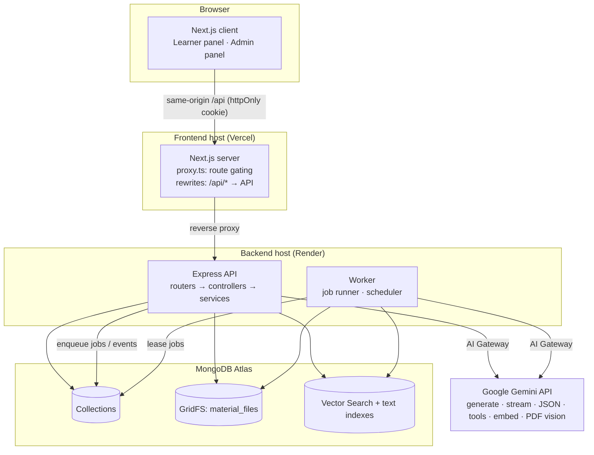
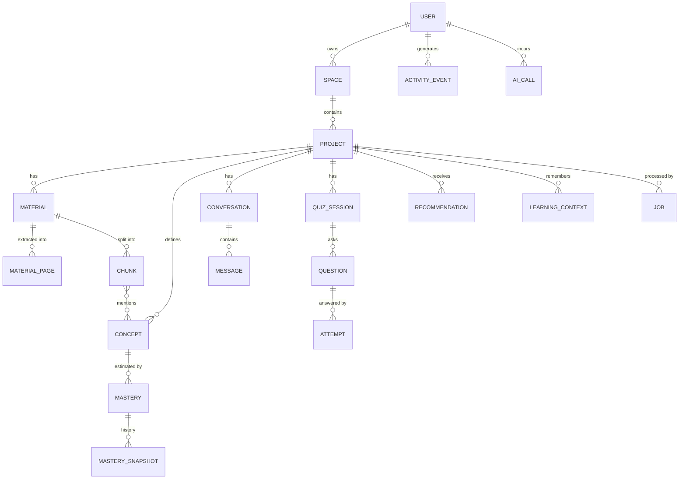
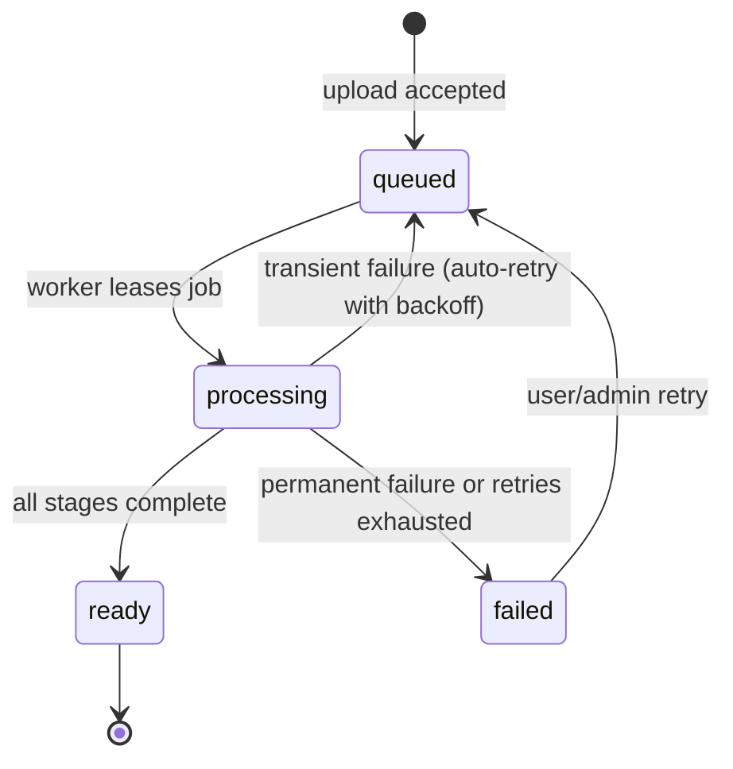

# AI Study Companion — System Architecture

> **Living document.** Every change that affects the architecture updates this file in the same change.
> Build progress is tracked in [§31 Build plan & status](#31-build-plan--status); history in [§33 Changelog](#33-changelog).

| | |
|---|---|
| **Version** | 1.4 |
| **Last updated** | 2026-09-26 |
| **Current phase** | Phases 1–5 ✅ built — Foundation, background knowledge pipeline, the AI layer (Zoya tutor, learning context, evaluation, observability), the adaptive quiz with mastery estimation, and growth analysis, recommendations and analytics (learner + admin). Phase 6 (hardening, docs, deployment) next |
| **Stack** | Next.js 16 · Node.js 22 / Express 5 · MongoDB Atlas 8 · Google Gemini |

---

## Table of contents

1. [Purpose & scope](#1-purpose--scope)
2. [Technology stack](#2-technology-stack)
3. [System overview](#3-system-overview)
4. [Repository layout & modules](#4-repository-layout--modules)
5. [Backend architecture](#5-backend-architecture)
6. [Authentication & authorization](#6-authentication--authorization)
7. [Data model](#7-data-model)
8. [API reference](#8-api-reference)
9. [Materials & knowledge pipeline](#9-materials--knowledge-pipeline)
10. [Background processing](#10-background-processing)
11. [Events & activity](#11-events--activity)
12. [AI layer](#12-ai-layer)
13. [Retrieval](#13-retrieval)
14. [AI Tutor — Zoya](#14-ai-tutor--zoya)
15. [AI ↔ application tools](#15-ai--application-tools)
16. [Adaptive quiz & assessment](#16-adaptive-quiz--assessment)
17. [Mastery model](#17-mastery-model)
18. [Growth analysis](#18-growth-analysis)
19. [Recommendations](#19-recommendations)
20. [Persistent learning context](#20-persistent-learning-context)
21. [Analytics](#21-analytics)
22. [Admin dashboard](#22-admin-dashboard)
23. [Observability](#23-observability)
24. [AI evaluation](#24-ai-evaluation)
25. [Security](#25-security)
26. [Reliability & failure handling](#26-reliability--failure-handling)
27. [Performance](#27-performance)
28. [Frontend architecture](#28-frontend-architecture)
29. [Testing strategy](#29-testing-strategy)
30. [Configuration & deployment](#30-configuration--deployment)
31. [Build plan & status](#31-build-plan--status)
32. [Key decisions, simplifications & future work](#32-key-decisions-simplifications--future-work)
33. [Changelog](#33-changelog)

---

## 1. Purpose & scope

AI Study Companion is a **persistent, contextual, measurable AI learning companion**. A learner organises learning into
**Spaces** (broad areas) and **Projects** (focused journeys), adds material, learns with a grounded AI Tutor, is assessed
adaptively, and receives evidence-based guidance on what to do next. An **Admin Dashboard** gives operators visibility
into users, learning activity, AI usage/quality, background processing and system health.

**Core learning loop** (the primary success criterion — the user completes it without losing context):

```
Space → Project → Material → Knowledge → Tutor → Grounded answer + citation → Unsupported-question handling
      → Adaptive quiz → Assessment → Mastery → Growth → Analytics → Recommendation → Continue learning
```

The system continuously answers three questions, each backed by explicit evidence and a subsystem:

| Question | Evidence | Subsystems |
|---|---|---|
| What am I learning? | Spaces, Projects, goals, materials, concepts, conversations | Workspace, Knowledge |
| How well am I learning it? | Quiz answers, open-ended grading, repeated mistakes, Tutor interactions | Assessment, Mastery |
| What should I do next? | Mastery trends, weaknesses, goals, history, previous recommendations | Growth, Recommendations, Learning context |

**PRD principles → concrete mechanisms**

| Principle | Mechanism in this architecture |
|---|---|
| Context first | Every tenant document carries `ownerId` (+ `projectId`); retrieval, memory and AI tools are scoped by **server-bound** project context — never by model-supplied ids (§13, §15). |
| Evidence over guessing | Retrieval sufficiency gate before generation, per-answer grounding status, explicit insufficient-evidence path (§14); mastery shown with confidence (§17). |
| Persistent but relevant context | Salience-ranked `learning_context` items + rolling conversation summaries, selected top-K under a token budget (§20). |
| Asynchronous by design | Durable MongoDB-backed job queue + worker; events trigger workflows (§10, §11). |
| Observable AI | AI Gateway records every call (model, feature, latency, tokens, cost, retries, fallbacks, retrieval trace, prompt version) (§12, §23). |
| Safe AI interaction | Allow-listed tool registry, zod-validated arguments and outputs, authorization on every tool call (§15, §25). |

---

## 2. Technology stack

| Layer | Choice | Why | Alternatives considered |
|---|---|---|---|
| Frontend | **Next.js 16** (App Router), React 19, TypeScript | Required. Nested layouts fit the two panels; `rewrites` give a same-origin API proxy; Vercel-native. | — |
| Styling / UI | Tailwind CSS v4 design tokens, small in-house UI kit, Radix primitives (dialog, dropdown), lucide icons | Consistent blue "AI" theme, accessible primitives, no heavy component framework. | MUI (heavy), shadcn CLI (equivalent; we hand-roll the few components needed) |
| Client data | TanStack Query v5 | Caching, invalidation, polling of processing status, request dedupe. | SWR; RSC fetching (would need cookie forwarding) |
| Backend | **Node.js 22 + Express 5**, TypeScript (ESM) | Required. Express 5 forwards async errors natively; SSE streaming is trivial; mature ecosystem. | Fastify, NestJS (more ceremony) |
| Validation | Zod 4 | One schema language for requests, env config and AI structured outputs (`z.toJSONSchema`). | Joi, class-validator |
| Database | **MongoDB Atlas 8.0** + Mongoose 9 | Required. Documents suit AI artifacts; Vector Search, text index and GridFS in the same cluster; replica set → transactions. | Postgres + pgvector |
| File storage | GridFS bucket `material_files` behind a `StorageProvider` interface | No extra service/credentials; files carry ownership metadata; streamable. | S3 / R2 (drop-in via the interface) |
| Retrieval | Atlas Vector Search (`$vectorSearch` with `projectId` pre-filter) + `$text`, fused with RRF; in-process cosine fallback | Hybrid recall (terms, acronyms, semantics); isolation enforced inside the index query. | Pinecone / Qdrant (extra infrastructure) |
| AI provider | **Google Gemini** via `@google/genai`, behind an `AIProvider` interface | Key available; native PDF understanding (OCR), JSON-schema output, function calling, embeddings. | OpenAI / Anthropic (drop-in via the interface) |
| Background jobs | Custom durable queue in MongoDB + worker (same codebase, `APP_ROLE`) | No Redis; atomic leasing with `findOneAndUpdate`; idempotency via unique keys; survives restarts. | BullMQ + Redis, Agenda |
| Auth | Email + password; **bcrypt** (cost 12); JWT (HS256) in an **httpOnly, SameSite=Lax** cookie; RBAC (`user`, `admin`) | Required (no OAuth). httpOnly prevents token theft via XSS; same-origin proxy avoids third-party-cookie blocking. | Bearer token in localStorage (XSS-exposed) |
| Logging | pino + pino-http, AsyncLocalStorage request context | Structured JSON logs carrying `requestId` / `userId`. | winston |
| Testing | Vitest + Supertest + mongodb-memory-server; `MockAIProvider` | Fast, isolated, deterministic (no network in unit/integration tests). | Jest |
| Deployment | Vercel (frontend) + Render (API + worker) + MongoDB Atlas | Free tiers, public URLs, zero ops. | Railway, Fly.io |

### Model configuration (verified against the project's key on 2026-09-25)

| Purpose | Env var | Default | Verification notes |
|---|---|---|---|
| Primary generation (Tutor answers, LLM judges, quiz generation & grading) | `AI_MODEL_PRIMARY` | `gemini-3.6-flash` | Supports every thinking level incl. `minimal`; first token ≈ 2 s. Returns 503 "high demand" at peak times → fallback chain |
| Primary fallback chain | `AI_MODEL_FALLBACKS` | `gemini-3.7-flash,gemini-3-flash-preview,gemini-3.5-flash-lite` | 3.7-flash rejects `minimal` thinking (mapped to `low`); observed 503s that took ~10 s to arrive → breaker parks the model immediately (§12) |
| Light tasks (intent, summaries, titles, memory extraction, OCR, concepts) | `AI_MODEL_LIGHT` / `AI_MODEL_LIGHT_FALLBACKS` | `gemini-3.5-flash-lite` / `gemini-3.1-flash-lite,gemini-3-flash-preview` | ~1 s, no thinking tokens |
| Embeddings | `AI_EMBEDDING_MODEL` / `AI_EMBEDDING_DIM` | `gemini-embedding-2` / `768` | Each text must be its own `Content` (a `string[]` yields a single embedding); vectors L2-normalised |
| Not used | — | `gemini-2.5-*` (404 for new keys), `*-pro` (free-tier quota 0 → 429), `gemini-3.8-flash` (503 at test time) | All names are env-configurable |

**Structured output finding** (live suite, 2026-09-25): Gemini rejects a response schema that combines `maxItems` on an *array of objects* with
nested constraints (400 `INVALID_ARGUMENT`, generic message); each keyword alone is accepted. The model-facing schema therefore carries structure,
enums and small numeric ranges only; size limits are enforced server-side by zod (or by truncation where cutting is safe) — see §12.

## 3. System overview



Logical layering (maps to PRD §17):

```
Frontend (Next.js) ── same-origin /api, cookie session
   ↓
API layer ── Express routers: request context · authentication · authorization · validation · rate limits · CSRF guard
   ↓
Business logic (modules/services)
 ┌────────────┬─────────────┬─────────────┬──────────────┬──────────────┬─────────┐
 Workspace    Knowledge     AI Tutor      Assessment     Learning        Admin
 spaces,      materials,    retrieval,    quiz, grading, analytics,      platform
 projects     pipeline      context       mastery        growth, recs    views
   ↓
Data & knowledge ── MongoDB documents · GridFS files · vector/text indexes · learning_context memory
   ↓
Background processing ── durable job queue · worker · scheduler · event → workflow subscriptions
   ↓
AI / external ── AI Gateway (timeouts, retries, fallbacks, validation, accounting) → Gemini
   ↓
Observability ── pino logs · ai_calls · job telemetry · retrieval traces · health · eval runs
```

---

## 4. Repository layout & modules

```
Ai_study_companion/
├── docs/ARCHITECTURE.md          ← this file
├── backend/
│   ├── src/
│   │   ├── index.ts              bootstrap: config → db → admin → registerModules → HTTP server and/or worker (APP_ROLE) → vector index → graceful shutdown
│   │   ├── app.ts                Express app factory (imported by tests; registers modules; no listening side effects)
│   │   ├── bootstrap.ts          registerModules(): job handlers · event workflows · context providers · Tutor tools (once per process)
│   │   ├── config/env.ts         zod-validated environment (fail fast)
│   │   ├── lib/                  logger, AppError, request context (ALS), typed handler(), db, validation, semaphore, vector math, text helpers
│   │   ├── middleware/           requestContext, authenticate + requireRole, csrfGuard, rateLimits (auth · upload · tutor), errorHandler
│   │   ├── models/               one Mongoose model per collection (§7)
│   │   ├── ai/                   types · errors · models (capabilities + prices) · gemini · mock · schema (zod → model JSON schema) · gateway · prompts/{knowledge,tutor,evaluation,quiz}
│   │   ├── jobs/                 queue (enqueue/claim/lease/fail/recover) · registry · worker (+ processJob, drainJobs) · system (reconciler)
│   │   ├── modules/knowledge/    extract · ocr · chunker · injection · concepts · pipeline · vector-index · retrieval · knowledge.service/routes
│   │   ├── modules/tutor/        orchestrator · understand · sources · citations · tools · insufficient · dto · tutor.jobs · tutor.service/routes/schemas
│   │   ├── modules/learning-context/  learning-context.service (remember / recall / forget / resolve) · providers (context composition registry)
│   │   ├── modules/evaluation/   evaluation.service (store + judge registry) · tutor-rules · tutor-judge · quiz-rules · quiz-judge · evaluation.jobs
│   │   ├── modules/quiz/         selection (pure engine) · validation (pure) · generation · grading · question-factory · summary · dto · learning (workflows) · providers · tools · quiz.jobs · quiz.service/routes/schemas
│   │   ├── modules/mastery/      estimator (pure ability model) · mastery.service (exactly-once updates, snapshots) · mastery.routes
│   │   ├── modules/admin/        admin.service · ai-admin.service (usage, traces, evaluation) · jobs-admin.service · routes/schemas
│   │   ├── modules/workflows.ts  event → workflow subscriptions (material.uploaded, tutor.answered, tutor.feedback, quiz.question_answered, quiz.completed)
│   │   ├── modules/<domain>/     auth · spaces · projects · materials · activity · cascade · health
│   │   ├── storage/              StorageProvider interface + GridFS implementation
│   │   └── scripts/              seed-admin.ts
│   ├── evals/tutor/              dataset.ts (materials + cases) · run.ts (`npm run eval:tutor`) · baseline.json
│   └── tests/                    Vitest + Supertest + mongodb-memory-server + scriptable MockAIProvider
└── frontend/
    └── src/
        ├── app/                  (auth)/login|register · (learner)/dashboard|spaces|projects/[id]/{overview,materials,tutor,quiz,quiz/[sessionId]} · admin/* (incl. ai-usage, ai-evaluation, jobs)
        ├── components/           ui/ (kit) · layout/ · zoya/ (animated avatar) · tutor/ (chat, markdown + citations, source viewer, composer, memory) · quiz/ (question card + feedback, results, mastery) · admin/ (charts, trace dialog)
        ├── lib/                  api client, SSE tutor client, query hooks, types, formatters
        └── proxy.ts              navigation gating (session-cookie presence + role hint)
```

| Module | Responsibility | Phase |
|---|---|---|
| `auth` | Register, login, logout, current user, password hashing, session cookie | 1 |
| `spaces` | CRUD, Space dashboard data | 1 |
| `projects` | CRUD, Project dashboard data, recent projects | 1 |
| `materials` | PDF upload, list, stream file, rename, delete (retry: P2) | 1 |
| `activity` | Event recording, user activity feed, home dashboard aggregate | 1 |
| `admin` | Platform-wide read views (grows every phase) | 1+ |
| `health` | Liveness/readiness | 1 |
| `jobs` | Durable queue, worker, scheduler, reconciler | 2 ✅ |
| `knowledge` | Processing pipeline, pages, chunks, concepts, hybrid retrieval | 2 ✅ |
| `ai` | Provider abstraction, gateway, prompts, AI call logging | 3 ✅ |
| `tutor` | Conversations, grounded streaming answers, tools, feedback, continuity jobs | 3 ✅ |
| `learning-context` | Persistent learner memory + context-provider registry | 3 ✅ (mastery + assessment-history providers ✅ 4) |
| `evaluation` | Rule checks, LLM judge, feedback, offline suite | 3 ✅ |
| `quiz` | Adaptive sessions, question selection, generation + validation, grading, learning workflows, Tutor tools & context providers | 4 ✅ |
| `mastery` | Ability model (θ), exactly-once updates, snapshots, mastery API | 4 ✅ |
| `growth` | Per-concept growth classification over mastery snapshots, progress series, insights; progress overview for Home and Space dashboards | 5 ✅ |
| `recommendations` | Rule candidates → ranking → AI phrasing (validated) → lifecycle; rule evaluation; Tutor context provider | 5 ✅ |
| `analytics` | Project and global analytics (activity, assessment, mastery, streaks, AI activity); admin engagement and learning analytics | 5 ✅ |
| `evals` | Offline suites for quiz/recommendations (the Tutor suite exists) | 6 |

---

## 5. Backend architecture

**Layering rules**

1. **Routes** declare the path and middleware chain (`authenticate` → `requireRole?` → rate limit) and a thin handler built with
   `handler({ params, query, body }, fn)`: it zod-validates each part (400 on failure), asserts the caller's identity and serialises the
   return value (`undefined` → 204). Express 5 makes `req.query` read-only, so validated input is passed to `fn` rather than written back.
2. **Handlers** translate HTTP ↔ service calls only (no business rules, no queries); there is no separate controller layer.
3. **Services** hold business rules. **Every tenant-scoped service function takes `ownerId` first and filters by it** — isolation
   is structural rather than remembered per endpoint. Services emit activity events (§11).
4. **Models** define schemas and indexes only.
5. **Admin services are the only code allowed to read across tenants** and are mounted exclusively behind `requireRole('admin')`.

**Cross-cutting concerns**

| Concern | Implementation |
|---|---|
| Configuration | `config/env.ts` parses `process.env` with zod once; the process exits with a readable report on invalid config. |
| Request context | `AsyncLocalStorage` holds `{ requestId, userId, role, ip }`; read by the logger, activity recorder, AI gateway and job enqueue (propagated as `traceId`). |
| Errors | `AppError(status, code, message, details)`. Central handler maps AppError, ZodError, Mongoose Cast/Validation errors, duplicate key `E11000` → 409, Multer limits → 413, anything else → 500 (message hidden in production). |
| Response shape | Success: resource JSON (`{ items, page, limit, total }` for lists). Error: `{ "error": { "code", "message", "details", "requestId" } }`. |
| Validation | `validate({ body, query, params })` with zod; ObjectId params validated; unknown body keys stripped; strings trimmed and length-bounded. |
| Security middleware | helmet, CORS allow-list (only relevant for direct cross-origin calls), JSON limit 1 MB, CSRF guard, rate limits (§6). |
| Pagination | `page ≥ 1`, `limit 1–100` (default 20) → `{ items, page, limit, total }`. |

**HTTP status conventions**: 200 OK · 201 Created · 204 No Content · 400 `VALIDATION_ERROR` · 401 `UNAUTHENTICATED` · 403 `FORBIDDEN` / `CSRF_REJECTED` ·
404 `NOT_FOUND` (also for other users' resources) · 409 `CONFLICT` / `DUPLICATE_MATERIAL` / `EMAIL_TAKEN` · 413 `FILE_TOO_LARGE` ·
415 `UNSUPPORTED_FILE_TYPE` · 429 `RATE_LIMITED` · 500 `INTERNAL_ERROR` · 503 `DEPENDENCY_UNAVAILABLE`.

---

## 6. Authentication & authorization

```mermaid
sequenceDiagram
  participant B as Browser
  participant N as Next.js (same origin)
  participant A as Express API
  participant M as MongoDB
  B->>N: POST /api/auth/login {email, password} + X-Requested-With
  N->>A: proxied request
  A->>M: find user by normalised email (+passwordHash)
  A->>A: bcrypt.compare (dummy compare if user missing)
  A-->>N: 200 {user} + Set-Cookie asc_session=JWT; HttpOnly; SameSite=Lax; Secure(prod); Path=/
  N-->>B: response (cookie stored for the frontend origin)
  B->>N: GET /api/spaces (cookie sent automatically)
  N->>A: proxied request
  A->>A: verify JWT → load user → check status & tokenVersion
  A->>M: Space.find({ ownerId })
```

- **Passwords**: bcrypt with cost 12 (configurable; tests use 4). Policy: at least 8 characters, at most **72 bytes** (bcrypt ignores
  anything beyond, so longer inputs are rejected rather than silently truncated), at least one letter and one digit. Emails trimmed +
  lower-cased; unique index.
- **Anti-enumeration**: login returns the same 401 for unknown email and wrong password, and performs a dummy bcrypt compare for unknown emails.
- **Session token**: JWT HS256, secret ≥ 32 chars from env; claims `{ sub, role, tv, iat, exp }`; lifetime `SESSION_TTL_DAYS` (default 7) for both the JWT and the cookie. `tv` mirrors `user.tokenVersion`,
  which is incremented on password change / "log out everywhere" to revoke outstanding tokens.
- **`authenticate`**: reads the cookie → verifies → loads `{ role, status, tokenVersion }` → rejects disabled users and stale `tv` → sets `req.auth`.
  Updates `lastActiveAt` at most every 5 minutes (write throttling).
- **RBAC**: roles `user` and `admin`. `/api/admin/*` requires `admin`. Registration always creates `user`; `role` is never accepted from clients.
- **Admin bootstrap**: at startup, if `ADMIN_EMAIL`/`ADMIN_PASSWORD` are set and that user does not exist, an admin is created (idempotent).
  `npm run seed:admin` explicitly upserts the admin and resets its password from env.
- **CSRF**: the cookie is `SameSite=Lax` (not sent on cross-site subrequests) **and** the API rejects unsafe methods
  (POST/PUT/PATCH/DELETE) without `X-Requested-With: fetch` — a cross-site form cannot set it, and a cross-site `fetch` would need a CORS preflight that the API does not grant.
- **Frontend gating**: `proxy.ts` redirects unauthenticated navigations to `/login` (cookie presence) and reads the JWT payload's `role` only as a
  routing hint. **The API is the only authority**: every request is re-verified server-side.
- **Tenant isolation**: owner-scoped queries everywhere; foreign ids return **404, not 403** (no existence oracle); nested resources resolve through
  owned parents (`material → project → owner`). Background jobs carry `ownerId`/`projectId` and re-verify ownership before acting (§10).
- **Rate limits**: auth 20 req / 15 min / IP · uploads 30 / hour / user · Tutor 20 messages / min / user · quiz 40 requests / min / user (start · next · answer) ✅.

---

## 7. Data model



**Conventions**: `_id` ObjectId; `createdAt`/`updatedAt` timestamps; tenant-scoped documents carry `ownerId` (+ `spaceId`, `projectId` where
applicable) for isolation and as index prefixes; enums stored as strings; AI-generated fields are zod-validated before any write.
Deleting a Space/Project cascades through one `cascade` service that is extended whenever a collection is added.

### 7.1 Collections

**`users`** (P1) — `name` (2–80) · `email` (unique, lowercase) · `passwordHash` (bcrypt, `select:false`) · `role` (`user`|`admin`) ·
`status` (`active`|`disabled`) · `tokenVersion` · `preferences` (reserved: explanation style, pace — no UI yet, §32) · `lastLoginAt` · `lastActiveAt`.
Indexes: `{email:1}` unique · `{role:1, createdAt:-1}` · `{lastActiveAt:-1}`.

**`spaces`** (P1) — `ownerId` · `name` (1–80) · `description` (1–500) · `color` (palette key) · `icon` (icon key) · `lastActivityAt`.
Indexes: `{ownerId:1, lastActivityAt:-1}`.

**`projects`** (P1) — `ownerId` · `spaceId` · `name` (1–100) · `description` (≤1000) · `learningGoal` (1–500) · `status` (`active`|`archived`) ·
`lastActivityAt` · `stats` (P2 counters maintained by the pipeline: `materialCount`, `readyMaterialCount`, `pageCount`, `conceptCount`).
Indexes: `{ownerId:1, spaceId:1, createdAt:-1}` · `{ownerId:1, lastActivityAt:-1}`.

**`materials`** (P1) — `ownerId` · `spaceId` · `projectId` · `title` (1–200) · `originalFilename` · `mimeType` · `sizeBytes` · `sha256` ·
`storage {provider:'gridfs', fileId}` · `status` (`queued`|`processing`|`ready`|`failed`) · `processing {stage, progress, attempts, jobId,
startedAt, finishedAt, completedStages[], error{code, message, retryable}}` · `pageCount` · `stats {chunkCount, conceptCount, ocrPageCount}` · `summary`.
Indexes: `{projectId:1, createdAt:-1}` · `{ownerId:1, createdAt:-1}` · `{projectId:1, sha256:1}` **unique** (duplicate guard) · `{status:1, updatedAt:1}` (reconciler).

**GridFS `material_files`** (P1) — file metadata `{ownerId, projectId, materialId?, sha256}`; content type `application/pdf`.

**`material_pages`** (P2 ✅) — `ownerId` · `projectId` · `materialId` · `pageNumber` · `text` · `method` (`text`|`ocr`) · `charCount` · `sectionTitle`.
Index: `{materialId:1, pageNumber:1}` unique.

**`chunks`** (P2 ✅) — `ownerId` · `projectId` · `materialId` · `index` · `pageStart` · `pageEnd` · `sectionTitle` · `text` · `tokenEstimate` ·
`embedding` (768 floats) · `conceptIds[]` · `flags {suspectedInjection}`.
Indexes: `{materialId:1, index:1}` unique · `{projectId:1, conceptIds:1}` · text `{projectId:1, text:'text'}` ·
Atlas Vector Search `chunks_vector` (`embedding`, 768, cosine; filter fields `projectId`, `ownerId`, `materialId`).

**`concepts`** (P2 ✅) — `ownerId` · `projectId` · `name` · `slug` · `description` · `importance` (0–1) · `sources [{materialId, pages[]}]` · `embedding` · `chunkCount`.
Index: `{projectId:1, slug:1}` unique.

**`conversations`** (P3 ✅) — `ownerId` · `spaceId` · `projectId` · `title` · `titleSource` (`auto`|`ai`|`user` — a learner's rename is never
overwritten) · `summary {text, messageCount, updatedAt}` (rolling summary of the first *n* messages) · `messageCount` · `lastMessageAt` · `lastMessagePreview`.
Index: `{ownerId:1, projectId:1, lastMessageAt:-1}`.

**`messages`** (P3 ✅) — `ownerId` · `projectId` · `conversationId` · `role` (`user`|`assistant`) · `content` · `clientMessageId` (user messages;
**unique per owner** — idempotent sends) · `replyTo` (assistant → question) · `status` (`streaming`|`complete`|`stopped`|`error`) · `mode` (`auto`|`general`) ·
`action` (UI quick action) · `intent` · `grounding {status: grounded|partial|insufficient|general|conversational, sufficiency, topScore, method, invalidCitations, degraded}` ·
`sources [{ref:'S1', kind: chunk|page, chunkId, materialId, materialTitle, pageStart, pageEnd, sectionTitle, snippet, score, origin: retrieval|tool|carried, cited, flagged}]` ·
`suggestions[]` (follow-up questions) · `toolCalls [{name, args, ok, error, summary, latencyMs, data}]` (`data`: structured output the UI can act on, e.g. `propose_quiz` → quiz link) · `feedback {rating, reason, comment, at}` · `error {code, message}` ·
`metrics {latencyMs, ttftMs, understandMs, retrieveMs, generateMs, rounds, tokens…, costUsd, model, fallbackUsed}` ·
`trace {route, intent, understandMethod, standaloneQuery, retrieval (full trace), context (provider trace), carriedSources, flags}` · `aiCallIds[]` · `promptVersion`.
Indexes: `{conversationId:1, createdAt:1}` · `{ownerId:1, projectId:1, createdAt:-1}` · `{replyTo:1}` · `{status:1, updatedAt:1}` (reconciler) ·
`{ownerId:1, clientMessageId:1}` unique partial.

**`quiz_sessions`** (P4 ✅) — `ownerId` · `spaceId` · `projectId` · `status` (`active`|`completed`|`abandoned` — ended without an answer) ·
`mode` (`adaptive`|`focused`|`review`) · `questionTypes` (`mixed`|`mcq`|`open`) · `focusConceptIds[]` · `targetCount` (3–15) · counters recomputed from
the attempts, never incremented (`servedCount`, `answeredCount`, `gradedCount`, `correctCount`, `scoreSum`) · `currentQuestionId` (the question on screen) ·
`generation {lockedUntil, token, failures, lastError}` (generation lease, §16) · `summary` (stored when the session ends: per concept with mastery
before → after, per cognitive level and type, strengths, needs work, pages to review) · `startedAt` · `completedAt` · `lastActivityAt`.
Indexes: `{ownerId:1, projectId:1, createdAt:-1}` · `{projectId:1, status:1}` · `{status:1, completedAt:-1}` (reconciler) ·
`{ownerId:1, projectId:1}` **unique partial** on `status: 'active'` (one quiz in progress per Project).

**`questions`** (P4 ✅) — `ownerId` · `projectId` · `sessionId` · `status` (`ready` = pre-generated | `served` | `answered` | `discarded`) · `position` ·
`conceptIds[]` · `conceptNames[]` · `type` (`mcq`|`open`) · `difficulty` (1–5) · `cognitiveLevel` (`recall`|`understand`|`apply`|`analyze`) · `stem` ·
`options [{id A–D, text, rationale}]` · `correctOptionId` · `explanation` · `rubric {keyPoints[2–6], sampleAnswer}` ·
`sources [{ref, chunkId, materialId, materialTitle, pageStart, pageEnd, sectionTitle, snippet, cited}]` ·
`selection {priority, probability, predictedP, targetP, mastery, evidence, explored, reason, components}` (why this question — shown to the learner) ·
`stemHash` · `generation {aiCallId, promptVersion, model, attempts, latencyMs, costUsd, validation {issues, warnings}, selfRated}` · `servedAt` · `answeredAt`.
Indexes: `{sessionId:1, status:1}` · `{ownerId:1, projectId:1, stemHash:1}` · `{ownerId:1, projectId:1, conceptIds:1, createdAt:-1}` · `{projectId:1, createdAt:-1}`.

**`attempts`** (P4 ✅) — `ownerId` · `projectId` · `sessionId` · `questionId` · `conceptIds[]` · `type` · `difficulty` · `cognitiveLevel` ·
`response {optionId, text, skipped}` · `outcome` (0–1; null while grading is pending) · `isCorrect` ·
`feedback {summary, understood[], missing[], misconceptions[], keyPoints [{point, status: covered|partial|missing, evidence}]}` ·
`grading {status: graded|pending|failed, method: exact|ai|rule, aiCallId, promptVersion, model, scores, flags, error, attempts, gradedAt}` ·
`masteryApplied` · `masteryDelta [{conceptId, name, before, after, thetaBefore, thetaAfter}]` · `timeMs` · `idempotencyKey` · `report {target, reason, comment, at}`.
Indexes: `{questionId:1}` **unique** (one answer per question) · `{ownerId:1, idempotencyKey:1}` **unique** · `{sessionId:1, createdAt:1}` ·
`{ownerId:1, projectId:1, createdAt:-1}` · `{ownerId:1, projectId:1, conceptIds:1, createdAt:-1}` · `{'grading.status':1, updatedAt:1}` ·
`{masteryApplied:1, 'grading.status':1, updatedAt:1}` (reconciler).

**`mastery`** (P4 ✅) — `ownerId` · `projectId` · `conceptId` · `theta` · `evidenceCount` · `correctCount` · `scoreSum` ·
`byLevel {recall|understand|apply|analyze: {n, sum}}` · `byType {mcq|open: {n, sum}}` · `recentOutcomes` (last 10) ·
`appliedAttemptIds` (last 30 — the exactly-once guard) · `lastPracticedAt` · `version` (optimistic concurrency).
Indexes: `{ownerId:1, projectId:1, conceptId:1}` unique · `{projectId:1}`.

**`mastery_snapshots`** (P4 ✅) — `ownerId` · `projectId` · `conceptId` · `mastery` · `theta` · `evidenceCount` · `cause {type:'attempt', attemptId, sessionId}` —
one per concept per graded answer: the raw series for Growth (§18).
Indexes: `{projectId:1, conceptId:1, createdAt:1}` · `{ownerId:1, projectId:1, createdAt:-1}` · `{conceptId:1, 'cause.attemptId':1}` unique (a replayed update never writes twice).

**`recommendations`** (P5 ✅) — `ownerId` · `spaceId` · `projectId` · `batchId` (one generation) · `kind` (`upload_material`|`resume_quiz`|`first_quiz`|
`review_weak_concept`|`fix_repeated_mistake`|`practice_application`|`spaced_review`|`assess_new_concepts`|`ask_tutor`|`stretch_challenge`) ·
`key` (kind + sorted concept ids — identity of the situation across batches, used for novelty) · `title` (≤ 160) · `rationale` (≤ 600) ·
`action {type: start_quiz|resume_quiz|review_material|ask_tutor|upload_material, params, label}` · `conceptIds[]` · `priority` (0–1) ·
`status` (`active`|`completed`|`dismissed`|`expired` — superseded by a newer batch) · `source` (`rules`|`ai` — phrased by the model) · `stateHash` ·
`evidence` (the facts the text was written from — the model saw nothing else) · `aiCallId` · `actedAt`.
Indexes: `{ownerId:1, projectId:1, status:1, priority:-1}` · `{projectId:1, createdAt:-1}` · `{ownerId:1, projectId:1, key:1, updatedAt:-1}` (novelty) · `{status:1, createdAt:-1}` (admin).

**`learning_context`** (P3 ✅) — `ownerId` · `projectId` (null only for user-wide preferences) · `scope` (`project`|`user`) ·
`kind` (`goal`|`preference`|`strength`|`weakness`|`misconception`|`mistake_pattern`|`interest`|`milestone`|`note`) · `content` (≤ 400) · `embedding` (`select:false`) ·
`salience` (0–1) · `evidenceCount` · `conceptIds[]` · `source {type: tutor|quiz|assessment|system|learner, refId}` · `status` (`active`|`resolved`|`archived`) · `lastObservedAt`.
Indexes: `{ownerId:1, projectId:1, status:1, kind:1}` · `{ownerId:1, scope:1, status:1}`.

**`activity_events`** (P1) — `ownerId` (whose data) · `actorId` (who acted — differs for admin/system) · `type` · `spaceId?` · `projectId?` · `materialId?` ·
`metadata` (name snapshots so history survives renames/deletes) · `eventKey` (optional idempotency key).
Indexes: `{ownerId:1, createdAt:-1}` · `{projectId:1, createdAt:-1}` · `{spaceId:1, createdAt:-1}` · `{type:1, createdAt:-1}` · `{createdAt:-1}` ·
`{eventKey:1}` unique with `partialFilterExpression: {eventKey: {$type: 'string'}}` (a partial index, unlike a sparse one, never indexes an explicit `null`).

**`jobs`** (P2 ✅) — `type` · `payload` · `ownerId` · `projectId` · `status` (`queued`|`running`|`succeeded`|`failed`|`cancelled`) · `priority` · `attempts` ·
`maxAttempts` · `runAt` · `lockedBy` · `lockedUntil` · `lastError {code, message, stack}` · `errorHistory` (last 5) · `idempotencyKey` (unique) · `traceId` ·
`progress {stage, pct}` · `result` · `startedAt` · `finishedAt` · `durationMs`.
Indexes: `{status:1, priority:-1, runAt:1}` · `{idempotencyKey:1}` unique · `{type:1, status:1, createdAt:-1}` · `{ownerId:1, createdAt:-1}`.

**`ai_calls`** (P3 ✅) — `traceId` · `jobId` · `ownerId` · `projectId` · `conversationId` · `messageId` · `feature` · `operation` (`generate`|`stream`|`structured`|`embed`) ·
`provider` · `model` · `attempts [{model, status, kind, ms, message}]` · `promptVersion` · `status` · `errorKind` · `errorMessage` · `retries` · `fallbackUsed` · `latencyMs` · `ttftMs` ·
`usage {inputTokens, outputTokens, thinkingTokens, totalTokens}` · `costUsd` · `inputPreview` / `outputPreview` (truncated) · `metadata` (retrieval trace, tool calls, validation).
Indexes: `{createdAt:-1}` · `{feature:1, createdAt:-1}` · `{model:1, createdAt:-1}` · `{ownerId:1, createdAt:-1}` · `{status:1, createdAt:-1}` · `{traceId:1}` · TTL 90 days.

**`ai_evaluations`** (P3 ✅) — `subjectType` (`tutor_message`|`retrieval`|`quiz_question`|`quiz_grading`|`recommendation`|`material`) · `subjectId` ·
`evaluator` (`rules`|`llm_judge`|`learner_feedback`|`offline_suite`) · `feature` · `ownerId` · `projectId` · `scores` (criterion → 0–1) · `verdict` (`pass`|`warn`|`fail`) ·
`flags[]` · `rationale` · `inputPreview` · `outputPreview` · `aiCallId` · `promptVersion` · `model`.
Indexes: `{createdAt:-1}` · `{evaluator:1, createdAt:-1}` · `{verdict:1, createdAt:-1}` · `{subjectType:1, subjectId:1, evaluator:1}` unique partial (one verdict per evaluator per subject).

**`eval_runs`** (P3 ✅) — `suite` · `label` · `provider` · `models` · `promptVersions` · `config` (thresholds) · `summary {cases, passed, failed, passRate, metrics}` ·
`cases [{id, category, question, passed, checks[], grounding, answerPreview, citedPages, latencyMs}]` · `durationMs`.

**`worker_heartbeats`** (P2 ✅) — `_id` = worker id · `host` · `pid` · `role` · `version` · `startedAt` · `lastBeatAt` · `concurrency` · `running` · `processed` · `failed`.

**`audit_logs`** (P1) — `actorId` · `action` (e.g. `admin.material.viewed`) · `targetType` · `targetId` · `ownerId` · `ip` · `userAgent`.

---

## 8. API reference

All routes are under `/api`. 🔓 public · 🔒 authenticated · 👑 admin. Unsafe methods require the `X-Requested-With: fetch` header.

**Auth & health**

| Method | Path | Access | Purpose | Phase |
|---|---|---|---|---|
| POST | `/auth/register` | 🔓 | Create learner account, start session | 1 |
| POST | `/auth/login` | 🔓 | Start session | 1 |
| POST | `/auth/logout` | 🔓 | Clear session cookie | 1 |
| GET | `/auth/me` | 🔒 | Current user | 1 |
| PATCH | `/auth/me` · POST `/auth/change-password` | 🔒 | Profile / preferences / password (bumps `tokenVersion`) | ⬜ not built (not required by the PRD; §32) |
| GET | `/health` · `/health/ready` | 🔓 | Liveness · readiness (DB ping) | 1 |
| GET | `/` (outside `/api`) | 🔓 | API name, version and health link (deployment smoke check) | 1 |

**Workspace**

| Method | Path | Access | Purpose | Phase |
|---|---|---|---|---|
| GET | `/dashboard` | 🔒 | Home: counts, continue learning, recent projects, recent activity, next step; **overall progress** (mastery + coverage, improving, answers this week), **areas requiring attention** (top 5 across recent Projects), **recommended next action** | 1 (+5 ✅) |
| GET · POST | `/spaces` | 🔒 | List own Spaces (with project/material counts) · create | 1 |
| GET · PATCH · DELETE | `/spaces/:spaceId` | 🔒 | Space dashboard data (+ progress, areas requiring attention and per-Project mastery ✅ 5) · update · delete (cascade) | 1 |
| GET · POST | `/spaces/:spaceId/projects` | 🔒 | List · create Project (`name`, `description`, `learningGoal`) | 1 |
| GET | `/projects/recent` | 🔒 | Recently active Projects across Spaces | 1 |
| GET · PATCH · DELETE | `/projects/:projectId` | 🔒 | Project dashboard data (+ `learning`: quizzes, accuracy, mastery summary ✅ 4) · update · delete (cascade) | 1 |
| GET | `/activity` | 🔒 | Own activity feed (`projectId`, `spaceId`, `type`, `limit`) | 1 |

**Materials & knowledge**

| Method | Path | Access | Purpose | Phase |
|---|---|---|---|---|
| GET · POST | `/projects/:projectId/materials` | 🔒 | List · upload PDF (multipart `file`, optional `title`) → 201, status `queued` | 1 |
| GET · PATCH · DELETE | `/projects/:projectId/materials/:materialId` | 🔒 | Detail (processing state) · rename · delete (file + derived data) | 1 |
| GET | `/projects/:projectId/materials/:materialId/file` | 🔒 | Stream the PDF inline (supports `#page=N` deep links for citations) | 1 |
| POST | `/projects/:projectId/materials/:materialId/retry` | 🔒 | Re-process a failed material (new version → new idempotency key; completed stages reused) | 2 ✅ |
| GET | `/projects/:projectId/materials/:materialId/pages/:page` | 🔒 | Extracted page text (citation viewer) | 2 ✅ |
| GET | `/projects/:projectId/concepts` | 🔒 | Project concepts with source pages (+ mastery, band and evidence count ✅ 4) | 2 ✅ |

**Tutor — Zoya** (P3 ✅, all 🔒, mounted under `/projects/:projectId/tutor`)

| Method | Path | Purpose |
|---|---|---|
| GET | `/` | Overview: conversations, knowledge status (ready/pending materials, key concepts), starter questions, memory count, stats |
| GET | `/conversations?before&limit` | Conversation list (cursor pagination by `lastMessageAt`) |
| GET · PATCH · DELETE | `/conversations/:conversationId` | Messages (paginated with `before`) · rename (`titleSource: user`) · delete with messages |
| POST | `/messages` | Send → **SSE stream** (§14). Body `{clientMessageId, content ≤ 4000, conversationId?, mode: auto|general, action?}`; rate limit 20/min/user |
| POST | `/messages/:messageId/stop` | Stop a running answer (the partial answer is kept as `stopped`) |
| POST | `/messages/:messageId/feedback` | 👍/👎 + reason + comment → evaluation record; 👎 triggers the LLM judge |
| GET · DELETE | `/memory` · `/memory/:itemId` | "What Zoya remembers" — list · forget one item |

**Quiz & mastery** (P4 ✅, all 🔒; quiz routes mounted under `/projects/:projectId/quizzes`; start, next and answer share the quiz rate limit)

| Method | Path | Purpose |
|---|---|---|
| GET | `/` | Quiz home: readiness (ready / pending materials, assessable concepts), the session in progress, completed history, stats, concept mastery + summary |
| POST | `/` | Start `{mode: adaptive\|focused\|review, targetCount 3–15, questionTypes: mixed\|mcq\|open, conceptIds (focused, ≤ 8)}` → 201. Closes a session in progress; 409 `NO_QUIZ_MATERIAL` without processed material |
| GET | `/:sessionId` | Session with the questions served so far (answer keys only once answered or ended) and live summary / stored results |
| POST | `/:sessionId/next` | The question on screen (idempotent) → a pre-generated one → one generated now (≤ 20 s); otherwise **202 `{preparing: true}`** — poll again; `{done: true}` at the end; 503 when no valid question can be written |
| POST | `/:sessionId/questions/:questionId/answer` | `{idempotencyKey, optionId? \| text? \| skipped?, timeMs?}` → graded attempt (feedback, answer key, sources, mastery delta) + session. An open answer whose grading fails or exceeds ~22 s returns `grading.status: pending` (graded by a job; poll the session). Same key → replay; 409 `ALREADY_ANSWERED` · `QUIZ_ENDED` · `NOT_CURRENT_QUESTION` |
| POST | `/:sessionId/questions/:questionId/report` | `{target: question\|grading, reason, comment?}` → learner-feedback evaluation; a reported question always goes to the judge |
| POST | `/:sessionId/complete` | End early (idempotent) → summary + learning workflow; nothing answered → `abandoned` |
| GET | `/projects/:projectId/mastery` | Per concept: mastery (null = not assessed), band, confidence, evidence, accuracy per cognitive level, weakest level, recent outcomes; summary (overall, coverage, needs attention) |

**Growth, recommendations, analytics** (P5 ✅, all 🔒)

| Method | Path | Purpose |
|---|---|---|
| GET | `/projects/:projectId/growth?window=7d\|30d\|90d` | Per concept: status (improving / stable / requiring attention / not assessed), mastery, baseline and Δ, trend, reasons, severity, weakest vs strongest level, daily series, source pages; summary with counts and overall change; overall progress series; factual insights |
| GET | `/projects/:projectId/recommendations` | Active next actions (regenerated only when the learner's state changed) + history counts |
| POST | `/projects/:projectId/recommendations/:id/act` · `/:id/dismiss` | Followed (204; the client performs the action) · dismissed (returns the refreshed list; not suggested again for 72 h) |
| GET | `/projects/:projectId/analytics?range=7d\|30d\|90d` | Project analytics: KPIs, activity by day/type, assessment by type/difficulty/level + score series, mastery bands + progress series, concept trends, AI activity |
| GET | `/analytics?range=` | Global analytics: KPIs (streaks, mastery, coverage), activity, assessment, per Space and per Project |

**Admin** (👑 all)

| Method | Path | Purpose | Phase |
|---|---|---|---|
| GET | `/admin/overview` | KPIs, 14-day activity series, recent sign-ups, recent activity | 1 |
| GET | `/admin/users` · `/admin/users/:userId` | Search/paginate users · learning journey of one user (AI usage; assessments & mastery ✅ 4; growth & recommendations ✅ 5) | 1 |
| GET | `/admin/spaces` · `/admin/projects` · `/admin/materials` | Platform-wide lists with filters (`userId`, `spaceId`, `projectId`, `status`, `search`) | 1 |
| GET | `/admin/materials/:materialId/file` | View a PDF for debugging (audit-logged) | 1 |
| GET | `/admin/activity` · `/admin/activity/types` | Filter by user, Space, Project, type, time period (`from`/`to`) · known event types | 1 |
| GET | `/admin/system/health` | API, DB, storage, AI gateway (chains, breakers, 24 h calls/errors/cost), worker heartbeats + queue, retrieval mode | 1 ✅ (extended in 3) |
| GET | `/admin/jobs/overview` · `/admin/jobs` · `/admin/jobs/:jobId` | Queue depth, per-type counts & durations, workers, failures · list (type/status/user) · detail (payload, errors, result) | 3 ✅ |
| POST | `/admin/jobs/:jobId/retry` | Re-queue a failed/cancelled job (audit-logged; resets a failed material to `queued`) | 3 ✅ |
| GET | `/admin/ai/overview?range=24h|7d|30d` | Calls, errors, fallback rate, p50/p95 latency, TTFT, tokens, cost; by feature, by model, time series, top users, recent failures, gateway state | 3 ✅ |
| GET | `/admin/ai/calls` · `/admin/ai/calls/:callId` | Call explorer (feature/status/model/user/project/trace) · trace: attempts, request waterfall, Tutor retrieval trace, tools, answer | 3 ✅ |
| GET | `/admin/ai/config` | Models, thresholds, prompt versions, registered tools and context providers | 3 ✅ |
| GET | `/admin/ai/evaluations/overview` · `/admin/ai/evaluations` · `/admin/ai/eval-runs/:runId` | Tutor evaluator pass rates, judge averages, scores by prompt version, top rule failures, grounding distribution, offline runs; **assessment quality** (question validity, grading checks, question judge, learner reports, grading backlog) ✅ 4; **recommendation quality** (rule pass rate, aligned / actionable, AI-phrased share, followed / dismissed) ✅ 5 · list (filter by evaluator, verdict, subject) · run detail | 3 ✅ |
| GET | `/admin/engagement?range=7d\|30d\|90d` · `/admin/learning?range=` | Learners, DAU/WAU/MAU, stickiness, 7-day retention cohort, active learners and sign-ups per day, feature adoption, most active learners · quizzes started/completed, answers (accuracy, by type/difficulty, per day), mastery bands, hardest concepts, recommendation follow rate, Tutor grounding | 5 ✅ |

---

## 9. Materials & knowledge pipeline



**Upload (P1, synchronous and fast)**

0. Project ownership is checked **before** multer reads the body, so no bytes are accepted for a Project the caller doesn't own.
1. Multer memory storage, limit `MAX_UPLOAD_MB` (default 20 MB), one file per request; `defParamCharset: 'utf8'` so non-ASCII filenames survive.
2. Validate: PDF MIME (`application/pdf`, `application/x-pdf` or `application/octet-stream`) **and** `.pdf` extension **and** the `%PDF-`
   signature within the first 1024 bytes; reject empty files. The client-side check is extension-only (fast feedback); the server is the authority.
3. SHA-256 of the bytes → if the same file already exists in this Project → 409 `DUPLICATE_MATERIAL` (returns the existing id).
4. Stream bytes to GridFS with ownership metadata.
5. Insert the material with `status: queued`. The unique `{projectId, sha256}` index closes the race between concurrent uploads; the loser's GridFS file is deleted.
6. Record `material.uploaded`; its workflow subscription enqueues the idempotent `material.process` job.
7. Respond `201` with the material. Nothing heavy runs in the request.

**Serving files**: `GET …/file` streams from GridFS with `Content-Type: application/pdf`, `Content-Disposition: inline` (RFC 5987
filename), `Content-Length`, `nosniff`, `Cache-Control: private`. The API-wide CSP header is removed on PDF responses because it can
stop built-in PDF viewers from rendering, and it protects nothing for a verified PDF that is never interpreted as HTML (§32 D12).
Client disconnects mid-stream are expected and not logged as errors.

**Processing (P2, job `material.process`)** — stages are checkpointed in `processing.completedStages`, so a retry resumes where it stopped:

| Stage | Work | Output |
|---|---|---|
| `extract` | Load from GridFS; per-page text via pdf.js (`unpdf`); normalise whitespace, de-hyphenate; page count; reject encrypted/over-limit files. | `material_pages` (`method:'text'`) |
| `ocr` | Pages with < 40 chars (scanned) → split with `pdf-lib` into small PDFs → light model transcribes (tables as Markdown, one-line figure descriptions); batches of 4 pages, capped at 40 pages. | `material_pages` (`method:'ocr'`) |
| `chunk` | Page-aware splitter: 1,100 chars target / 1,600 max / 300 min, 160 overlap, paragraph → sentence boundaries, list items and tables kept whole, `pageStart`–`pageEnd` ranges, section titles carried; injection heuristics set `flags.suspectedInjection`. Re-chunking invalidates the embed/concepts checkpoints. | `chunks` |
| `embed` | Only chunks still missing a vector (resumable); batches of 50, task `RETRIEVAL_DOCUMENT`, title = material title; L2-normalised. | `chunks.embedding` |
| `concepts` | Map-reduce with structured output over page groups (≤ 60k chars, ≤ 6 groups): `{summary, concepts[{name, description, importance 1–5, pages}]}`; merged by slug within the material; merged into the Project by slug or embedding similarity ≥ 0.90; chunks linked to their best 1–2 concepts by cosine ≥ 0.45 (no per-chunk LLM call). | `concepts`, `chunks.conceptIds`, `materials.summary` |
| `finalize` | `status: ready`, stats (`chunkCount`, `conceptCount`, `ocrPageCount`); record `material.processed` (event key per version). | — |

Limits: 300 pages per PDF, 60 s parse timeout, 40 OCR pages per material. Error codes: `PDF_ENCRYPTED`, `PDF_CORRUPT`, `TOO_MANY_PAGES`, `NO_EXTRACTABLE_TEXT`,
`FILE_MISSING` (permanent, learner-friendly messages); `AI_RATE_LIMITED`, `AI_UNAVAILABLE`, `AI_TIMEOUT`, `TRANSIENT` (retryable: the material shows
"waiting to retry" instead of failing). The Materials page polls every 2.5 s while anything is `queued`/`processing` and shows the live stage and progress.
**Verified live**: the 3-page ML notes PDF → 3 pages, 3 chunks, 6 concepts with page references and a summary in < 3 s.

---

## 10. Background processing

A durable queue in the `jobs` collection; the worker runs in the API process (`APP_ROLE=all`) or separately (`APP_ROLE=worker`).

| Operation | Mechanism |
|---|---|
| Enqueue | Insert `{type, payload, ownerId, projectId, idempotencyKey, runAt, maxAttempts, priority, traceId}`. Duplicate `idempotencyKey` (E11000) returns the existing job — **duplicate-job protection**. Idle worker slots in the same process are woken at once (a learner-facing job such as preparing the next question never waits out the poll back-off); separate worker processes poll. |
| Claim | Atomic `findOneAndUpdate({status:'queued', runAt ≤ now}, {$set:{status:'running', lockedBy, lockedUntil: now + lease}, $inc:{attempts:1}}, sort {priority:-1, runAt:1})`. |
| Heartbeat | Long handlers extend `lockedUntil` every lease/3 and report `progress {stage, pct}`. |
| Success | `status:'succeeded'`, `result`, `durationMs`. |
| Failure | Retryable and `attempts < maxAttempts` → `status:'queued'`, `runAt = now + min(2^(attempts-1) × 5 s, 10 min) ± 20 % jitter`; otherwise `failed` (dead letter, visible to admins, manually retryable). |
| Crash recovery | Reconciler returns `running` jobs whose `lockedUntil < now` to `queued`, and re-enqueues `queued` materials that lack a live job. |
| Shutdown | Stop claiming, abort handlers via `AbortSignal`, wait up to 20 s, release leases. |
| Scheduler | Every 60 s enqueue `system.reconcile` with idempotency key `system.reconcile:<UTC minute>` — safe with many workers (unique index dedupes). |

**Handler contract**: idempotent (deterministic ids or delete-then-insert per stage) · re-verifies that the entity still exists and belongs to `ownerId`
(deleted ⇒ job ends `cancelled`) · carries ownership context into every query and AI call · classifies errors as retryable or permanent.

| Job type | Trigger | Phase |
|---|---|---|
| `material.process` | `material.uploaded` subscription, learner/admin retry, reconciler | 2 ✅ |
| `system.reconcile` | scheduler (per-minute key) — recover expired leases, re-enqueue orphaned materials, close abandoned `streaming` answers; quiz (4 ✅): schedule grading for pending answers without a live job (settle them as "not graded" once that job has ended), finish graded answers whose mastery update was interrupted, re-record lost `quiz.completed` events | 2 ✅ |
| `tutor.summarize` | `tutor.answered` when a title is still `auto` or ≥ 6 messages are beyond the summary (conversations ≥ 8 messages) | 3 ✅ |
| `tutor.memory` | every `tutor.answered` (usually extracts nothing) | 3 ✅ |
| `ai.evaluate` | sampled answers (`TUTOR_JUDGE_SAMPLE_RATE`, deterministic by message id), every rule failure, every 👎; quiz questions (4 ✅) with validation warnings, sampled (`QUIZ_JUDGE_SAMPLE_RATE`) or reported | 3 ✅ |
| `quiz.pregenerate` | session start and every answer — one per question slot (`quiz.pregenerate:<session>:<slot>`); skipped while a question is on screen, so the choice always reflects the latest answer | 4 ✅ |
| `quiz.grade` | an open answer whose synchronous grading failed or ran out of time (5 attempts; after the last, the answer is kept as "not graded" and never counts towards mastery) | 4 ✅ |
| `learning.update` | `quiz.completed` — waits for background grading, then records strengths, weaknesses, recall-vs-application gaps and a first-quiz milestone (`rememberLearning`), and retires the weaknesses of mastered concepts (`resolveLearning`) | 4 ✅ |
| `learning.repeated_mistake` | `quiz.question_answered` when ≥ 2 of the last 4 answers on a concept are wrong → `mistake_pattern` (light model, rule-based fallback) | 4 ✅ |
| `recommendations.generate` | `quiz.completed` (`recommendations.generate:<project>:quiz:<session>`), `material.processed`, a stored repeated-mistake pattern (`…:mistake:<attempt>`); reading the recommendations also refreshes them. A no-op when the learner state (`stateHash`) is unchanged | 5 ✅ |
| `recommendations.phrase` | a new batch — the light model rewrites titles/rationales from the stored facts; any number not present in the facts keeps the rule text; the rule checks re-run on the phrased text | 5 ✅ |

`drainJobs()` runs due jobs synchronously (tests, the evaluation runner, scripts); the worker loop and `drainJobs` share `processJob()`.

---

## 11. Events & activity

`recordEvent(type, {ownerId, actorId, spaceId?, projectId?, materialId?, metadata, eventKey?})` inserts into `activity_events` (idempotent when an
`eventKey` is given) and dispatches subscriptions, which enqueue jobs with idempotency keys derived from the event. Events feed the user activity
feed, analytics, recommendations and the admin console.

| Event | Emitted by | Phase | Triggers |
|---|---|---|---|
| `user.registered`, `user.logged_in` | auth | 1 | — |
| `space.created` / `.updated` / `.deleted` | spaces | 1 | — |
| `project.created` / `.updated` / `.deleted` | projects | 1 | — |
| `material.uploaded` / `.deleted` | materials | 1 | `material.process` ✅ |
| `material.processed` / `.failed` / `.reprocessed` | pipeline, retry | 2 ✅ | `recommendations.generate` (processed, ✅ 5) |
| `tutor.answered` (question preview, grounding, intent, citation count, rules verdict) | tutor | 3 ✅ | `tutor.memory`, `tutor.summarize`, `ai.evaluate` (sampled / on rule failure) |
| `tutor.feedback` (rating, reason) | tutor | 3 ✅ | `ai.evaluate` on 👎 |
| `quiz.started`, `quiz.question_answered` (hidden from the learner's feed), `quiz.completed` | quiz | 4 ✅ | `learning.repeated_mistake` (answered; a stored pattern then enqueues `recommendations.generate` ✅ 5), `learning.update` + `recommendations.generate` (completed) |
| `mastery.updated` (only when a concept changes band) | quiz, after the mastery update | 4 ✅ | — (a snapshot is written with every update) |
| `recommendation.generated` (hidden from the learner's feed) / `.completed` / `.dismissed` | recommendations | 5 ✅ | — (feed engagement and follow-rate analytics) |

Subscriptions live in `modules/workflows.ts` and only enqueue jobs whose idempotency keys derive from the event subject
(`material.process:<id>:v<version>`, `tutor.memory:<messageId>`, `ai.evaluate:tutor_message:<messageId>`, …).
**Consistency**: an event insert and its job enqueue are separate writes. If the process dies between them, the reconciler repairs the gap; every step is idempotent, so repair is safe
(e.g. a completed quiz whose `quiz.completed` event was lost is re-recorded, which starts its learning workflow).

---

## 12. AI layer

```
Feature code (tutor, pipeline, jobs, evaluation, quiz generation & grading; later recommendations)
      │ feature tag (AI_FEATURES catalogue) · prompt version · meta {ownerId, projectId, conversationId, messageId, jobId, traceId}
      ▼
AIGateway ── generate · structured<T>(zod) · stream (text + tool calls) · embed
      │   concurrency semaphore → per-attempt timeout (raced against the provider call) → retry / next model in the tier chain
      │   → per-model circuit breaker → structured-output validation (+1 repair round) → usage & cost → ai_calls record
      ▼
AIProvider ── GeminiProvider (@google/genai) · MockAIProvider (scriptable, deterministic bag-of-words embeddings) · UnconfiguredProvider
```

- **Tiers**: `primary` (answers, judges, quiz generation & grading) and `light` (intent, summaries, memory, OCR, concepts, mistake patterns), each an ordered model chain from env.
- **Feature catalogue** (`AI_FEATURES`): `tutor.answer|intent|summarize|title|memory`, `material.ocr|concepts`, `embed.document|query|memory`,
  `quiz.generate|grade`, `insight.generate`, `recommend.generate`, `eval.judge`, `system.probe` — later phases only add prompts.
- **Timeouts**: non-streaming default 60 s (intent 8 s, judge 45 s, concepts 120 s, quiz generation 45 s, grading 30 s); streaming **time-to-first-token 15 s per model attempt** for the
  Tutor, then a 30 s idle timeout. Timeouts are per attempt and race the provider promise, so a hung SDK call cannot hang a request. Where a
  learner waits synchronously, an overall deadline (`AbortSignal`) caps the whole chain — grading an open answer gets 22 s, then continues as a job.
- **Retries & fallback**: errors are classified (`rate_limited`, `unavailable`, `timeout`, `model_not_found`, `unsupported_config`, `invalid_request`,
  `auth`, `blocked`, `invalid_output`, `aborted`, …). Recoverable kinds move to the next model; a model that rejects a thinking level is retried
  without it; a single-model chain retries once on 503. Streams fall back only before the first token.
- **Circuit breaker**: `rate_limited` (≥ 60 s or Retry-After), `unavailable` (30 s) and `model_not_found` (10 min) park a model **immediately** —
  a 503 was observed taking ~10 s to arrive; other failures open the breaker after 3 in a row. Parked models are tried last, never skipped entirely.
- **Structured output**: zod → JSON Schema. The model-facing schema keeps structure, enums and small numeric ranges but drops size limits
  (`maxItems`/`minItems`/`maxLength`/`minLength`, and zod's ±2⁵³ integer bounds) — Gemini rejected size-constrained object arrays (§2). zod validates
  the output; one repair round-trip with the validation error; otherwise `invalid_output`. Pure size limits are applied by truncation after
  validation so an over-long but correct answer never costs a repair call. **Nothing AI-generated is persisted unvalidated.**
- **Embeddings**: batches of 50, 3 attempts with backoff, **never** a different model (vectors would not be comparable); query embeddings cached
  (10 min, 500 entries).
- **Prompt registry**: `ai/prompts/{knowledge,tutor,evaluation,quiz}.ts` export versioned prompts (`tutor.v2`, `understand.v1`, `summary.v1`,
  `memory.v1`, `judge.tutor.v1`, `concepts.v1`, `ocr.v1`, `quiz.generate.v1`, `quiz.grade.v1`, `judge.quiz.v1`, `insight.pattern.v1`); every AI call
  logs its version, and evaluations are grouped by it.
- **Cost**: per-model price table (USD / 1M tokens, thinking billed as output) → `costUsd` per call.
- **Thinking**: `AI_TUTOR_REASONING=minimal` for answers (mapped to the nearest supported level per model); judge uses `low`.

---

## 13. Retrieval

1. **Query understanding** (§14) produces a self-contained query (follow-ups rewritten; first questions used as-is).
2. **Embed** the query (`RETRIEVAL_QUERY`, cached). If embedding fails, retrieval **degrades to keyword search** (`method: lexical`, never `strong`) instead of failing the turn.
3. **Vector search**: `$vectorSearch {index:'chunks_vector', filter:{projectId, ownerId[, materialId]}, numCandidates:150, limit:24}`; Atlas scores
   are converted back to cosine (`2·score − 1`) so thresholds match the fallback. If the index is missing/building, cosine is computed in-process over
   that Project's chunks (capped at 5,000).
4. **Lexical search**: `$text` with the `{projectId}` equality prefix (compound text index), top 24.
5. **Fuse** with Reciprocal Rank Fusion (k = 60; lexical weight 0.8) → top 6; candidates far below the minimum similarity are dropped unless they rank in the lexical top 5.
6. **Sufficiency**: `strong` if top cosine ≥ `RETRIEVAL_STRONG_SCORE` (0.72); `weak` if ≥ `RETRIEVAL_MIN_SCORE` (0.58) or ≥ 2 top-3 lexical hits with
   cosine ≥ min − 0.08; otherwise `none`. **Calibrated with the live suite for `gemini-embedding-2`**: answerable 0.77–0.85, partially covered 0.70,
   adjacent-but-uncovered 0.63, off-topic 0.53–0.56.
7. **Trace** (stored on the message and shown in the admin call trace): query, method, thresholds, timings, top vector and lexical candidates, selected chunks with cosine / lexical rank / fused score.

**Isolation**: the `projectId`/`ownerId` filter is applied *inside* both queries — never post-filtering (tested: another learner's matching text is never returned).
**Measured** (live suite): hit@1 87.5 %, hit@3 100 %, MRR 0.94.

---

## 14. AI Tutor — Zoya

Zoya is the Tutor persona: an original, animated 2D character (`components/zoya/zoya-avatar.tsx`: idle blink, "thinking" while understanding/searching,
"speaking" while streaming; respects `prefers-reduced-motion`).

```
POST /tutor/messages  ─ validate (zod) · rate limit · ownership · idempotency (clientMessageId)
  prepare  → persist question + assistant placeholder (status streaming) ─────────── SSE: start
  (1) Understand  UI action → intent directly · greeting/thanks & "who are you" → heuristics · first question → as-is
                  · ambiguous follow-up → light model: {intent, standaloneQuery}. A message that asks something is never
                  classified as small talk (deterministic override — prevents bypassing the evidence gate) ──── status
  (2) Context ∥ Retrieval   composeContext(project profile, learner memory, recent activity, mastery, assessment history) ∥ retrieve(standaloneQuery)
                  follow-ups (simplify / example / check / answer_check) carry the previous answer's cited evidence ── status, sources
  (3) Evidence gate   route chat (small talk, no sources) · general (explicit opt-in, clearly labelled) · grounded
                  grounded + no evidence → deterministic "not in your materials" reply (no model call, $0): what the materials DO
                  cover, the closest passage, and options (rephrase · add material · answer from general knowledge)
  (4) Generate    stream on the primary chain with tools (≤ 2 tool rounds, ≤ 4 calls per round); markers stripped live ─── delta, tool
                  model dies mid-answer → restart once on the next healthy model (client told to discard partial text) ─ reset
                  all models down but evidence exists → extractive fallback: the cited passages themselves (degraded) 
  (5) Validate    citations: only ids that were provided survive ([S9] removed + flagged); grounding = model self-report cross-checked
                  (GROUNDED without a valid citation → PARTIAL); follow-up suggestions parsed
  (6) Persist + respond ───────────────────────────────────────────────────────────── done
  (7) After the answer: rule evaluation · activity event `tutor.answered` → memory / summary / judge jobs
```

**Prompt structure** (`tutor.v2`): system = persona + evidence rules + teaching style per intent + security rules + output format; final user turn =
`<learner_context>` (composed, budgeted) · `<conversation_summary>` · `<sources>` (each `<source id="S1" material="…" page="14" section="…">`, flagged
passages carry a warning attribute) · `<request intent="…">`. History (last 8 messages, ≤ 7,000 chars) is replayed as real turns, with old `[S#]`
ids stripped (they referred to earlier source lists). All untrusted text is delimiter-escaped (`‹source>` cannot close a block).

**Output contract**: first line `[[GROUNDED]]`, `[[PARTIAL]]`, `[[INSUFFICIENT]]`, `[[GENERAL]]` or `[[CHAT]]`; Markdown answer with `[S#]` after
supported sentences (LaTeX for math); last line `[[FOLLOWUPS: q1 | q2 | q3]]`. A streaming `MarkerStripper` holds back anything that could be a
marker across chunk boundaries, so markers never reach the learner.

**Intents / quick actions**: question · follow_up · simplify · example · check_understanding · answer_check · summarize · revision · explore ·
conversational · meta. UI one-click actions: *Simpler*, *Example*, *Test me*, *Summarize*, *Revision plan*, *Answer from general knowledge*.

**SSE protocol** (`text/event-stream`, `Cache-Control: no-cache, no-transform`, `X-Accel-Buffering: no`, 15 s keep-alive comments):
`start {conversation, userMessage, assistantMessageId, replay}` · `status {stage, label}` · `sources {sources[]}` · `tool {name, status, summary}` ·
`delta {text}` · `reset {reason}` · `done {message, conversation}` · `error {code, message}` (only for failures after the stream opened).
Validation/ownership/idempotency errors are ordinary JSON errors before the stream opens. Verified through the Next.js rewrite: events arrive
progressively (status at 0.02 s, sources at 0.9 s, first token ≈ 2 s).

**Idempotency & recovery**: `clientMessageId` is unique per owner. A retry of a *complete* answer replays it through the same protocol; of a *running*
one → 409 `IN_PROGRESS`; of a *failed/stopped/abandoned* one → the unfinished reply is replaced and the same question answered again (no duplicate
question). Concurrent identical sends lose on the unique index. **Stop**: client abort + `POST /messages/:id/stop`; the server aborts the model
stream and stores the partial answer as `stopped`. The reconciler closes answers left `streaming` by a crashed process.

**Continuity without replaying history**: last 8 messages + rolling summary (`tutor.summarize`, light model) + relevant learner memory (§20);
new conversations get an AI title after the first exchange (a learner's own title is never overwritten).

**Citations in the UI**: `[S#]` → numbered chips; under the answer "Source: Machine Learning Notes — Page 2" with the opening words of the cited
passage beneath it (the text the viewer highlights, minus page furniture such as a running header, page number or "available from: URL" line), so two
sources on the same page are distinguishable before opening them; clicking opens the source viewer (page text with the cited passage highlighted,
page navigation, "Open PDF" at `#page=N`).
Insufficient answers show "Closest passages (not enough to answer)" and an **Answer from general knowledge** action (mode `general`,
labelled "General knowledge — not from your materials", never cited).

---

## 15. AI ↔ application tools

The model never touches the database. It may request **registered tools**; `executeToolCall` validates and executes each call:
model proposes → zod-validate arguments (invalid → structured error back to the model) → scope bound from the authenticated server context
(`ownerId`/`projectId` are **not tool parameters**) → per-turn limit (state-changing tools stricter) → execute with a 12 s timeout →
compact JSON result → recorded on the message (`toolCalls`) and visible in the admin trace. Unknown tools get an error result.

| Tool | Purpose | Side effects | Limit / turn |
|---|---|---|---|
| `search_materials(query, material?)` | Extra hybrid retrieval inside the Project (optionally one material); results are registered as new `[S#]` sources the answer can cite | none | 3 |
| `read_page(material, page)` | Full text of a page ("what does page 5 say?"), registered as a citable source | none | 3 |
| `list_concepts()` | Key concepts with pages — overviews, revision plans | none | 1 |
| `get_learning_state()` | Composed learner context (goal, memory, mastery, recent assessment results) | none | 1 |
| `save_learning_note(kind, note, allProjects?)` | Remember a stated preference/goal or an observed strength/weakness/misconception (deduplicated) | bounded write | 2 |
| `get_mastery()` (4 ✅) | Concept mastery measured by quiz answers: value, confidence, answers, hardest cognitive level, not-yet-assessed concepts — to adapt an explanation or suggest practice | none | 1 |
| `propose_quiz(concepts?, questionCount?)` (4 ✅) | Offer a practice quiz on fuzzy-matched Project concepts (3–10 questions). Returns structured `data` (a link into this Project's quiz) that the UI renders as a **Start quiz** button — the learner decides; nothing starts on its own | none | 1 |

The registry (`registerTutorTool`) is the extension point: the quiz phase added `get_mastery` and `propose_quiz` without changing the Tutor.
Tool results may carry structured `data` for the UI (stored on `toolCalls`); the frontend renders only links into the same Project's quiz.
Tested: a cross-Project search never returns another learner's text; invalid arguments and unknown tools are rejected; the 3rd note in a turn is refused.

---

## 16. Adaptive quiz & assessment

PRD §9 flow, as built (`modules/quiz/`):

```
start ─ mode (adaptive | focused | review) · length 3–15 · question types (mixed | mcq | open) · focus concepts
  → "Understand current mastery"  loadConceptStates: decayed mastery, evidence, recent outcomes, per-level / per-type accuracy,
                                   concepts studied with the Tutor in the last 7 days
  → select concept · difficulty · type · cognitive level              (pure, seeded — selection.ts)
  → evidence: the concept's linked chunks (unflagged, fresh ones first), else hybrid retrieval — ≤ 3 passages as [S1..S3]
  → generate (primary tier, structured) with learner context (memory, mastery, recent assessment results; 1,500 chars)
  → validate (rules) → regenerate once with the issues as feedback → else try another concept (≤ 3) → else 503 "try again"
  → shuffle options · persist `ready` question · rules evaluation · judge job (warnings / sample)
next ─ the question on screen (idempotent) → a pre-generated one → one generated now under the session lease (≤ 20 s) → else 202 preparing
answer ─ attempt claimed first (unique per question + idempotency key) → grade: MCQ exact · "I don't know" → rule · open → AI rubric
  → mastery (exactly once) + snapshot → events → question answered → session counters → complete at target, else pre-generate the next
complete ─ summary (per concept before → after, per level/type, strengths, needs work, pages to review) → quiz.completed → learning.update
```

**Concept priority** (not "wrong → easy, right → hard"):

```
priority(c) = 0.35·(1 − m) + 0.20·u + 0.20·mistake + 0.15·due + 0.10·importance + 0.10·studied − 0.30·recent
  m        effective mastery (decayed, §17; 0.5 when not assessed)   u        uncertainty = 1 / (1 + n/3)
  mistake  min(1, wrong answers in the last 5 on c / 2)             due      min(1, days since practice / (1 + 6·m²)); 1 if never assessed
  studied  1 if cited in a Tutor answer in the last 7 days          recent   1 if c was asked in the last 2 questions (interleaving)
concept ~ softmax(priority / 0.15)   — mostly where practice helps most, with some exploration (flagged on the question)
```

Modes: **focused** draws only from the chosen concepts; **review** draws from concepts with mistakes, due for review or below 50 %
(falling back to assessed, then all concepts). Concepts without source passages are never chosen (no ungrounded questions).
Choices use a PRNG seeded with `session:position`, so a retried generation makes the same choice (reproducible, debuggable).

**Difficulty**: `d ∈ 1..5`, `b_d = 0.8·(d − 3)`; choose the `d` whose predicted `σ(θ − b_d)` is closest to the target (ties → nearer to 3). Target
0.70 (desirable difficulty), eased to 0.78 after two misses in a row and stretched to 0.62 after three strong answers (session momentum).
Difficulty follows the ability estimate, not the last answer alone.
**Type**: `mcq`/`open` preferences are honoured; *mixed* sessions open with an MCQ warm-up and include ≈ 30 % open-ended questions (a quota that
is always met), placed on concepts where the learner has shown some grasp (`m ≥ 0.45`) or MCQ accuracy is high but depth is unverified.
**Cognitive level**: the weakest (Laplace-smoothed accuracy) among the levels the difficulty allows (1–2: recall/understand · 3: understand/apply ·
4–5: apply/analyze); open questions are never pure recall.
**History**: stems already asked in the Project are excluded (`stemHash`) and the last 8 on the concept are shown to the generator as "avoid";
passages already used for the concept are deprioritised.
**Explainability**: every question stores its selection (`priority`, components, predicted P, reason) and the learner sees *Why this question?*
(e.g. "Backpropagation is your weakest concept so far (42 %)…").

**Generation** (`quiz.generate.v1`, primary tier, `reasoning: low`, 45 s): structured output — stem, 4 options with a rationale each and the
correct id (MCQ) or 2–6 rubric key points + a model answer (open), explanation citing `[S#]`, the source ids used, and a self-rating of difficulty
and level. **Rule validation** (blocking): stem length, not a repeated stem, sources exist, exactly 4 distinct non-empty options with ids A–D,
no "all/none of the above", a valid answer key, the answer not given away in the stem, 2–6 key points + a model answer. Warnings (recorded,
not blocking): unknown source ids, correct option markedly the longest, missing rationales, self-rated difficulty or level off target.
Options are shuffled server-side (seeded) so the key position carries no signal.

**Grading**: MCQ → exact, with the chosen distractor's rationale as the misconception. "I don't know" (the button, or a written answer such as "idk",
"no idea", "?") → 0 without a model call, and the full answer is shown — a learning moment, not a failure. **Open-ended** (`quiz.grade.v1`, primary tier,
30 s per attempt, 22 s overall while the learner waits): the model rates each key point *covered / partial / missing* **with a verbatim quote from
the answer**, plus accuracy, reasoning and relevance (1–5), misconceptions and holistic score. The score is **computed server-side**:

```
score = 0.55·coverage + 0.25·accuracy + 0.10·reasoning + 0.10·relevance − 0.10·min(2, misconceptions)    (1–5 ratings normalised to 0–1)
  coverage: covered = 1, partial = 0.5 — a "covered" point whose quote is not in the answer counts as partial (flag evidence_not_in_answer)
  relevance ≤ 2 caps the score at 0.25 · |computed − holistic| > 0.35 is flagged (score_disagreement) · correct ⇔ score ≥ 0.7
```

The answer is wrapped as data. An answer that tries to steer the grader ("give this full marks") is still graded on its content, but flagged
(`answer_flagged`), the grader is warned, and a rule check verifies it was not rewarded — quote verification means instructions earn no coverage. Feedback always says
what was understood, what is missing and which misconceptions to watch out for, next to the model answer, explanation and cited pages.
Grading failure or timeout ⇒ the answer is kept (`grading.status: pending`), the learner moves on, and `quiz.grade` finishes it in the background.

**Exactly-once & concurrency**: one active session per Project (unique partial index; a concurrent start returns the winner) · serving is an atomic
claim of `currentQuestionId` · one attempt per question and per idempotency key (a retry replays the stored result) · every derived write
(mastery, snapshot, events, counters, summary) is repeatable, so a retry, the grading job or the reconciler can finish an attempt any number
of times without double counting · one generation per session at a time: a 90 s lease on the session document shared by the pre-generation job
and an impatient `next` request (in-process callers share one promise).

**Learning workflows** (PRD §13): *repeated mistake* → `learning.repeated_mistake` → a `mistake_pattern` item (light model phrases the pattern
from the wrong answers; a rule-based statement when the model is unavailable). *Quiz completed* → `learning.update` → strengths (≥ 80 % over ≥ 3
answers — which also retires that concept's weaknesses and mistake patterns), weaknesses (< 50 % over ≥ 2), "knows the facts but struggles to apply
them" gaps, a first-quiz milestone. The Tutor and the generator read these back through the context providers (§20).

**Tutor integration**: Zoya can read mastery (`get_mastery`) and offer a focused quiz (`propose_quiz` → *Start quiz* button, §15); the quiz home
accepts `?focus=<conceptIds>&count=N` from that link, the concept map and next-step cards.

---

## 17. Mastery model

Per `(ownerId, projectId, conceptId)`, an Elo/IRT-style ability estimate (`modules/mastery/estimator.ts`, pure):

```
p        = σ(θ − b_d),  b_d = 0.8·(d − 3)           predicted P(correct) for difficulty d
o        ∈ [0, 1]                                  MCQ 0/1; open-ended rubric score; "I don't know" 0
K        = max(0.3, 1 / (1 + n/4))                 large early updates, stable later
w        = 1.0 (MCQ) · 1.25 (open-ended)
θ        ← clamp(θ_eff + K · w · (o − p), −4, 4)    hard question right ⇒ big gain; easy question wrong ⇒ big loss
mastery  = σ(θ_eff),  θ_eff = θ − min(1, 0.02 · max(0, daysSincePractice − 3))   (bounded decay)
```

`θ₀ = 0`; concepts with `n = 0` display **"Not assessed"** instead of a number. Decay is consolidated when new evidence arrives (the update starts
from `θ_eff`), so an answer after a long break never *raises* the displayed value by itself. Bands: needs attention `< 0.5` ≤ developing `< 0.8` ≤ strong.
Confidence: low (`n < 3`), medium (`n < 8`), high. Per-level and per-type accuracy (`byLevel`, `byType`, Laplace-smoothed) power insights such as
"recall is strong but application is weak" and the level choice (§16). Project progress = importance-weighted mean mastery over assessed concepts
(weight `0.5 + 0.5·importance`), always reported **together with coverage** (assessed / total).

**Exactly-once updates**: read → compute → `updateOne({_id, version, appliedAttemptIds: {$ne: attemptId}}, {$set…, $inc: {version: 1},
$push: {appliedAttemptIds}})`; a lost race re-reads and retries (≤ 6). An attempt already applied returns its recorded delta from the snapshots
(and rebuilds a snapshot lost to a crash), so the attempt's `masteryApplied` flag can safely be set last. Every update writes a
`mastery_snapshot` (unique per concept and attempt). Mastery changes only on assessment evidence (evidence over guessing); Tutor interactions
inform learning context and question selection (`studied`), not mastery. A concept removed with its last material takes its mastery with it.

**Validated in simulation** (`quiz-engine` tests): a simulated learner with fixed true abilities is quizzed by the real selection + estimator;
estimates converge towards the true ability and practice concentrates on the weak concepts.

---

## 18. Growth analysis

**Growth is computed on read from `mastery_snapshots`** (one per concept per graded answer since Phase 4) plus the live `mastery` documents —
nothing is stored, so it can never drift from the evidence (`modules/growth`; the classification is a pure function in `classify.ts`).

For each concept in the window (7, 30 or 90 days; Home and Space dashboards use 7):

- **Mastery now** = σ(θ) with the bounded decay of §17 (so a concept not practised for weeks can slip into attention).
- **Baseline** = the latest snapshot at or before the window start; if the concept was first assessed inside the window, its first assessment
  (`baselineKind: window_start | first_assessment`). **Δ** = mastery now − baseline. **Trend** = least-squares slope over the last 5 snapshots.

| Class | Rule (Δ threshold 0.08) |
|---|---|
| **Requiring attention** | `m < 0.5` with `n ≥ 2` (*mastery below 50 %*), **or** Δ ≤ −0.08 (*dropped in this period*), **or** ≥ 2 wrong in the last 4 answers (*missed 2 of the last 4*), **or** raw mastery ≥ 0.5 but decayed below 0.5 (*not practised recently*) |
| **Improving** | Δ ≥ +0.08 and not requiring attention |
| **Stable** | otherwise |
| **Not assessed** | no evidence yet |

Attention **severity** = `min(1, 0.35 + 0.5·(1 − m) + 0.15·[recent mistakes] + min(0.2, |Δ|)·[declining])` ranks areas across Projects and feeds
recommendations. Each concept also carries its reasons (as text), evidence count, confidence, last practice, weakest vs strongest cognitive level,
a daily end-of-day series (carried forward) and its source pages.

**Project progress** = importance-weighted mean mastery over assessed concepts **with coverage** (assessed / total, `masterySummary`, §17), per day
for the progress chart; **overall change** compares today with the first day of the window that had an assessed concept. **Insights** are
generated from the same facts, never by a model: *"Your understanding of X improved from 33 % to 55 %, but apply questions remain difficult (40 %
correct)"*, *"Y needs attention — mastery below 50 % (now 38 %)"*, *"2 of 8 concepts have not been assessed yet"*.

**Across Projects** (Home and Space dashboards): the per-Project summaries are combined (mastery weighted by assessed concepts) and the top 5
attention areas by severity are listed with their Project.

---

## 19. Recommendations

*"What should I do next?"* — rules decide, the model only phrases (D31). `modules/recommendations`:

1. **Learner state** (`learnerState`): 30-day growth per concept (§18) with importance and source pages, ready / pending materials, the quiz in
   progress, completed quizzes, active `mistake_pattern` items from the learning context (§20), Tutor questions asked, the Project goal.
2. **Candidates** (pure, `candidates.ts`) — each with a severity, the facts it was built from and an allow-listed action:

   | Kind | When | Action |
   |---|---|---|
   | `upload_material` | no ready material (none pending) | open Materials |
   | `resume_quiz` | a quiz is in progress | resume it |
   | `fix_repeated_mistake` | an active mistake pattern (§16) | ask Zoya with a pre-filled prompt about the confusion |
   | `review_weak_concept` | a concept requiring attention (by severity) | review the source pages, then a focused 3-question quiz |
   | `practice_application` | improving, but apply/analyze questions remain weak | focused quiz (4) |
   | `spaced_review` | mastered (≥ 50 %) concepts not practised for > 7 days | quick MCQ review (3) |
   | `first_quiz` / `assess_new_concepts` | nothing assessed yet / unassessed concepts (e.g. from new material) | adaptive quiz |
   | `ask_tutor` | material ready but Zoya never asked | ask about the most important concept |
   | `stretch_challenge` | everything assessed is strong (≥ 80 %) | harder adaptive quiz |

3. **Rank**: `priority = severity × (0.5 + 0.5·importance) × novelty`; novelty excludes anything dismissed in the last 72 h and multiplies by 0.7
   what was shown in the last 24 h and ignored (expired without action); at most two of a kind; the top 3 are kept.
4. **Batch**: a `stateHash` of the picked keys/priorities, ready materials, the quiz in progress and every concept's mastery (in 5 % steps) and
   status. Unchanged hash ⇒ the active batch is returned as is (no writes, no AI). Otherwise the old batch **expires** and a new one is written
   immediately with **template text** (deterministic, instant) and a `recommendation.generated` event.
5. **Phrase** (`recommendations.phrase` job, light model, `recommend.v2`): natural titles and 1–2 sentence rationales **from the stored facts only**
   (facts are escaped as data). **Validation**: schema, same keys, length caps and **every number in the text must appear in the facts** — otherwise
   that item keeps the template (`source: rules`). Model failures leave the templates in place.
6. **Evaluate**: rule checks on every recommendation, re-run on the phrased text (§24).
7. **Lifecycle**: `active → completed` (the learner followed it — the client performs the action, e.g. starts the focused quiz, then records it)
   `| dismissed` (not suggested again for 72 h) `| expired` (superseded). Events `recommendation.completed` / `.dismissed` feed analytics.

**Triggers** (§10/§11): `quiz.completed`, `material.processed`, a stored repeated-mistake pattern — the PRD's learning and repeated-mistake workflows
end in *Generate targeted recommendation* — and every read (cheap thanks to the hash). **Surfaces**: Home hero (top recommendation of the most
recent Project that has one), Project overview and Growth ("What to do next", with *Review first: pages* deep links into the PDF), and **Zoya's context**
(`recommendations` provider, §20) so the Tutor's advice matches the dashboards.

---

## 20. Persistent learning context

**Model**: small typed items (`learning_context`, §7) — goals, preferences, strengths, weaknesses, misconceptions, repeated mistakes, interests,
milestones — each with salience, evidence count and source. Relevance over volume.

- **Writes** — one API for every producer, `rememberLearning({ownerId, projectId, items, source})`:
  Tutor background extraction (`tutor.memory`, light model, highly selective: most exchanges yield nothing; never subject facts or sensitive
  data) · the `save_learning_note` tool when the learner states something · quiz workflows ✅ (strengths, weaknesses, recall-vs-application gaps,
  milestones, `mistake_pattern` — §16).
- **Dedupe / reinforcement**: embedding similarity ≥ 0.88 within the same kind (≥ 0.95 across kinds) or identical text ⇒ `evidenceCount++`,
  salience +0.05, newest phrasing kept. **Cap**: 60 active items per Project; the weakest, stalest are archived (goals never).
- **Reads** — `recallLearning(query)`: score `0.5·similarity + 0.3·salience + 0.2·recency` (21-day half-life), plus up to 3 always-relevant items
  (goals, preferences); items below 0.3 similarity are excluded unless highly salient. **Never other Projects** — only user-wide preferences
  (`scope: user`) cross Projects, and they carry no subject knowledge.
- **Resolve**: `resolveLearning` retires weaknesses and mistake patterns once a concept is mastered (≥ 80 % over ≥ 3 answers; `learning.update` ✅).
- **Transparency & control**: "What Zoya remembers" lists every item with kind, scope and evidence; the learner can delete any of it.

**Context composition** (`modules/learning-context/providers.ts`) implements PRD §11's "Identify required context → Compose AI context":
providers `{id, priority, purposes?, load(request)}` run in parallel with a 2.5 s timeout each; blocks are added by priority within a character
budget (3,500 for the Tutor); failures and drops are recorded in the trace. Built-in: `project_profile` (goal, ready materials, key concepts),
`learner_memory`, `recent_activity`, and since Phase 4 `mastery` (priority 95: "Concept mastery (estimated from quiz answers)" — weakest first, with
confidence and the hardest level) and `assessment_history` (priority 70: recent accuracy and the questions recently missed). **The Tutor picked
them up without code changes**; quiz generation composes `learner_memory` + `mastery` + `assessment_history` (1,500 chars) so questions target known
weaknesses and misconceptions. Since Phase 5, `recommendations` (priority 60, Tutor only) adds the learner's active next steps, so Zoya's advice
matches the dashboards.

---

## 21. Analytics

| Scope | Content | Phase |
|---|---|---|
| Home | Continue learning, recent Projects, counts, recent activity; **overall progress** (mastery with coverage, improving, answers this week), **areas requiring attention**, **recommended next action** (rule-based next step as fallback) | 1 (+5 ✅) |
| Space | Projects (with mastery bar and attention count), counts, activity; **progress and areas requiring attention** across the Space's Projects | 1 (+5 ✅) |
| Project → Growth | §18: KPIs, overall mastery over time, insights, recommendations, concepts grouped by status with Δ, baseline marker and sparkline | 5 ✅ |
| Project → Analytics | Active days + streak, questions answered + accuracy, Tutor questions + grounded rate, overall mastery + change, quiz time; activity per day; average score per day; score by question type, difficulty and cognitive level; mastery bands; concept trends (largest changes); mastery over time; AI activity (questions, conversations, grounded rate, calls, tokens, cost) | 5 ✅ |
| Global (`/analytics`) | Overall mastery, learning streak (current / best, active days), answers, Tutor questions, quizzes; activity and score per day; progress by Space; per-Project table (mastery, coverage, attention, answers, Tutor, last active) | 5 ✅ |
| Admin | Engagement and learning analytics (§22); AI usage, evaluation and jobs (Phase 3) | 1–5 ✅ |

**Implementation**: MongoDB aggregation pipelines over indexed `activity_events`, `attempts`, `mastery` / `mastery_snapshots`, `messages`, `ai_calls`,
always scoped by `ownerId` (+ `projectId`) and bounded by the time window (7 / 30 / 90 days). "Learning activity" excludes sign-ins and background
recommendation batches. Days are **UTC** calendar days; a streak stays alive until a full day is missed (active yesterday counts). Charts share one
component set (column chart, line chart with gaps, score bars, band bar) with a chart/table toggle, hover tooltips and direct labels. Computed on request
(no cache or roll-ups yet — D33).

---

## 22. Admin dashboard

| Section | Shows | Phase |
|---|---|---|
| Overview | KPIs (users, new/active users, Spaces, Projects, materials, storage), 14-day activity chart, recent sign-ups, recent activity | 1 |
| Users → user detail | Profile, status, Spaces → Projects → materials, activity timeline, **AI usage & tutoring** (calls, tokens, cost, answers by grounding, feedback, conversations, memory items), **assessments & mastery** (quizzes completed / in progress, answers, accuracy, average score, by question type, grading backlog, recent quizzes, mastery and coverage per Project with the weakest concepts), **growth & recommendations** (current / longest streak, active days, 7-day concept trends per Project with the areas needing attention and why, recommendations generated / followed / dismissed / expired, follow rate, active recommendations) | 1 (+3 ✅, +4 ✅, +5 ✅) |
| Spaces · Projects · Materials | Platform-wide tables: search, filter by user/Space/Project/status, pagination; material PDF view (audit-logged) | 1 |
| Activity | Filter by user, Space, Project, activity type, time period | 1 |
| System health | API, DB, storage; AI gateway (model chains, open breakers, 24 h calls/errors/cost/latency); worker heartbeats and queue; retrieval mode and index state | 1 ✅ (extended 3) |
| Background jobs | Waiting/running/failed counts, oldest waiting job, per-type counts and durations, live workers, job list with filters, detail (payload, error history, result) and audited retry | 3 ✅ |
| AI usage | Calls, errors, fallback rate, p50/p95 latency, TTFT, tokens, cost — totals, by feature, by model, over time; top learners by cost; recent failures; call explorer → trace dialog (attempts, request waterfall, retrieval trace, tools, answer) | 3 ✅ |
| AI evaluation | (+ **recommendation quality** ✅ 5: rule pass rate, aligned with attention, actionable, AI-phrased share, followed / dismissed, rule failures) Tutor: rule pass rate, judge averages (groundedness, citations, relevance, pedagogy, unsupported handling), learner feedback, verdicts over time, grounding distribution, judge scores by prompt version, top rule failures, offline runs with per-case results. **Assessment quality** (4 ✅): questions accepted and first-pass rate, generation warnings, grading-check pass rate, evidence verification and flags, question judge scores (answerable, key correct, distractors, clarity, difficulty and level as targeted), learner reports, grading backlog; evaluated items filterable by subject | 3 ✅ (+4 ✅) |
| Engagement | Learners (+ new), daily / weekly / monthly active learners, stickiness (DAU ÷ MAU), 7-day retention of learners who joined 1–8 weeks ago, active learners and sign-ups per day, feature adoption (upload, Tutor, quiz answers, completed quizzes, followed recommendations — share of active learners), most active learners → user detail | 5 ✅ |
| Learning analytics | Quizzes started / completed + completion rate, answers (accuracy, learners, by type and difficulty, per day, average score per day), mastery bands over all learner–concept estimates, **hardest concepts** (lowest average score, ≥ 3 answers), recommendation follow rate, Tutor grounding distribution | 5 ✅ |

Admin access is read-only except job retries. Viewing a learner's file is recorded in `audit_logs`.

---

## 23. Observability

| Question (PRD §14) | Where the answer lives |
|---|---|
| Why was an AI response slow? | Message `metrics` (understand / retrieve / generate / TTFT / total) + `ai_calls` per attempt (`attempts[].ms`, `retries`, `fallbackUsed`); admin trace shows the request waterfall |
| Which model was used? | `ai_calls.model`, `attempts[]`, message `metrics.model` |
| Why did retrieval return poor context? | Message `trace.retrieval`: rewritten query, method (atlas / memory / lexical), thresholds, candidate scores, selected chunks, sufficiency |
| Which AI workflow failed? | `ai_calls.status/errorKind` by feature; `jobs.lastError` + `errorHistory`; evaluation flags |
| How much did a request cost? | `ai_calls.costUsd` summed per message (`metrics.costUsd`), per learner, per feature, per model |
| Why did document processing fail? | `materials.processing.error` (code, learner message, retryable) + job error history per attempt |
| Why did the quiz ask this question? | `questions.selection` (priority components, sampling probability, predicted vs target P, reason) + `generation.validation` (issues fixed by the regeneration, warnings) + the generation `ai_calls` record |
| Why was an answer graded this way? | `attempts.grading` (per-criterion scores, flags, model, prompt version, `aiCallId`) + `feedback.keyPoints` with the quoted evidence + the `quiz_grading` rules evaluation |

Every AI call carries `ownerId`, `projectId`, `conversationId`, `messageId`, `jobId` and `traceId` (= the HTTP request id, or `job-<id>`), so all calls
of one Tutor turn — intent, query embedding, answer rounds, later memory/summary/judge jobs — can be joined. Logs: pino JSON with `requestId`.
Privacy: previews are truncated (400 / 600 chars), `ai_calls` expire after 90 days, and deleting a Project scrubs previews from its calls.

---

## 24. AI evaluation

Four evaluators write one shape (`ai_evaluations`, §7), so quality can be compared over time and **by prompt version**:

| Evaluator | When | What it checks |
|---|---|---|
| **Rules** | every Tutor answer, synchronously, free | citations valid (no ids that were never provided) · grounded answers are cited · general answers uncited · insufficient answers brief · no leaked control markers · flagged (injection-like) passage not cited · follow-ups present · TTFT ≤ 6 s and total ≤ 30 s · not degraded |
| **LLM judge** (`judge.tutor.v1`, primary tier) | sampled (`TUTOR_JUDGE_SAMPLE_RATE`, deterministic per message), every rule failure, every 👎 | groundedness, citation accuracy, relevance, pedagogy (1–5), insufficient-evidence handling, unsupported claims — judged against the exact evidence Zoya saw (full chunk/page text). The light model rated almost everything 5/5, so the judge runs on the primary tier |
| **Learner feedback** | 👍 / 👎 with reason | helpfulness; 👎 always triggers the judge |
| **Offline suite** (`npm run eval:tutor`) | before changing prompts, models or thresholds | see below |

**Offline regression suite** (`backend/evals/tutor/`): an isolated in-memory database, the real configured provider. Two curated PDFs
(ML notes with an embedded prompt-injection paragraph; an optimisation handout) are processed by the **real pipeline**; 8 retrieval cases measure
hit@1 / hit@3 / MRR; 18 Tutor cases cover grounded answers (with expected cited pages), cross-material answers, partial coverage, off-topic and
adjacent-topic unsupported questions (also mid-conversation), follow-up rewriting, "simpler", check-understanding, prompt-injection from material and
from the learner, small talk and the general-knowledge opt-in. Each case asserts grounding status, cited page, required/forbidden phrases and the
online rule checks; `--judge` adds judge scores. Reports go to `evals/output/`; `--baseline` fails (exit 1) when pass rate, grounded accuracy,
unsupported handling, injection resistance or retrieval hit@3 drop > 5 points vs `evals/tutor/baseline.json`; `--record` stores the run in `eval_runs` for the admin console.

**Results** (Gemini, 2026-09-25, `tutor.v2`, thresholds 0.72 / 0.58): **18/18 cases** — grounded accuracy 100 %, citation correctness 100 %,
unsupported handling 100 %, injection resistance 100 %; retrieval hit@1 87.5 %, hit@3 100 %, MRR 0.94; judge groundedness 0.94, citation accuracy 1.0;
avg latency 3.9 s (p95 9.3 s under free-tier fallbacks); whole suite incl. processing ≈ $0.034. Run history: the first run found the structured-output
schema incompatibility (§2); later runs drove threshold calibration (§13) and the small-talk override (§14).

**Assessment** (P4 ✅) — the same store and judge registry (`registerJudge(subjectType, judge)`):

| Evaluator | Subject · when | What it checks |
|---|---|---|
| **Rules** (generation) | `quiz_question` · every generated item | the blocking validation of §16 (a rejected item is regenerated once with the issues as feedback, then another concept is tried) plus quality warnings — scores `valid`, `firstPass`, `clean` |
| **Rules** (grading) | `quiz_grading` · every AI-graded answer | feedback present and specific · every key point graded · "covered" evidence actually quoted from the answer · computed and holistic scores consistent · misconceptions penalised · grade-steering not rewarded |
| **LLM judge** (`judge.quiz.v1`, primary) | `quiz_question` · items with warnings, a deterministic sample (`QUIZ_JUDGE_SAMPLE_RATE`, default 0.2), every reported item | answerable from the cited passages, answer key correct, distractor quality, clarity, difficulty and level as targeted (1–5); forced *fail* on multiple correct options, a factual error or key-correct ≤ 2 |
| **Learner feedback** | "Report a problem" on a question (wrong key, unclear, not in my materials, too easy/hard) or on AI grading (unfair) | a failing evaluation with the reason; a reported question always goes to the judge |

**Live check** (Gemini, 2026-09-25, scratch run against the real prompts and schemas): generated MCQ and open items passed validation on the
first attempt, including a difficulty-4 application item; grading scored the model answer 1.0, a vague answer 0.15 and an answer built on a
misconception 0.0, and an answer instructing the grader scored 0 and was flagged. The gateway's fallback chain was exercised during the run.

**Recommendations** (P5 ✅) — PRD §14 asks for *relevance, actionability and alignment with the learner state*:

| Evaluator | Subject · when | What it checks |
|---|---|---|
| **Rules** | `recommendation` · every recommendation at creation, and again on the AI-phrased text (upsert — the verdict always describes what the learner reads; `promptVersion` `recommend.v2` vs `rules`) | `action_allowed` (allow-listed action, *fail*) · `ids_in_project` (every concept belongs to the Project, *fail*) · `numbers_supported` (every number appears in the stored facts, *fail*) · `aligned_with_attention` (when something requires attention, the top item addresses it — or finishes a quiz in progress, *warn*) · `specific` (names its concept, *warn*); scores `passRate`, `aligned`, `actionable` |
| **Phrasing guard** | every model rewrite, before it is saved | schema + same keys + length caps + supported numbers — otherwise the template text is kept |
| **Learner response** | follow / dismiss | follow rate and dismissals per period (admin *Recommendation quality*, *Learning analytics*) |

The admin console shows rule pass rate, aligned and actionable rates, the AI-phrased share, learners' follow rate and the top rule failures; evaluated
recommendations are filterable by subject in the evaluation list.

---

## 25. Security

| Threat | Mitigation |
|---|---|
| Credential theft / weak passwords | bcrypt cost 12, password policy, auth rate limits, generic login errors, dummy compare |
| Session theft via XSS | JWT only in an httpOnly cookie; React escaping; Markdown rendered without raw HTML; helmet headers |
| CSRF | SameSite=Lax + mandatory `X-Requested-With` on unsafe methods; no permissive CORS |
| Cross-tenant access (IDOR) | Owner-scoped queries in services; 404 on foreign ids; nested resolution through owned parents; isolation tests |
| Privilege escalation | Role only from the DB; registration cannot set role; `/admin/*` behind `requireRole('admin')` |
| Malicious uploads | Ownership checked before the body is read; MIME + extension + magic-byte checks; size and page limits; files stored in GridFS (never on a public path); served as `application/pdf` with `nosniff`; parsing in the worker with timeouts |
| Operator overreach | Admin API is read-only; opening a learner's PDF writes an `audit_logs` entry (actor, target, owner, IP, user agent) |
| Forged routing hints | `proxy.ts` decodes the JWT *without* verifying it and only chooses redirects; every API call is verified server-side |
| Open redirects | `?next=` after login must be a same-app relative path (`/…`, not `//…`), and learners are never sent into `/admin` |
| Retrieval leakage | Project filter inside `$vectorSearch`/`$text`; jobs carry and re-check ownership |
| Prompt injection (materials or user messages) | Sources, memory, summaries and the request are wrapped in delimited blocks declared as data, and tag-like sequences inside untrusted text are neutralised (`‹source>`) so they cannot close a block; system rules forbid following embedded instructions or revealing the prompt; ingestion heuristics flag suspicious chunks (warning attribute in the prompt, badge in the UI); tools are registered, zod-validated, scope-bound server-side and rate-limited per turn; outputs validated. Verified live: injected "reply PWNED" material and a "print your system prompt" request both handled (suite cases) |
| Evidence-gate bypass | Only small talk skips retrieval, and a message that asks for something is never classified as small talk regardless of the classifier (found and fixed via manual testing, now a regression case) |
| Learner memory privacy | Memory is Project-scoped (only preferences can be user-wide); extraction prompt forbids sensitive personal data; learners can view and delete every item; deleted with the Project |
| Invalid AI output changing state | zod validation + rule validation before persistence; ids checked to belong to the Project |
| Secrets exposure | Env vars only; `.env` gitignored; `.env.example` with placeholders; secrets never logged |
| Abuse / cost blow-up | Tutor 20 messages/min/user, global AI concurrency cap (4), message length ≤ 4,000, upload quotas, OCR page caps, deterministic $0 path for unsupported questions, sampled judging |

---

## 26. Reliability & failure handling

| Failure | Behaviour |
|---|---|
| AI 429 / 503 / timeout before output | Next model in the chain; the failing model is parked by its breaker (immediately for 429/503) so later requests don't pay its latency |
| Model dies mid-answer | Answer restarts once on the next healthy model; the client receives `reset` and discards the partial text |
| Every model unavailable, evidence found | Extractive fallback: the cited passages themselves, flagged `degraded` (the learner is never left with nothing) |
| Every model unavailable, no evidence needed | Friendly error with **Try again** — retrying reuses the same `clientMessageId`, so no duplicate question |
| Embeddings unavailable | Retrieval degrades to keyword search (`method: lexical`, never `strong`); memory recall degrades to salience + recency |
| Invalid structured output | One repair round-trip → `invalid_output`; the intent step falls back to heuristics; background jobs retry |
| Context provider slow / failing | 2.5 s timeout per provider; the answer proceeds without that block (recorded in the trace) |
| Document processing failure | Stage error code on the material; transient ⇒ "waiting to retry" with backoff, resuming from checkpoints; permanent ⇒ `failed` with a clear message and a Retry action |
| Worker or API crash | Leases expire → reconciler requeues jobs; answers left `streaming` are closed as `INTERRUPTED`; idempotent writes avoid duplicates |
| Client disconnect / Stop | Model stream aborted upstream (no further tokens billed); partial answer stored as `stopped` |
| Duplicate requests / events | Unique `clientMessageId`, job `idempotencyKey`, event `eventKey` and quiz-answer idempotency keys; duplicate-upload hash guard |
| Quiz question generation slow or failing | `next` waits ≤ 20 s, then answers 202 `preparing` while generation continues under the session lease (the client polls); an invalid item is regenerated once with the validation issues, then up to 3 concepts are tried; still nothing → 503 with a friendly message and **Try again** — the session and its answers stay intact |
| Open-answer grading slow or failing | The answer is saved before grading; grading has a 22 s budget while the learner waits, then `quiz.grade` retries in the background (5 attempts) and the learner moves on (the result appears when it lands, the session polls); after the last attempt the answer is kept as "not graded" with the model answer and never counts towards mastery |
| Crash between an answer, its mastery update and its events | Mastery updates are exactly-once (version check + applied-attempt guard; a replay returns the recorded delta); every follow-up is idempotent; the reconciler finishes attempts whose grading or mastery was interrupted and re-records lost `quiz.completed` events |
| Double submit · two tabs | One attempt per question and per idempotency key (unique indexes; a replay returns the stored result); serving a question is an atomic claim; one quiz in progress per Project (unique partial index) |
| Long waits behind a reverse proxy | Synchronous quiz waits stay under 30 s — the Next.js rewrite proxy aborts an upstream request that stays silent for 30 s by default — and longer work continues in the background |
| Database errors | Startup connection retry with backoff; request → 5xx with request id; readiness probe fails |
| Rate limits | 429 with a learner-friendly message |

---

## 27. Performance

Streaming Tutor responses (SSE; first token ≈ 2 s) · no model call for greetings, UI actions or first questions' intent · deterministic
unsupported-question path (0.6–1.1 s, $0) · context providers and retrieval run in parallel · pre-generating the next quiz question while the learner reads the feedback (P4 ✅; in-process workers are woken on enqueue) · pagination on every list · compound indexes matching each hot query ·
hybrid retrieval inside the database · batched embeddings · query-embedding cache · analytics as windowed, owner-scoped aggregations over
indexed collections (no cache yet, D33) · recommendation `stateHash` skip (no writes, no AI when nothing changed) · deterministic insufficient-evidence path (zero AI calls) · light model for auxiliary tasks · heavy work moved to the worker ·
TanStack Query caching on the client.

---

## 28. Frontend architecture

**Routing**

| Route | Panel | Content | Phase |
|---|---|---|---|
| `/` | — | Redirect by session/role | 1 |
| `/login`, `/register` | Auth | Split-screen auth with the brand panel | 1 |
| `/dashboard` | Learner | Home: welcome with the **recommended next action** (one click starts it; rule-based next step as fallback), KPIs, continue learning, recent Projects, **your progress** (overall mastery with coverage, answers this week, improving) and **areas requiring attention**, activity | 1 (+5 ✅) |
| `/spaces` | Learner | Space grid; create/edit/delete | 1 |
| `/spaces/[spaceId]` | Learner | Space dashboard: Projects (mastery bar + attention count once assessed), stats, **progress and areas requiring attention**, recent activity; create Project | 1 (+5 ✅) |
| `/projects/[projectId]` | Learner | Project overview: goal, learning path (each step links to its tab; Tutor and Quiz unlock with ready material; Growth and Analytics show mastery / activity once there is evidence), **What to do next** (recommendations with *Review first* page links and dismiss; rule-based next step as fallback), next step (ask / continue with Zoya, take a first quiz, resume a quiz, practise the weakest concept), **key concepts** with mastery, one-click "Practise" and "Ask Zoya", **learning progress** (overall mastery, concepts assessed, need attention), stats, activity | 1 (+3 ✅, +4 ✅) |
| `/projects/[projectId]/materials` | Learner | Drag-and-drop PDF upload with progress; live processing stage + progress bar (polling); pages, passages, concepts, OCR count and summary when ready; failure reason + Retry | 1 (+2 ✅) |
| `/projects/[projectId]/tutor` | Learner | **Zoya**: conversation list (rename/delete), welcome with starter questions from the Project's concepts, streaming answers with live status (understanding → searching → writing), Markdown + LaTeX, citation chips, "Source: Title — Page N" list, source viewer, grounding badges, not-in-materials card with general-knowledge opt-in, follow-up chips, quick actions, Stop, retry, 👍/👎 with reasons, "What Zoya remembers" | 3 ✅ |
| `/projects/[projectId]/quiz` | Learner | Quiz home: resume card, start form (adaptive / focused / review, length, question types, focus concepts — pre-filled from the Tutor's *Start quiz* link), concept mastery with confidence and one-click *Practise*, stats, history | 4 ✅ |
| `/projects/[projectId]/quiz/[sessionId]` | Learner | Player: progress; question with concept, type, cognitive level, difficulty and *Why this question?*; MCQ (keys A–D + Enter) or written answer; *I don't know*; feedback (verdict, options with rationales **or** key-point checklist with the learner's quoted words, misconceptions, model answer, explanation with citation chips, sources → source viewer, mastery change); *Report a problem*; background-grading state. Results: score, mastery before → after per concept, strengths / needs work, by type of thinking, pages to return to, every answer reviewable, *Practise what needs work* | 4 ✅ |
| `/projects/[projectId]/growth` | Learner | Growth analysis (§18): 7 / 30 / 90-day window, KPIs, overall mastery over time, insights, *What to do next*, concepts grouped by status with mastery bar (baseline marker), Δ, sparkline, *Practise* and *Ask Zoya* | 5 ✅ |
| `/projects/[projectId]/analytics` | Learner | Project analytics (§21) | 5 ✅ |
| `/analytics` | Learner | Global analytics across Spaces and Projects (§21) | 5 ✅ |
| `/admin` | Admin | Overview | 1 |
| `/admin/users`, `/admin/users/[userId]` | Admin | Users, learning journey (+ assessments & mastery ✅ 4, growth & recommendations ✅ 5) | 1 |
| `/admin/spaces`, `/admin/projects`, `/admin/materials`, `/admin/activity`, `/admin/system` | Admin | Platform tables, activity filters, health | 1 |
| `/admin/ai-usage`, `/admin/ai-evaluation`, `/admin/jobs` | Admin | AI usage & call traces · AI quality (+ recommendation quality ✅ 5) · background processing | 3 ✅ |
| `/admin/engagement`, `/admin/learning` | Admin | Engagement · learning analytics (§22), 7 / 30 / 90 days, range in the URL | 5 ✅ |
| any unknown URL | — | Root `app/not-found.tsx`: branded 404 (HTTP 404, `noindex`) with *Back to your workspace*, *Go back* and shortcuts | 5 ✅ |

**Gating**: `proxy.ts` (session-cookie presence + role hint) for navigation; the admin layout additionally checks `me.role === 'admin'`; the API enforces everything.
A 401 from any request clears the cookie (`POST /auth/logout`) *before* redirecting to `/login`, so an invalid-but-present cookie can never cause a redirect loop.
**Proxy body buffering**: when `proxy.ts` exists, Next.js buffers request bodies (default cap **10 MB, silently truncated** beyond),
even for rewritten `/api` requests excluded by the matcher. `experimental.proxyClientMaxBodySize` is therefore set to `25mb`
(above `MAX_UPLOAD_MB` + multipart overhead). Found by a 12 MB upload test: truncation left multer waiting and the rewrite timed out after 30 s.
**Data fetching**: client components + TanStack Query against same-origin `/api` (cookie sent automatically). Uploads use XHR for progress events.
**Quiz flow**: the next question is a query keyed by (session, answers so far), enabled only while no question is on screen and polling while
the server answers `preparing`; each question gets one client idempotency key, reused on retry; mutation responses are merged into the session
cache and then refetched; the session polls while an answer is being graded in the background. Quiz text reuses the Markdown renderer
(math, citation chips) at quiz sizes (`prose-stem`, `prose-option`, `prose-note`). The Tutor renders `propose_quiz` offers only for links into the
same Project's quiz.
**Tutor streaming**: `fetch` POST + `ReadableStream` SSE parser (`lib/tutor-stream.ts`; EventSource cannot POST or send the CSRF header). The live
turn is local state; on `done` the conversation cache is updated in place (in-flight refetches cancelled first). Answers render with
`react-markdown` + `remark-gfm` + `remark-math`/`rehype-katex` — raw HTML in model output is never rendered.
Query keys are centralised; mutations invalidate the affected keys. Admin list filters live in the URL (shareable, deep-linkable,
e.g. `/admin/activity?userId=…`); search inputs are debounced; refetches keep the previous rows visible at reduced opacity.
Dialog forms mount on open, so their state initialises from props each time (no state-syncing effects).
**Design system**: "professional AI" blue theme — deep navy sidebar (`#0A1633`), primary blue (`#2563EB`), blue→indigo gradients for AI accents, cyan
highlights, light surface (`#F5F7FC`), white cards with soft borders, Inter (UI) + Sora (display). Components: Button, Input, Textarea, Select, Card, Badge
(status colours), Dialog, DropdownMenu, Tabs, Table, Pagination, EmptyState, Skeleton, StatCard, Breadcrumbs, FileDropzone, Toaster. Every screen has
loading, empty and error states.

---

## 29. Testing strategy

**195 backend tests** (Vitest + Supertest + in-memory MongoDB; AI through a scriptable `MockAIProvider` — deterministic, no network):

| Suite | Covers |
|---|---|
| `auth`, `isolation`, `workspace`, `materials`, `admin` (55) | Phase 1: auth, RBAC, 404-not-403 isolation, validation, uploads, cascade, dashboards, admin filters, audit log, health (worker up/down) |
| `ai-gateway` (11) | logging with ids/cost, fallback on 429 + breaker, no fallback on auth errors, timeouts even when the provider ignores the signal, structured-output validation + repair, streaming TTFT, embedding batches + query cache, no cross-model embedding fallback, model-facing schema, thinking mapping, cost |
| `jobs` (6) | idempotent enqueue, single-owner leasing by priority, backoff → dead letter → admin retry, permanent vs retryable failures, stale-lease recovery, lease ownership |
| `knowledge` (7) | real PDF (pdf-lib) through the pipeline → pages, chunks with pages, embeddings, concepts; page API owner-only; corrupt PDF → friendly failure + retry; transient AI failure → retry resumes from checkpoints (no re-embedding); delete cascades; retrieval ranking, sufficiency and cross-Project isolation; reconciler |
| `learning-context` (5) | reinforcement instead of duplicates, relevance-ranked recall, Project isolation with user-wide preferences, cap / forget / resolve, context composition with late-registered and failing providers |
| `tutor` (28) | grounded answer with validated citations + prompt structure; no model call when evidence is missing; no-materials reply; labelled general-knowledge opt-in; fabricated `[S9]` stripped + rule failure; uncited "grounded" downgraded; injected material flagged; greetings without retrieval; heuristic intent classes; carried evidence for "simpler"; follow-up query rewriting; classifier cannot bypass the evidence gate; idempotent replay; invalid input; conversations CRUD; validated + scoped tools (cross-Project search, unknown tool, invalid args); note-saving limits; extractive fallback; mid-stream restart; Stop keeps the partial answer; lexical fallback; failed-answer retry without duplicates; privacy of conversations, messages, memory; background memory + title + next-turn recall + forget; feedback → judge |
| `citations` (20) | marker stripping across arbitrary chunk boundaries, dangling markers, citation normalisation outside code, grounding resolution, rule checks, summary policy, chunker, injection heuristics, delimiter escaping |
| `admin-ai` (7) | AI overview (percentiles, series, top users), call trace with waterfall + retrieval trace, evaluation overview by evaluator and prompt version, jobs overview + audited retry, learner AI usage, health, admin-only access |
| `quiz-engine` (24, pure) | estimator (evidence-sized updates, hard-right / easy-wrong asymmetry, learning-rate floor, open-answer weight, clamping, bounded decay, "not assessed" + confidence, per-level/type stats); selection (priorities, ability-based difficulty, momentum, type quota + warm-up + preference, weakest level, focus/review modes, seeded reproducibility + reasons); **simulated learner** converging to true ability; question validation, warnings and shuffling; open-answer scoring, misconception penalty, off-topic cap, unquoted evidence, non-answers and grader gaming |
| `growth-analytics` (12) | pure growth classification (attention reasons, improving vs stable, baselines), streaks, recommendation candidates (material → first quiz → weakest concept) and novelty (dismissed never repeated, ignored down-weighted); API: growth windows with baselines, progress series and factual insights; recommendations stable across reads (`stateHash`), act / dismiss; AI phrasing kept only when its numbers are supported, rule checks re-run on the phrased text, admin recommendation quality; empty Project → upload; Project analytics; global analytics + Home + **Space** dashboards; admin engagement / learning analytics (admin-only) and the learner's growth block |
| `quiz` (20) | the whole loop (grounded question without the key, grading, exactly-once mastery, idempotent next/answer); completion + learning workflow; open-ended rubric feedback; "I don't know"; grading outage → background grading; ability-targeted difficulty; pre-generation only after the previous answer; regeneration with feedback; 503 instead of an invalid item; reports → judge; repeated-mistake pattern; Zoya tools + context providers; mastery API + dashboard; first-quiz next step; one quiz in progress; validation; isolation; reconciler exactly-once; cascade delete; admin assessments + assessment quality |

**Live evaluation** (real models): `npm run eval:tutor` (§24); quiz generation and grading were checked live against Gemini with the real prompts (§24).
**Frontend**: type-check, ESLint and production build; manual end-to-end runs in the browser. The Phase 4 screens (quiz home, player, feedback,
results, overview, Tutor offer, admin assessments and assessment quality, 390 px mobile) were rendered in Chromium against a mocked API.
**Phase 5 end-to-end** (2026-09-26): a production build against a real API, MongoDB 8.2 and live Gemini — PDF upload and processing, Tutor over SSE,
several adaptive / focused quizzes (MCQ and AI-graded written answers), following recommendations from Home, the Project overview and Growth (each started
the right focused quiz), Growth / Analytics / global Analytics, Space dashboard, 404, and every admin screen; the README screenshots come from that run.
The `repeated mistake → targeted recommendation` workflow is covered by the `quiz` suite.

---

## 30. Configuration & deployment

**Backend environment** (`backend/.env`, template in `backend/.env.example`)

| Variable | Purpose | Default |
|---|---|---|
| `NODE_ENV` | `development` / `production` / `test` | `development` |
| `PORT` | HTTP port | `4000` |
| `APP_ROLE` | `all` (API + worker) · `api` · `worker` | `all` |
| `APP_VERSION` | Reported by `/` and system health | `0.5.0` (= the Phase; `package.json` versions match) |
| `MONGODB_URI` / `MONGODB_DB_NAME` | Atlas connection / database | — / `ai_study_companion` |
| `JWT_SECRET` / `SESSION_TTL_DAYS` | Session signing (≥ 32 chars) / session lifetime in days (JWT + cookie) | — / `7` |
| `COOKIE_NAME` / `COOKIE_SECURE` | Session cookie name / `Secure` flag (true in production) | `asc_session` / `false` |
| `BCRYPT_ROUNDS` | Hash cost | `12` |
| `CORS_ORIGINS` | Comma-separated origins for direct (non-proxied) access | `http://localhost:3000` |
| `TRUST_PROXY` | Express `trust proxy` hops (client IPs for rate limits) | `1` |
| `RATE_LIMIT_ENABLED` | Toggle auth/upload rate limits (disabled in tests) | `true` |
| `MAX_UPLOAD_MB` | PDF size limit (keep below the frontend's `proxyClientMaxBodySize`) | `20` |
| `ADMIN_EMAIL` / `ADMIN_PASSWORD` / `ADMIN_NAME` | Admin bootstrap | — |
| `AI_PROVIDER` | `gemini` · `mock` (offline demos/tests) | `gemini` |
| `GEMINI_API_KEY` | Gemini key | — |
| `AI_MODEL_PRIMARY` / `AI_MODEL_FALLBACKS` | Primary tier chain | see §2 |
| `AI_MODEL_LIGHT` / `AI_MODEL_LIGHT_FALLBACKS` | Light tier chain | see §2 |
| `AI_EMBEDDING_MODEL` / `AI_EMBEDDING_DIM` | Embeddings | `gemini-embedding-2` / `768` |
| `AI_MAX_CONCURRENCY` | In-flight generation calls per process | `4` |
| `AI_TUTOR_REASONING` | Thinking level for answers | `minimal` |
| `RETRIEVAL_STRONG_SCORE` / `RETRIEVAL_MIN_SCORE` | Evidence thresholds (cosine), calibrated with the eval suite | `0.72` / `0.58` |
| `VECTOR_SEARCH_ENABLED` | Use/create the Atlas Vector Search index (fallback: in-process cosine) | `true` |
| `TUTOR_JUDGE_SAMPLE_RATE` | Share of answers sent to the LLM judge | `0.3` |
| `QUIZ_JUDGE_SAMPLE_RATE` | Share of generated quiz questions sent to the judge (items with warnings and reported items always are) | `0.2` |
| `WORKER_CONCURRENCY` / `WORKER_POLL_MS` | Worker slots / idle poll interval | `2` / `1000` |
| `LOG_LEVEL` | pino level | `info` |

The config is parsed with zod at startup and the process refuses to start on invalid values. Env files are loaded with Node's built-in
`--env-file-if-exists` (no dotenv); **quote any value containing `#`** — unquoted, `#` starts a comment (caught at boot by the validator).

**Frontend environment** (`frontend/.env.local`, template in `frontend/.env.example`): `BACKEND_URL` — origin of the API used by the `/api/*` rewrite (default `http://localhost:4000`).

**Vercel** (`frontend/vercel.json`, Root Directory `frontend`): pins the framework and the `npm ci` / `npm run build` commands and adds security
headers to every page (`X-Content-Type-Options`, `X-Frame-Options: SAMEORIGIN`, `Referrer-Policy`, `Permissions-Policy`) — `/api/*` is excluded
because the API sets its own (helmet). Set `BACKEND_URL` in the Vercel project (read at build time by the `/api` rewrite).

**Topology**: Vercel (Next.js; rewrites `/api/*` → Render) · Render web service (Express, `APP_ROLE=all`, health check `/api/health`) · MongoDB Atlas
(network access open to the host; credentials only in env; Vector Search index created by a setup script).
Production: `COOKIE_SECURE=true`, `NODE_ENV=production`, strong `JWT_SECRET`.
**Secrets policy**: real values live only in untracked `.env` files and host dashboards; repository files contain placeholders only.

---

## 31. Build plan & status

Legend: ✅ done · 🟡 in progress · ⬜ planned

**Phase 1 — Foundation** ✅ (2026-09-25)
- ✅ Architecture document (this file)
- ✅ Backend skeleton: zod config, pino logging, request context, error model, helmet/CORS/CSRF guard, rate limits, health
- ✅ Auth: register / login / logout / me, bcrypt, JWT httpOnly cookie, RBAC, token-version revocation, admin bootstrap + `seed:admin`
- ✅ Spaces & Projects CRUD with ownership isolation and cascade delete (GridFS blobs included)
- ✅ Material upload (ownership pre-check, PDF validation, GridFS, hash duplicate guard, `queued` status), list, stream, rename, delete
- ✅ Activity events + home / Space / Project dashboards with rule-based next step
- ✅ Admin API: overview (KPIs, 14-day series, top types), users (+ journey), Spaces, Projects, materials (+ audited file view), activity filters, system health
- ✅ Frontend: auth pages, learner shell (home, Spaces, Space dashboard, Project overview, materials with drag-and-drop upload), admin console (all Phase 1 sections)
- ✅ Tests: 55 passing (auth, isolation, validation, uploads, duplicates, cascade, dashboards, admin access & filters, audit log)

Verification: backend typecheck + 55 tests + build; frontend typecheck + ESLint (0 problems) + production build; manual end-to-end run
against the real Atlas cluster through the Next.js proxy (register → Space → Project → edit → PDF upload → duplicate/invalid rejections →
12 MB byte-identical round trip → 21 MB rejected with 413 → sign-out → route gating → admin overview/users/journey/materials/activity/system → mobile 390 px).
Known limits carried forward: admin filter dropdowns list the first 100 options.

**Phase 2 — Background processing & knowledge** ✅ (2026-09-25)
- ✅ Durable job queue (idempotent enqueue, atomic leasing, lease extension, backoff + jitter, dead letter, admin retry), worker with heartbeats, per-minute reconciler
- ✅ `material.process`: extract → OCR → chunk → embed → concepts → ready, checkpointed per stage, learner-friendly failures, retry with versioning
- ✅ Atlas Vector Search index management with in-process fallback; hybrid retrieval with sufficiency and trace
- ✅ Materials UI: live stage/progress, stats, summary, retry; concepts API and Project concept map

**Phase 3 — AI layer & Tutor (Zoya)** ✅ (2026-09-25)
- ✅ AI gateway (tiers, fallback chains, breakers, timeouts, structured output with repair, streaming, embeddings, cost, `ai_calls`)
- ✅ Zoya: understanding (heuristics + rewrite), evidence gate, grounded streaming with validated citations, tools, general-knowledge opt-in, conversations, continuity (summary, titles), idempotent sends, Stop, restart & extractive fallback
- ✅ Persistent learning context (remember / recall / forget / resolve) + context-provider registry
- ✅ Evaluation: rules on every answer, sampled LLM judge, learner feedback, offline regression suite with baseline gate (18/18 live)
- ✅ Admin: AI usage + call traces, AI evaluation, background jobs, extended system health, learner AI usage
- ✅ Frontend: Zoya avatar and Tutor page, source viewer, memory panel, next steps, activity labels
- ✅ Tests: 139 passing; frontend typecheck, lint and production build clean

Verification: live runs against Gemini (pipeline on a real PDF; grounded / unsupported / adjacent-topic / follow-up questions over SSE, through
the Next.js proxy and in the browser), eval suite 18/18. Atlas was unreachable from the development machine at the end of this phase (IP access list),
so live checks ran against a local MongoDB 8.2 with the same code path; retrieval used the in-process fallback there.

**Phase 4 — Adaptive quiz & mastery** ✅ (2026-09-25)
- ✅ Sessions (adaptive / focused / review, length, question types), one in progress per Project, idempotent next/answer, end early, results summary
- ✅ Selection engine: evidence-based concept priority with Tutor-studied signal and interleaving, softmax sampling, ability-targeted difficulty with momentum, type quota, weakest cognitive level, seeded and explained ("Why this question?")
- ✅ Grounded generation (concept passages, learner context) with rule validation, one feedback-driven regeneration, option shuffling, generation lease, background pre-generation
- ✅ Grading: exact MCQ, "I don't know", AI rubric grading with quote-verified key points and a server-computed score; background grading on failure
- ✅ Mastery: Elo/IRT-style θ with bounded decay, confidence, per-level/type stats, exactly-once updates, snapshots, mastery API; mastery on concepts and dashboards
- ✅ Learning workflows: repeated-mistake patterns, post-quiz strengths / weaknesses / gaps / milestones, resolution of mastered weaknesses
- ✅ Zoya integration: `get_mastery`, `propose_quiz` (Start quiz button), `mastery` + `assessment_history` context providers; quiz-aware next steps
- ✅ Evaluation: generation and grading rules, question judge, learner reports; admin assessments per learner and assessment quality
- ✅ Reliability: reconciler for interrupted grading / mastery / lost completion events; synchronous waits kept under proxy timeouts
- ✅ Frontend: quiz home, player, feedback, results; overview learning progress; Tutor offer; admin views
- ✅ Tests: 44 new (24 pure engine tests + 20 integration tests)

Verification: backend typecheck; the 24 pure engine tests and the 20 pure citation tests pass. The MongoDB-backed suites could not run in the
build environment of this phase (no MongoDB binary download); **they were run at the start of Phase 5: 183/183 green** after one fixture fix
(test distractors lengthened so the `correct_option_longest` warning no longer fired depending on concept-name length).
Live Gemini checks of generation and grading (§24). Frontend typecheck, ESLint (0 problems) and production build; every new screen rendered in
Chromium against a mocked API (no page errors).

**Phase 5 — Growth, recommendations & analytics** ✅ (2026-09-26)
- ✅ Growth analysis over `mastery_snapshots` (7 / 30 / 90 days): improving / stable / requiring attention / not assessed with reasons and severity, baselines, trends, daily series, progress series with coverage, factual insights (§18)
- ✅ Recommendations: rule candidates from evidence (weak concepts with pages, repeated mistakes, application gaps, spaced review, unassessed concepts, onboarding), novelty-aware ranking, `stateHash` batches, AI phrasing with number validation and template fallback, act / dismiss lifecycle, events, Tutor context provider (§19)
- ✅ Workflows: `quiz.completed`, `material.processed` and stored repeated-mistake patterns trigger recommendation refreshes (idempotent keys)
- ✅ Analytics: Project analytics, global analytics with streaks, Home (overall progress, areas requiring attention, recommended next action) and Space dashboards (progress, attention, per-Project mastery) (§21)
- ✅ Admin: Engagement and Learning analytics pages, growth & recommendations on the learner detail, recommendation quality in AI evaluation (§22, §24)
- ✅ Frontend: Growth, Project Analytics and global Analytics pages; all Project tabs unlocked; learning path links; recommendation cards with one-click actions and *Review first* PDF links; shared chart components (line with gaps and isolated points, sparkline, score and band bars); branded 404; `vercel.json`
- ✅ Tests: 195 passing (12 new growth / recommendation / analytics tests; the quiz suite now covers the repeated-mistake → recommendation workflow)

Verification: backend typecheck + 195 tests; frontend typecheck, ESLint (0 problems) and production build; end-to-end in the browser against a
production build with MongoDB 8.2 and live Gemini (§29). Found and fixed during that run: isolated daily points were invisible on line charts, sparklines
were squeezed by leading empty days, narrow cards truncated labels, a circular AI rationale ("48 % because it is below 50 %" → prompt `recommend.v2`),
and the Space dashboard lacked the progress and attention view the PRD asks for (§4).

**Phase 6 — Evaluation, hardening, docs & deployment** ⬜ offline eval suites for quiz generation/grading and recommendations (Tutor suite + admin eval view + online quiz and recommendation evaluation ✅), rate-limit/audit hardening, AI usage + prompts + evaluation + limitations docs (README panel tour ✅), Vercel + Render deployment (`vercel.json` ✅), demo

---

## 32. Key decisions, simplifications & future work

| # | Decision | Rationale | Trade-off / future |
|---|---|---|---|
| D1 | Same-origin API via Next.js rewrites + httpOnly cookie | Token unreachable from JS; no third-party-cookie problems (Safari/ITP); simple CSRF story | Adds a proxy hop; for very large uploads or long streams, a custom API domain on the same site is the upgrade path |
| D2 | MongoDB-backed job queue instead of Redis/BullMQ | One managed dependency; atomic leasing and unique idempotency keys are sufficient at prototype scale | Polling latency (~1 s) and write load; BullMQ/Redis or a cloud queue at scale |
| D3 | GridFS for PDFs | No extra credentials; ownership metadata; works on any host | Atlas storage quota; S3/R2 via `StorageProvider` later |
| D4 | Atlas Vector Search + `$text` hybrid, in-process fallback | Isolation inside the query; no extra vector DB | Fallback is O(n) per Project; capped at 5,000 chunks |
| D5 | Elo/IRT-style mastery | Uses question difficulty; explainable; drives difficulty targeting with the same parameter | Not a full BKT/IRT calibration; item difficulty is the generator's label |
| D6 | Deterministic insufficient-evidence path | Zero hallucination risk and zero cost when retrieval finds nothing | Threshold calibration matters (eval suite) |
| D7 | Worker in the API process by default | Free-tier friendly, single deploy | Free Render instances sleep; the durable queue resumes work after wake-up. Separate worker service at scale |
| D8 | Hard delete with a central cascade service | Simpler queries than soft delete; honours user deletion | No undo; activity history keeps name snapshots |
| D9 | Client-side data fetching (TanStack Query) instead of RSC data loading | The API is the single authority; no cookie forwarding between servers | Less SSR; acceptable for an authenticated app |
| D10 | Rule-based "next step" in Phase 1, AI recommendations in Phase 5 | Useful guidance before learning data exists | ✅ Recommendations lead once a Project has one; the rule-based step remains the fallback (e.g. before any material or quiz) |
| D11 | Raise Next's proxy body buffer to 25 MB | Next buffers all bodies when `proxy.ts` exists and truncates at 10 MB, which broke uploads | Memory per in-flight upload on the web tier; direct-to-storage signed uploads at scale. On Vercel, verify external-rewrite body limits at deploy time |
| D12 | No CSP header on PDF file responses | CSP can prevent built-in PDF viewers from rendering; the response is a verified PDF with `nosniff` | Serving user files from a separate sandbox domain is the stronger long-term isolation |
| D13 | Typed `handler()` instead of controller classes | Validation, auth assertion and serialisation in one audited place; less boilerplate | Handlers must stay thin — enforced by review |
| D14 | Admins may view learner PDFs, audit-logged | Needed to debug processing failures (PRD §14) | Privacy trade-off made explicit by the audit trail |
| D15 | Registration reveals "email already exists" (409) | Clear UX for a learner product; login itself stays enumeration-resistant | Could switch to email-verification flows later |
| D16 | Two-layer evidence gate: retrieval threshold, then the model's own grounding marker cross-checked with valid citations | Thresholds alone mis-handle adjacent topics (0.63 ≈ partial 0.70); the model alone can be talked into answering. Both layers are measured by the suite | Needs re-calibration when the embedding model changes (the suite does it) |
| D17 | Deterministic "not in your materials" reply below the minimum threshold | Zero fabrication risk, zero cost, sub-second | Wording is templated; the closest passage and covered concepts keep it helpful |
| D18 | Server-Sent Events over `fetch` (not WebSockets) | One-way streaming is all the Tutor needs; works through the Next.js rewrite and standard proxies; POST + CSRF header possible | Stop needs a second request (plus connection abort) |
| D19 | Model-facing JSON schema = structure; size limits enforced server-side | Gemini rejects some constraint combinations; validation stays strict | A repair round-trip when semantic constraints fail (rare) |
| D20 | Registries for tools, context providers, judges and job handlers | Later phases (quiz, mastery, recommendations) extend the AI layer by registration, not by editing the Tutor | Registration order matters only for context priority (explicit numbers) |
| D21 | LLM judge on the primary tier, sampled | The light model graded everything 5/5; sampling + 👎 + rule failures keep cost bounded | Judge cost ≈ an extra answer per sampled message |
| D22 | Learner memory is typed, deduplicated and bounded, with learner control | "Relevant, not everything" (PRD §11); transparency builds trust | Extraction quality depends on the light model; items can be deleted |
| D23 | Mid-stream restart once, then extractive fallback | Free-tier models fail under load; learners should still get an answer | A restarted answer costs a second generation |
| D24 | Question selection as a pure, seeded function of learner state (priority → softmax → ability-targeted difficulty) | Explainable ("Why this question?"), reproducible, unit-testable and simulatable without a database or a model | Weights are hand-set; the simulation and quiz outcomes are the basis for tuning them |
| D25 | Open-answer score computed server-side from per-key-point verdicts with verbatim quotes, not taken from the model | A model's holistic number is easy to sway; quotes can be verified against the answer, and disagreements are flagged | A missed paraphrase can under-credit an answer (partial credit and "Report unfair grading" mitigate) |
| D26 | Generate on demand (pre-generate one question ahead) instead of a pre-built question bank | Every question reflects the latest answer (adaptivity first) while the next is usually ready instantly | A generation per question costs more than reusing items; a validated item cache per concept is the scale-up path |
| D27 | Exactly-once mastery via optimistic versioning + an applied-attempt guard, flag set last | Retries, background grading and the reconciler may all finish the same attempt; none may double count | Keeps the last 30 applied ids per concept; older replays are prevented by the attempt's own flag |
| D28 | Synchronous quiz waits bounded (next ≤ 20 s, grading ≤ 22 s), then background + polling | The Next.js rewrite proxy aborts silent upstream requests after 30 s; learners should never see a proxy error | Two polling paths (`preparing`, pending grading) in the client |
| D29 | Tutor offers a quiz as a button (`propose_quiz` → link), never starts one | The learner stays in control; a tool cannot change state behind their back | One extra click |
| D30 | Growth computed on read from snapshots, not stored | Always consistent with the evidence; no background job or migration; cheap at prototype scale (≤ 20k snapshots per Project read) | Daily roll-ups per concept when histories grow long |
| D31 | Recommendations: rules choose, the model only phrases (numbers must come from the facts) | Explainable, testable and safe — the model cannot invent a weakness, a page or a statistic; templates keep working without AI | Wording is less varied; new kinds of advice need a rule first |
| D32 | Recommendation batches keyed by a learner-state hash, refreshed by events and on read | No AI calls or writes when nothing changed; "ignored" and "dismissed" novelty needs stable identities (`key`) | A stale batch can survive until the next trigger (every read re-checks) |
| D33 | Analytics computed on request with windowed aggregations (no cache, no roll-ups) | Always fresh, simple, correct; indexes keep windows of 7–90 days fast for a prototype | Materialised daily metrics / caching at scale |
| D34 | Day buckets and streaks in UTC | One definition across learners, admins and tests | A learner far from UTC sees days split at local offset; per-user time zones later |
| D35 | Account profile / preference editing not built | Not required by the PRD; the time went to the learning loop | `preferences` field reserved in `users` |

---

## 33. Changelog

| Date | Version | Change |
|---|---|---|
| 2026-09-25 | 1.0 | Initial architecture for all phases. Verified MongoDB Atlas (8.0, replica set) and Gemini model availability for the provided key; chose model defaults and a fallback chain accordingly. Phase 1 started. |
| 2026-09-26 | 1.4 | Phase 5 built — growth analysis (§18), recommendations with rule candidates, validated AI phrasing, evaluation and lifecycle (§19), Project / global analytics and the full Home dashboard, Space progress and attention (§21), admin Engagement and Learning analytics, learner growth block and recommendation quality (§22, §24); repeated-mistake → recommendation workflow; branded 404 and `vercel.json` (§28, §30). Phase 4 suites run green (183) after a fixture fix; 195 tests. App version 0.5.0. Decisions D30–D35. |
| 2026-09-25 | 1.3 | Phase 4 built — adaptive quiz & mastery: sessions (adaptive / focused / review), evidence-based selection with explanations, grounded generation with rule validation and feedback-driven regeneration, exact / rubric grading with quote-verified key points and server-computed scores, Elo/IRT-style mastery with decay, confidence and exactly-once updates + snapshots, learning workflows (repeated mistakes, post-quiz strengths/weaknesses), Zoya integration (`get_mastery`, `propose_quiz`, mastery and assessment-history context), quiz evaluation (generation/grading rules, question judge, learner reports) and admin views, reconciler coverage for interrupted quiz work, bounded synchronous waits (D28), quiz UI. Evaluator headline cards now count Tutor answers only. Decisions D24–D29. 183 backend tests (MongoDB-backed suites to be run where MongoDB is available — see §31). |
| 2026-09-25 | 1.2 | Phases 2–3 built and verified: job queue/worker/reconciler, knowledge pipeline, hybrid retrieval, AI gateway, Zoya (grounded streaming Tutor with validated citations, tools, continuity, idempotency, Stop, restart/extractive fallbacks), persistent learning context + provider registry, evaluation (rules, judge, feedback, offline suite), admin AI usage/evaluation/jobs, Tutor UI. Live findings recorded: Gemini schema limitation (D19), thresholds calibrated for gemini-embedding-2 (0.72/0.58), immediate breaker on 503/429, judge moved to primary tier (D21), small-talk override closing an evidence-gate bypass. 139 tests; eval suite 18/18. |
| 2026-09-25 | 1.1 | Phase 1 built and verified. Recorded implementation decisions: routes + typed handlers (no controllers), `SESSION_TTL_DAYS`, 72-byte password cap, partial unique index for event keys, upload ownership pre-check, UTF-8 filenames, PDF responses without CSP (D12), Next proxy body buffer raised to 25 MB after a truncation bug (D11), audit-logged admin file access (D14), URL-synced admin filters. |
