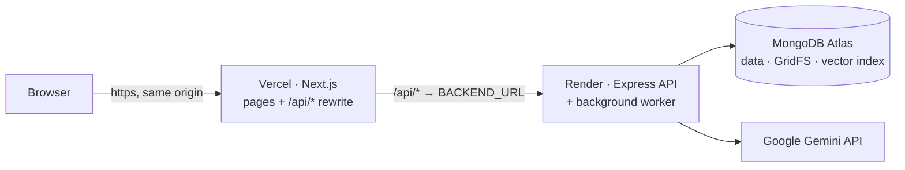

# Deployment

## Live deployment

| | |
|---|---|
| **Application** | **https://ai-companion-two-jet.vercel.app** |
| Frontend | Vercel (Next.js 16), project Root Directory `frontend` |
| API + background worker | Render web service (Node.js 22, Express 5), one process (`APP_ROLE=all`) |
| Database and file storage | MongoDB Atlas (documents, GridFS for PDFs, Atlas Vector Search) |
| AI | Google Gemini API |
| Health (through the app's origin) | [`/api/health`](https://ai-companion-two-jet.vercel.app/api/health) (liveness) · [`/api/health/ready`](https://ai-companion-two-jet.vercel.app/api/health/ready) (database round trip) |

Learners can register on the site. For the demo, the admin login is shown in the [README](../README.md#demo-admin-login) and on the sign-in page.

The browser only talks to the Vercel origin, and `/api/*` is reverse-proxied to Render. The session cookie is therefore first-party and httpOnly,
and no CORS setup is needed ([ARCHITECTURE.md D1](ARCHITECTURE.md#32-key-decisions-simplifications--future-work)).

---

## 1. MongoDB Atlas

1. Create a cluster (MongoDB 7+; the free M0 tier works for the prototype) and a database user.
2. **Network Access**: allow the API host. Render's outbound addresses can change, so either add the static outbound IP ranges Render lists for the service's region, or allow `0.0.0.0/0` with a strong database password.
3. Copy the connection string into `MONGODB_URI`. If the password contains `#` or other special characters, URL-encode it.

No manual index setup is needed. Mongoose builds the collection indexes on start, and the API requests the **Atlas Vector Search index** `chunks_vector` (768 dimensions, cosine, filtered by `projectId` / `ownerId` / `materialId`). While that index builds, or if Atlas Search is unavailable, retrieval uses the in-process fallback automatically. **Admin → System health** shows the current retrieval mode.

## 2. API + worker on Render

Create a **Web Service** from the repository:

| Setting | Value |
|---|---|
| Root Directory | `backend` |
| Runtime | Node (the `engines` field requires ≥ 22.9; `--env-file-if-exists` needs it) |
| Build Command | `npm ci --include=dev && npm run build` (tsup is a dev dependency; `--include=dev` keeps it available even when `NODE_ENV=production`) |
| Start Command | `npm start` (`node --env-file-if-exists=.env dist/index.js`; on Render the variables come from the dashboard) |
| Health Check Path | `/api/health` |

**Environment variables** (template: [`backend/.env.example`](../backend/.env.example)):

| Variable | Production value |
|---|---|
| `NODE_ENV` | `production` |
| `APP_ROLE` | `all` (API + worker in one process); use `api` plus a separate `worker` service to split them |
| `MONGODB_URI` · `MONGODB_DB_NAME` | Atlas connection string · database name |
| `JWT_SECRET` | 48+ random bytes, e.g. `node -e "console.log(require('crypto').randomBytes(48).toString('base64url'))"` |
| `COOKIE_SECURE` | `true` (HTTPS) |
| `TRUST_PROXY` | `1` (the Render proxy; client IPs for rate limits) |
| `ADMIN_EMAIL` · `ADMIN_PASSWORD` · `ADMIN_NAME` | the admin account created on first boot |
| `GEMINI_API_KEY` | Gemini API key |
| Optional | `AI_MODEL_*` (model chains), `RETRIEVAL_*` (evidence thresholds), `*_JUDGE_SAMPLE_RATE`, `WORKER_CONCURRENCY`, `MAX_UPLOAD_MB`, `LOG_LEVEL`; defaults are documented in [ARCHITECTURE.md §30](ARCHITECTURE.md#30-configuration--deployment) |

`PORT` is provided by Render. `CORS_ORIGINS` is only needed if a browser calls the API origin directly, which this setup never does.

**Resetting the admin password**: change `ADMIN_PASSWORD`, then run `npm run seed:admin` from a shell with the same environment. This also signs out existing admin sessions.

## 3. Frontend on Vercel

1. Import the repository and set **Root Directory** to `frontend`. [`frontend/vercel.json`](../frontend/vercel.json) pins the framework, `npm ci` and `npm run build`, and adds security headers to every page: `X-Content-Type-Options`, `X-Frame-Options: SAMEORIGIN`, `Referrer-Policy` and `Permissions-Policy`. `/api/*` is excluded because the API sets its own headers.
2. Environment variable **`BACKEND_URL`** = the Render service origin, e.g. `https://<service>.onrender.com`, with no trailing slash.
3. Deploy. `BACKEND_URL` is read **at build time** by the `/api/*` rewrite, so **redeploy after changing it**.

## 4. Smoke test after a deploy

1. `GET /api/health` returns `{"status":"ok"}` and `GET /api/health/ready` returns `"database":{"status":"up"}`. Verified on the live app on 2026-09-26, together with the security headers above.
2. Register a learner, create a Space and a Project, and upload a PDF. The material should move from *Queued* to *Processing* to *Ready*.
3. Ask Zoya a question the PDF answers (a cited answer), then one it doesn't (the "not in your materials" reply).
4. Take a short quiz with a written answer; check that Growth, Analytics and Home show progress and a recommendation.
5. Sign in as the admin and check **System health** (database, storage, AI gateway, worker, retrieval mode), **Background jobs** and **AI usage**.

## Troubleshooting

| Symptom | Likely cause |
|---|---|
| `/api/*` returns 502/504 or the first request is slow | The Render service is waking from sleep (free plan), or `BACKEND_URL` is wrong. Check `/api/health`, then redeploy the frontend after fixing the variable |
| Login works but the session is lost | `COOKIE_SECURE=true` requires HTTPS, which both hosts provide. Also check that the browser uses the Vercel origin, not the Render one |
| API fails to start with a database timeout or TLS alert | The Atlas Network Access list doesn't include the host |
| Materials stay *Queued* | The worker isn't running (`APP_ROLE` must be `all` or `worker`). **Background jobs** shows the live workers |
| Tutor answers are slow or say the AI is busy | Free-tier Gemini 429/503 errors; the gateway falls back automatically. **AI usage** shows the errors and fallbacks per model |
| Retrieval mode shows *memory* or *lexical* | The vector index is still building or unavailable; answers keep working through the fallback |

## Secrets policy

Real values live only in the hosts' dashboards and in local, git-ignored `.env` files. The repository contains placeholders only
(`backend/.env.example`, `frontend/.env.example`). The one deliberate exception is the **demo admin login**, published for reviewers.
Its password is not used anywhere else and should be rotated after the review: set a new `ADMIN_PASSWORD` on Render, run `npm run seed:admin`,
then update the README and `frontend/src/lib/demo.ts`.
